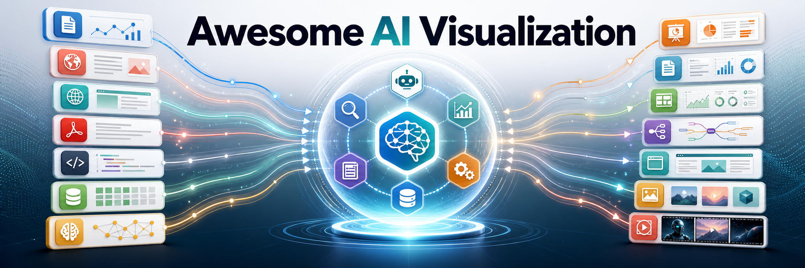

[English](README.md) | 简体中文 | [繁體中文](README.zh-TW.md) | [日本語](README.ja.md) | [한국어](README.ko.md) | [Español](README.es.md) | [Türkçe](README.tr.md) | [Русский](README.ru.md)

> [!NOTE]
> 本项目由 RenaissanceMind Agent 辅助自动更新。工具信息、Star、许可证和服务条款可能会变化，使用前请核实对应官网或仓库。

一个关于 AI 可视化与内容呈现的精选目录：收集使用 LLM 或 Agent，把论文、新闻、网页、文档、代码库、数据集和知识集合转成“给人看的”视觉产物的工具、网站、开源项目、Agent Skill 和 MCP Server。

这个列表按**信息来源**、**工具形态**、**产出物形式**和**依赖类型**标注。PPT 只是产出物之一；同一个工具也可能同时产出报告、网页、图表、思维导图或代码地图。

## ✨ 推荐使用方式

| 使用者 | 建议 |
| --- | --- |
| 🤖 For Agent | 安装/启用 [`ai-visualization-advisor`](skills/ai-visualization-advisor/SKILL.md) skill，让 Agent 根据信息源、目标读者和使用限制，建议合适的信息呈现形式与工具；它会优先读取 [`data/catalog.yml`](data/catalog.yml) 和 [`data/tool-research.yml`](data/tool-research.yml)。 |
| 👤 For Human | 查阅当前 README，或访问 [awesome-ai-visualization.renaissancemind.ai](https://awesome-ai-visualization.renaissancemind.ai/)（Recommended）浏览和筛选工具。 |

## 目录

- [主工作流工具](#主工作流工具)
- [辅助、前后处理与小工具](#辅助前后处理与小工具)
- [怎么筛选工具](#怎么筛选工具)
- [继续发现更多工具](#继续发现更多工具)
- [数据](#数据)
- [贡献](#贡献)

## 主工作流工具

这一部分放“从信息来源直接生成面向人阅读/展示的产物”的工具。每行都同时标注三条轴：信息来源、工具形态、产出物形式。

### 论文、科研资料与学术检索

从论文、科研主题和文献库出发，生成图形摘要、报告、课程、文献地图或学术传播产物。

| 项目 | 信息来源 | 工具形态 | 产出物形式 | 依赖类型 |
| --- | --- | --- | --- | --- |
| [Paper2Any](https://github.com/OpenDCAI/Paper2Any)  | 论文/科研资料 | 开源应用/框架 | 图形摘要/信息图 / PPT/演示文稿 / 网页/交互页面 | 本地语言环境 / 模型 API / 文档解析/OCR / 渲染/导出 / GPU/加速器 / 模板/素材 |
| [paper-2-web](https://github.com/davila7/claude-code-templates/blob/main/cli-tool/components/skills/scientific/paper-2-web/SKILL.md?plain=1)  | 论文/科研资料 | Agent Skill | 图形摘要/信息图 / PPT/演示文稿 / 网页/交互页面 | Agent 宿主 / 模型 API / 本地语言环境 / 渲染/导出 / 模板/素材 |
| [paper-to-course](https://github.com/ZeroxZhang/paper-to-course)  | 论文/科研资料 | Agent Skill | 网页/交互页面 / 问答/学习材料 | Agent 宿主 / 模型 API / 本地语言环境 / 渲染/导出 |
| [Auto-Research-In-Sleep](https://github.com/wanshuiyin/Auto-claude-code-research-in-sleep)  | 论文/科研资料 | Skill 集合 | 报告/长文档 / 证据表 | Agent 宿主 / 模型 API / 本地语言环境 / 系统工具 / 渲染/导出 / 模板/素材 |
| [scientific-agent-skills](https://github.com/K-Dense-AI/scientific-agent-skills)  | 论文/科研资料 | Skill 集合 | 图形摘要/信息图 / PPT/演示文稿 / 网页/交互页面 | Agent 宿主 / 模型 API / 外部检索/数据源 / 渲染/导出 |
| [claude-scientific-writer](https://github.com/K-Dense-AI/claude-scientific-writer)  | 论文/科研资料 | Agent Skill | 报告/长文档 / 证据表 | Agent 宿主 / 模型 API / 外部检索/数据源 / 模板/素材 |
| [SciGA](https://github.com/IyatomiLab/SciGA)  | 论文/科研资料 | 数据集/评测 | 图形摘要/信息图 / PPT/演示文稿 / 网页/交互页面 | 本地语言环境 / 文档解析/OCR / GPU/加速器 |
| [Academic Figures](https://github.com/sai-tv/academic-figures)  | 论文/科研资料 / 文本/想法 | Agent Skill | 图形摘要/信息图 / SVG/PNG/PDF | Agent 宿主 / 模型 API / 渲染/导出 / 模板/素材 |
| [PaperBanana](https://github.com/dwzhu-pku/PaperBanana)  | 论文/科研资料 / 文本/想法 | 开源应用/框架 | 图形摘要/信息图 / SVG/PNG/PDF | 本地语言环境 / 模型 API / 文档解析/OCR / 外部检索/数据源 / 渲染/导出 / 模板/素材 |
| [PaperBanana Skills](https://github.com/PlutoLei/paperbanana-skill)  | 论文/科研资料 / PDF/文档 / 数据/表格 / 文本/想法 | Agent Skill | 图形摘要/信息图 / PPT/演示文稿 / SVG/PNG/PDF | Agent 宿主 / 模型 API / 本地语言环境 / 文档解析/OCR / 外部检索/数据源 / 渲染/导出 / 模板/素材 |
| [academic-slides-skill](https://github.com/Rebeccca2000/academic-slides-skill)  | 论文/科研资料 / PDF/文档 / 文本/想法 | Agent Skill | PPT/演示文稿 / 网页/交互页面 / SVG/PNG/PDF | Agent 宿主 / 本地语言环境 / 渲染/导出 / 模板/素材 |
| [PaperToSlides](https://github.com/jxtse/PaperToSlides)  | 论文/科研资料 / PDF/文档 | 开源应用/框架 | PPT/演示文稿 | 本地语言环境 / 模型 API / 文档解析/OCR / 渲染/导出 / GPU/加速器 |
| [Paper2Slides](https://github.com/pchi123/Paper2Slides)  | Papers/research | Open-source app/framework | Graphical abstract/infographic / PPT/deck | Local runtime / Document parsing/OCR / Rendering/export / Templates/assets |
| [AI-Researcher](https://github.com/HKUDS/AI-Researcher)  | 论文/科研资料 | 研究原型 | 报告/长文档 / 证据表 | 本地语言环境 / 模型 API / 外部检索/数据源 / GPU/加速器 |
| [Elicit](https://elicit.com/) | 论文/科研资料 | 产品/SaaS | 报告/简报 / 证据表 | 浏览器/账号 / 外部检索/数据源 |
| [Paperguide](https://paperguide.ai/) | 论文/科研资料 | 产品/SaaS | 报告/简报 / 证据表 | 浏览器/账号 / 外部检索/数据源 |
| [SciSpace Infographic Maker](https://scispace.com/agents/infographic-maker-hbcwetac) | 论文/科研资料 | 产品/SaaS | 图形摘要/信息图 / PPT/演示文稿 / 网页/交互页面 | 浏览器/账号 / 模板/素材 |
| [Grabstract](https://grabstract.io/graphical-abstracts) | 论文/科研资料 | 产品/SaaS | 图形摘要/信息图 / PPT/演示文稿 / 网页/交互页面 | 浏览器/账号 / 模板/素材 |
| [Open Knowledge Maps](https://openknowledgemaps.org/) | 论文/科研资料 / 引用网络 | 产品/SaaS | 文献地图/知识地图 | 浏览器/账号 / 外部检索/数据源 |
| [Connected Papers](https://www.connectedpapers.com/) | 论文/科研资料 / 引用网络 | 产品/SaaS | 文献地图/知识地图 | 浏览器/账号 / 外部检索/数据源 |
| [ResearchRabbit](https://www.researchrabbit.ai/) | 论文/科研资料 / 引用网络 | 产品/SaaS | 文献地图/知识地图 | 浏览器/账号 / 外部检索/数据源 |
| [Litmaps](https://www.litmaps.com/) | 论文/科研资料 / 引用网络 | 产品/SaaS | 文献地图/知识地图 | 浏览器/账号 / 外部检索/数据源 |
| [Consensus](https://consensus.app/) | 论文/科研资料 | 产品/SaaS | 报告/简报 / 证据表 | 浏览器/账号 / 外部检索/数据源 |

### 网页、新闻、资讯与行业情报

从网页、搜索结果、新闻流、市场数据或威胁情报出发，生成带来源的报告、仪表盘和知识图。

| 项目 | 信息来源 | 工具形态 | 产出物形式 | 依赖类型 |
| --- | --- | --- | --- | --- |
| [GPT Researcher](https://github.com/assafelovic/gpt-researcher)  | 网页/搜索结果 / 新闻/资讯 | 开源应用/框架 | 报告/长文档 / 引用答案 | 本地语言环境 / 模型 API / 外部检索/数据源 / 存储/索引 |
| [STORM](https://github.com/stanford-oval/storm)  | 网页/搜索结果 / 新闻/资讯 | 开源应用/框架 | 报告/长文档 / 引用答案 | 本地语言环境 / 模型 API / 外部检索/数据源 / 存储/索引 |
| [Scira](https://github.com/zaidmukaddam/scira)  | 网页/搜索结果 / 新闻/资讯 | 开源应用/框架 / Bot/助手 | 报告/长文档 / 引用答案 | 本地语言环境 / 模型 API / 外部检索/数据源 / 存储/索引 |
| [Vane](https://github.com/ItzCrazyKns/Vane)  | 网页/搜索结果 / 新闻/资讯 | 开源应用/框架 / Bot/助手 | 报告/长文档 / 引用答案 | 本地语言环境 / 模型 API / 外部检索/数据源 / 存储/索引 |
| [FinRobot](https://github.com/AI4Finance-Foundation/FinRobot)  | 新闻/资讯 / 数据/表格 / 网页/搜索结果 | 开源应用/框架 | 报告/长文档 / 图表/仪表盘 | 本地语言环境 / 模型 API / 外部检索/数据源 / 渲染/导出 |
| [Market-Intelligence-Agent](https://github.com/vikas-kashyap97/Market-Intelligence-Agent)  | 新闻/资讯 / 数据/表格 / 网页/搜索结果 | 开源应用/框架 | 图表/仪表盘 / 报告/简报 | 本地语言环境 / 模型 API / 外部检索/数据源 / 渲染/导出 / 存储/索引 |
| [World Monitor](https://github.com/FutureSpeakAI/agent-fridays-global-intelligence-monitor)  | 新闻/资讯 / 网页/搜索结果 | 开源应用/框架 | 图表/仪表盘 / 报告/简报 | 本地语言环境 / 模型 API / 外部检索/数据源 / 渲染/导出 / 存储/索引 |
| [OSSInsight](https://github.com/pingcap/ossinsight)  | 代码库 / 数据/表格 / 网页/搜索结果 | 开源应用/框架 / 产品/SaaS | 图表/仪表盘 / 报告/简报 | 浏览器/账号 / 外部检索/数据源 / 渲染/导出 / 存储/索引 |

### 文档、PDF 与知识库

从 PDF、Office 文档、网页、个人资料库或团队知识库出发，生成简报、问答、学习材料和知识地图。

| 项目 | 信息来源 | 工具形态 | 产出物形式 | 依赖类型 |
| --- | --- | --- | --- | --- |
| [notex](https://github.com/smallnest/notex)  | PDF/文档 / 网页/搜索结果 / 知识库/个人资料 | 开源应用/框架 | 报告/简报 / 思维导图/知识地图 / 问答/学习材料 | 本地语言环境 / 模型 API / 文档解析/OCR / 渲染/导出 / 存储/索引 |
| [Open Notebook](https://github.com/lfnovo/open-notebook)  | PDF/文档 / 网页/搜索结果 / 知识库/个人资料 | 开源应用/框架 | 报告/简报 / 思维导图/知识地图 / 问答/学习材料 | 本地语言环境 / 模型 API / 文档解析/OCR / 存储/索引 |
| [SurfSense](https://github.com/MODSetter/SurfSense)  | PDF/文档 / 网页/搜索结果 / 知识库/个人资料 | 开源应用/框架 | 报告/简报 / 思维导图/知识地图 / 问答/学习材料 | 本地语言环境 / 模型 API / 外部检索/数据源 / 存储/索引 |
| [NotebookLM](https://notebooklm.google/) | PDF/文档 / 网页/搜索结果 / 知识库/个人资料 | 产品/SaaS / Bot/助手 | 报告/简报 / 思维导图/知识地图 / 问答/学习材料 | 浏览器/账号 |
| [NotebookLM AI Plugin](https://github.com/proyecto26/notebooklm-ai-plugin)  | PDF/文档 / 网页/搜索结果 / 知识库/个人资料 / 任意/多源 | Agent Skill / Bot/助手 | PPT/演示文稿 / 视频/音频 / 思维导图/知识地图 / 信息图/视觉报告 / 报告/简报 / 表格/时间线 / 问答/学习材料 | Agent 宿主 / 浏览器/账号 / 本地语言环境 / 文档解析/OCR / 外部检索/数据源 / 渲染/导出 |

### 代码库与软件系统

把 GitHub 仓库、本地代码、依赖和 diff 转成架构图、代码地图、Repo Wiki 或知识图谱。

| 项目 | 信息来源 | 工具形态 | 产出物形式 | 依赖类型 |
| --- | --- | --- | --- | --- |
| [GitDiagram](https://github.com/ahmedkhaleel2004/gitdiagram)  | 代码库 | 开源应用/框架 | 代码地图/Repo Wiki / 架构图/流程图 | 浏览器/账号 / 模型 API / 代码分析工具 |
| [CodeBoarding](https://github.com/Codeboarding/CodeBoarding)  | 代码库 | 开源应用/框架 | 代码地图/Repo Wiki / 架构图/流程图 | 本地语言环境 / 模型 API / 代码分析工具 / 渲染/导出 / 存储/索引 |
| [Understand-Anything](https://github.com/Egonex-AI/Understand-Anything)  | 代码库 | Agent Skill | 代码地图/Repo Wiki / 架构图/流程图 | Agent 宿主 / 本地语言环境 / 模型 API / 代码分析工具 / 存储/索引 |
| [GitNexus](https://github.com/abhigyanpatwari/GitNexus)  | 代码库 | 开源应用/框架 / MCP Server | 代码地图/Repo Wiki / 架构图/流程图 / 网页/交互页面 | MCP Client / 本地语言环境 / 代码分析工具 / 存储/索引 / 渲染/导出 |
| [DeepWiki Open](https://github.com/AsyncFuncAI/deepwiki-open)  | 代码库 | 开源应用/框架 | 代码地图/Repo Wiki / 架构图/流程图 | 本地语言环境 / 模型 API / 代码分析工具 / 渲染/导出 |
| [PocketFlow Tutorial Codebase Knowledge](https://github.com/The-Pocket/PocketFlow-Tutorial-Codebase-Knowledge)  | 代码库 | 开源应用/框架 | 代码地图/Repo Wiki / 架构图/流程图 | 本地语言环境 / 模型 API / 代码分析工具 / 渲染/导出 |
| [local-deepwiki-mcp](https://github.com/UrbanDiver/local-deepwiki-mcp)  | 代码库 | MCP Server / 开源应用/框架 | 代码地图/Repo Wiki / 架构图/流程图 / 网页/交互页面 / SVG/PNG/PDF | MCP Client / 本地语言环境 / 模型 API / 代码分析工具 / 存储/索引 / 渲染/导出 / GPU/加速器 |
| [GitVizz](https://github.com/adithya-s-k/GitVizz)  | 代码库 | 开源应用/框架 | 代码地图/Repo Wiki / 架构图/流程图 | 浏览器/账号 / 模型 API / 代码分析工具 / 渲染/导出 |
| [codeflow](https://github.com/braedonsaunders/codeflow)  | 代码库 | 开源应用/框架 | 代码地图/Repo Wiki / 架构图/流程图 | 浏览器/账号 / 模型 API / 代码分析工具 / 渲染/导出 |
| [oh-my-mermaid](https://github.com/oh-my-mermaid/oh-my-mermaid)  | 代码库 | Agent Skill | 代码地图/Repo Wiki / 架构图/流程图 | Agent 宿主 / 模型 API / 代码分析工具 / 渲染/导出 |
| [codag-visualizer](https://github.com/codag-megalith/codag-visualizer)  | 代码库 | 开源应用/框架 | 代码地图/Repo Wiki / 架构图/流程图 | 本地语言环境 / 代码分析工具 / 渲染/导出 |
| [codebase-memory-mcp](https://github.com/DeusData/codebase-memory-mcp)  | 代码库 | MCP Server | 代码地图/Repo Wiki / 架构图/流程图 | MCP Client / 本地语言环境 / 代码分析工具 / 存储/索引 |
| [CodeAtlas](https://github.com/lucyb0207/CodeAtlas)  | 代码库 | 开源应用/框架 | 代码地图/Repo Wiki / 架构图/流程图 | 本地语言环境 / 代码分析工具 / 渲染/导出 |
| [devlensOSS](https://github.com/devlensio/devlensOSS)  | 代码库 | 开源应用/框架 | 代码地图/Repo Wiki / 架构图/流程图 | 本地语言环境 / 代码分析工具 / 渲染/导出 |
| [Visual-Explainer](https://github.com/jircik/Visual-Explainer)  | 代码库 | Agent Skill | 代码地图/Repo Wiki / 架构图/流程图 | Agent 宿主 / 模型 API / 代码分析工具 / 渲染/导出 |
| [codemap-skill](https://github.com/Asixa/codemap-skill)  | 代码库 | Agent Skill | 代码地图/Repo Wiki / 架构图/流程图 | Agent 宿主 / 模型 API / 代码分析工具 |
| [DeepWiki](https://docs.devin.ai/work-with-devin/deepwiki) | 代码库 | 产品/SaaS | 代码地图/Repo Wiki / 架构图/流程图 | 浏览器/账号 / 代码分析工具 |
| [CodeSee](https://www.codesee.io/) | 代码库 | 产品/SaaS | 代码地图/Repo Wiki / 架构图/流程图 | 浏览器/账号 / 代码分析工具 |

### 数据、表格与业务指标

把 CSV、数据库、指标和业务数据转成图表、仪表盘或分析报告。

| 项目 | 信息来源 | 工具形态 | 产出物形式 | 依赖类型 |
| --- | --- | --- | --- | --- |
| [Data Formulator](https://github.com/microsoft/data-formulator)  | 数据/表格 / 数据库 | 开源应用/框架 | 图表/仪表盘 / 报告/简报 | 本地语言环境 / 模型 API / 渲染/导出 |
| [LIDA](https://github.com/microsoft/lida)  | 数据/表格 / 数据库 | 开源应用/框架 | 图表/仪表盘 / 报告/简报 | 本地语言环境 / 模型 API / 渲染/导出 |
| [WrenAI](https://github.com/Canner/WrenAI)  | 数据/表格 / 数据库 / 知识库/个人资料 | 开源应用/框架 / Agent Skill | 图表/仪表盘 / 报告/简报 | Agent 宿主 / 本地语言环境 / 模型 API / 外部检索/数据源 / 存储/索引 |
| [Vanna](https://github.com/vanna-ai/vanna)  | 数据库 / 数据/表格 | 开源应用/框架 / API/SDK/库 | 图表/仪表盘 / 报告/简报 | 本地语言环境 / 模型 API / 外部检索/数据源 / 存储/索引 / 渲染/导出 |
| [VMind](https://github.com/VisActor/VMind)  | 数据/表格 / 文本/想法 | API/SDK/库 | 图表/仪表盘 / 信息图/视觉报告 / 图表/渲染输出 | 本地语言环境 / 模型 API / 渲染/导出 / 模板/素材 |
| [Semiotic](https://github.com/nteract/semiotic)  | 数据/表格 / DSL/代码 | API/SDK/库 / MCP Server | 图表/仪表盘 / 图表/渲染输出 / SVG/PNG/PDF | 本地语言环境 / MCP Client / 渲染/导出 / 模板/素材 |
| [chart-visualization-skills](https://github.com/antvis/chart-visualization-skills)  | 数据/表格 / 文本/想法 / 代码/技术描述 | Skill 集合 / API/SDK/库 | 图表/仪表盘 / 信息图/视觉报告 / 架构图/流程图 / 图表/渲染输出 | Agent 宿主 / 本地语言环境 / 渲染/导出 / 模板/素材 |
| [mcp-server-chart](https://github.com/antvis/mcp-server-chart)  | 数据/表格 / 文本/想法 / 数据库 | MCP Server / Skill 集合 | 图表/仪表盘 / 信息图/视觉报告 / 架构图/流程图 / 白板/思维导图 / 图表/渲染输出 | MCP Client / 本地语言环境 / 渲染/导出 |
| [mcp-dashboards](https://github.com/KyuRish/mcp-dashboards)  | 数据/表格 / 数据库 / 任意/多源 | MCP Server | 图表/仪表盘 / PPT/演示文稿 / SVG/PNG/PDF | MCP Client / Agent 宿主 / 本地语言环境 / 外部检索/数据源 / 渲染/导出 |
| [Claude Data Analysis Assistant](https://github.com/liangdabiao/claude-data-analysis)  | 数据/表格 / 数据库 | Agent Skill / 开源应用/框架 | 图表/仪表盘 / 报告/长文档 / SVG/PNG/PDF | Agent 宿主 / 本地语言环境 / 模型 API / 渲染/导出 / 模板/素材 |
| [wshm](https://github.com/wshm-dev/wshm)  | 代码库 / 数据/表格 / 网页/搜索结果 | 开源应用/框架 | 图表/仪表盘 / 报告/长文档 / 网页/交互页面 | 本地语言环境 / 模型 API / 外部检索/数据源 / 代码分析工具 / 存储/索引 / 渲染/导出 |
| [MatPlotAgent](https://github.com/thunlp/MatPlotAgent)  | 数据/表格 / 数据库 | 研究原型 | 图表/仪表盘 / 报告/简报 | 本地语言环境 / 模型 API / 渲染/导出 |
| [OpenVizAI](https://github.com/OpenVizAI/OpenVizAI)  | 数据/表格 / 数据库 | 开源应用/框架 | 图表/仪表盘 / 报告/简报 | 本地语言环境 / 模型 API / 渲染/导出 |
| [generative-dashboard-builder](https://github.com/KaranChandekar/generative-dashboard-builder)  | 数据/表格 / 数据库 | 开源应用/框架 | 图表/仪表盘 / 报告/简报 | 本地语言环境 / 模型 API / 渲染/导出 / 存储/索引 |
| [OpenBI](https://github.com/narender-rk10/OpenBI)  | 数据/表格 / 数据库 | 开源应用/框架 | 图表/仪表盘 / 报告/简报 | 本地语言环境 / 模型 API / 外部检索/数据源 / 存储/索引 / 渲染/导出 |

### 通用文本、想法与白板图示

从提示词、草稿、白板想法或半结构化文本生成信息图、流程图、白板图和视觉报告。

| 项目 | 信息来源 | 工具形态 | 产出物形式 | 依赖类型 |
| --- | --- | --- | --- | --- |
| [q-skills](https://github.com/TyrealQ/q-skills)  | 文本/想法 / PDF/文档 / 数据/表格 | Skill 集合 | 信息图/视觉报告 / 报告/长文档 | Agent 宿主 / 模型 API / 本地语言环境 / 渲染/导出 |
| [Visualize](https://github.com/careerhackeralex/visualize)  | 文本/想法 / 数据/表格 / 代码/技术描述 | Agent Skill | 网页/交互页面 / PPT/演示文稿 / 图表/仪表盘 / 信息图/视觉报告 / 架构图/流程图 | Agent 宿主 / 模型 API / 本地语言环境 / 渲染/导出 / 模板/素材 |
| [Visual Explainer Skill](https://github.com/ericblue/visual-explainer-skill)  | 文本/想法 / PDF/文档 / 代码库 / 代码/技术描述 | Agent Skill | 信息图/视觉报告 / 白板/思维导图 / PPT/演示文稿 / 架构图/流程图 / 图形摘要/信息图 | Agent 宿主 / 模型 API / 渲染/导出 / 模板/素材 |
| [visual-explainer](https://github.com/nicobailon/visual-explainer)  | 文本/想法 / 代码库 / 代码/技术描述 / 数据/表格 | Agent Skill | 网页/交互页面 / PPT/演示文稿 / 架构图/流程图 / 图表/仪表盘 / 信息图/视觉报告 | Agent 宿主 / 本地语言环境 / 渲染/导出 / 模板/素材 |
| [baoyu-skills](https://github.com/JimLiu/baoyu-skills)  | 文本/想法 / PDF/文档 / 网页/搜索结果 | Skill 集合 | 信息图/视觉报告 / 图形摘要/信息图 / PPT/演示文稿 / SVG/PNG/PDF | Agent 宿主 / 模型 API / 本地语言环境 / 渲染/导出 / 模板/素材 |
| [aiz-infographic](https://github.com/aizzaku/aiz-infographic)  | 文本/想法 / 数据/表格 | Agent Skill | 信息图/视觉报告 / 网页/交互页面 / SVG/PNG/PDF | Agent 宿主 / 本地语言环境 / 渲染/导出 / 模板/素材 |
| [ascii-canvas](https://github.com/noodlebindev/ascii-canvas)  | 文本/想法 / 代码/技术描述 / 论文/科研资料 / 数据/表格 | Agent Skill | 信息图/视觉报告 / 架构图/流程图 / 白板/思维导图 / 表格/时间线 / PPT/演示文稿 | Agent 宿主 / 本地语言环境 / 渲染/导出 |
| [Piktochart AI](https://piktochart.com/generative-ai/) | 文本/想法 / PDF/文档 / 数据/表格 | 产品/SaaS | 信息图/视觉报告 / 报告/长文档 | 浏览器/账号 / 模板/素材 |
| [hbr-style-visualization](https://github.com/kgraph57/hbr-style-visualization)  | 文本/想法 / 数据/表格 | Agent Skill | 信息图/视觉报告 / 图表/仪表盘 / PPT/演示文稿 | Agent 宿主 / 模型 API / 渲染/导出 / 模板/素材 |
| [viz-skills](https://github.com/silvere/viz-skills)  | 文本/想法 / 网页/搜索结果 / PDF/文档 | Agent Skill | 信息图/视觉报告 / SVG/PNG/PDF / 白板/思维导图 | Agent 宿主 / 本地语言环境 / 渲染/导出 |
| [Claude Design](https://www.anthropic.com/news/claude-design-anthropic-labs) | 文本/想法 / PDF/文档 / Office 文档 / 网页/搜索结果 / 代码库 | 产品/SaaS / Bot/助手 | 信息图/视觉报告 / PPT/演示文稿 / 网页/交互页面 / SVG/PNG/PDF | 浏览器/账号 / 模型 API / 渲染/导出 / 模板/素材 |
| [Venngage AI Infographic Generator](https://venngage.com/ai-tools/infographic-generator) | 文本/想法 / PDF/文档 / 数据/表格 | 产品/SaaS | 信息图/视觉报告 / 报告/长文档 | 浏览器/账号 / 模板/素材 |
| [Venngage AI Report Generator](https://venngage.com/ai-tools/report-generator) | 文本/想法 / PDF/文档 / 数据/表格 | 产品/SaaS | 信息图/视觉报告 / 报告/长文档 | 浏览器/账号 / 模板/素材 |
| [Jeda AI Infographic Generator](https://www.jeda.ai/ai-infographic-generator) | 文本/想法 / PDF/文档 / 数据/表格 | 产品/SaaS | 信息图/视觉报告 / 报告/长文档 | 浏览器/账号 / 文档解析/OCR / 模板/素材 |
| [Infogram](https://infogram.com/) | 文本/想法 / PDF/文档 / 数据/表格 | 产品/SaaS | 信息图/视觉报告 / 报告/长文档 | 浏览器/账号 / 外部检索/数据源 / 模板/素材 |
| [DeepDiagram](https://github.com/LingyiChen-AI/DeepDiagram)  | 文本/想法 / 代码/技术描述 / 数据/表格 | 开源应用/框架 | 架构图/流程图 / 白板/思维导图 / 图表/仪表盘 / 信息图/视觉报告 / 图表/Mermaid | 本地语言环境 / 模型 API / 渲染/导出 / 模板/素材 / 存储/索引 |
| [next-ai-draw-io](https://github.com/DayuanJiang/next-ai-draw-io)  | 文本/想法 / 代码/技术描述 | 开源应用/框架 | 架构图/流程图 / 白板/思维导图 / SVG/PNG/PDF | 浏览器/账号 / 本地语言环境 / 模型 API / 渲染/导出 / 模板/素材 |
| [Napkin AI](https://www.napkin.ai/) | 文本/想法 / 代码/技术描述 | 产品/SaaS | 架构图/流程图 / 白板/思维导图 | 浏览器/账号 / 模板/素材 |
| [Eraser AI](https://www.eraser.io/ai) | 文本/想法 / 代码/技术描述 | 产品/SaaS | 架构图/流程图 / 白板/思维导图 | 浏览器/账号 / 模板/素材 |
| [Mermaid Chart AI](https://mermaid.ai/mermaid-ai) | 文本/想法 / 代码/技术描述 | 产品/SaaS | 架构图/流程图 / 白板/思维导图 | 浏览器/账号 / 渲染/导出 |
| [Whimsical AI](https://whimsical.com/ai) | 文本/想法 / 代码/技术描述 | 产品/SaaS | 架构图/流程图 / 白板/思维导图 | 浏览器/账号 / 模板/素材 |
| [Lucid AI](https://www.lucidchart.com/pages/use-cases/diagram-with-AI) | 文本/想法 / 代码/技术描述 | 产品/SaaS | 架构图/流程图 / 白板/思维导图 | 浏览器/账号 / 模板/素材 |
| [Miro AI diagrams](https://help.miro.com/hc/en-us/articles/28782102127890-Miro-AI-with-Diagrams-and-mindmaps) | 文本/想法 / 代码/技术描述 | 产品/SaaS | 架构图/流程图 / 白板/思维导图 | 浏览器/账号 / 模板/素材 |
| [FigJam AI](https://help.figma.com/hc/en-us/articles/18706554628119-Make-boards-and-diagrams-with-FigJam-AI) | 文本/想法 / 代码/技术描述 | 产品/SaaS | 架构图/流程图 / 白板/思维导图 | 浏览器/账号 / 模板/素材 |

### 程序化视频与动态讲解

把提示词、网页、代码库、结构化时间线或 Agent 生成的 HTML 转成带解说或动画的 MP4/视频产物。

| 项目 | 信息来源 | 工具形态 | 产出物形式 | 依赖类型 |
| --- | --- | --- | --- | --- |
| [html-video](https://github.com/nexu-io/html-video)  | 文本/想法 / 网页/搜索结果 / 代码库 | 开源应用/框架 | 视频/音频 / 网页/交互页面 | Agent 宿主 / 本地语言环境 / 模型 API / 渲染/导出 / 系统工具 / 模板/素材 |
| [HyperFrames](https://github.com/heygen-com/hyperframes)  | 文本/想法 / 网页/搜索结果 / PDF/文档 / 数据/表格 / DSL/代码 | 开源应用/框架 / Agent Skill | 视频/音频 / 网页/交互页面 / 图表/仪表盘 | Agent 宿主 / 本地语言环境 / 渲染/导出 / 系统工具 / 模板/素材 |
| [NextFrame](https://github.com/ChaosRealmsAI/NextFrame)  | DSL/代码 / 文本/想法 | 开源应用/框架 | 视频/音频 / 网页/交互页面 | 本地语言环境 / 渲染/导出 / 系统工具 |
| [Helios](https://github.com/BintzGavin/helios)  | DSL/代码 / 文本/想法 | API/SDK/库 / Agent Skill | 视频/音频 / 网页/交互页面 | 本地语言环境 / 渲染/导出 / 系统工具 / Agent 宿主 |
| [OpenMontage](https://github.com/calesthio/OpenMontage)  | 文本/想法 / 网页/搜索结果 / 新闻/资讯 | 开源应用/框架 | 视频/音频 | Agent 宿主 / 本地语言环境 / 模型 API / 外部检索/数据源 / 渲染/导出 / 系统工具 |
| [ralphy](https://github.com/alecs5am/ralphy)  | 文本/想法 / 网页/搜索结果 | 开源应用/框架 | 视频/音频 | Agent 宿主 / 本地语言环境 / 模型 API / 渲染/导出 / 系统工具 / 存储/索引 |
| [data-animation-skills](https://github.com/iart-ai/data-animation-skills)  | 数据/表格 / 文本/想法 | Skill 集合 | 视频/音频 / 图表/仪表盘 / 信息图/视觉报告 / PPT/演示文稿 | Agent 宿主 / 本地语言环境 / 渲染/导出 / 模板/素材 |

### 演示文稿与多源内容呈现

把文本、文档、网页、研究材料或大纲转成 PPT、Deck，或让 Agent 生成/编辑演示文稿。

| 项目 | 信息来源 | 工具形态 | 产出物形式 | 依赖类型 |
| --- | --- | --- | --- | --- |
| [ppt-master](https://github.com/hugohe3/ppt-master)  | 文本/想法 / PDF/文档 / 网页/搜索结果 | 开源应用/框架 | PPT/演示文稿 | 本地语言环境 / 模型 API / 渲染/导出 / 模板/素材 |
| [Presenton](https://github.com/presenton/presenton)  | 文本/想法 / PDF/文档 / 网页/搜索结果 | 开源应用/框架 / API/SDK/库 | PPT/演示文稿 | 本地语言环境 / 模型 API / 渲染/导出 / MCP Client / 模板/素材 |
| [PPTAgent](https://github.com/icip-cas/PPTAgent)  | 文本/想法 / PDF/文档 / 网页/搜索结果 | 研究原型 | PPT/演示文稿 | 本地语言环境 / 模型 API / 渲染/导出 / 模板/素材 |
| [AI Multi-Agent Presentation Builder](https://github.com/Azure-Samples/ai-multi-agent-presentation-builder)  | 文本/想法 / 网页/搜索结果 | 开源应用/框架 | PPT/演示文稿 | 本地语言环境 / 模型 API / 外部检索/数据源 / 渲染/导出 / 模板/素材 |
| [presentation-ai](https://github.com/allweonedev/presentation-ai)  | 文本/想法 / PDF/文档 / 网页/搜索结果 | 开源应用/框架 | PPT/演示文稿 | 本地语言环境 / 模型 API / 渲染/导出 / 模板/素材 |
| [DeckForge](https://github.com/Whatsonyourmind/deckforge)  | 文本/想法 / 数据/表格 / 数据库 | 开源应用/框架 / MCP Server / API/SDK/库 | PPT/演示文稿 / 图表/仪表盘 | MCP Client / 本地语言环境 / 模型 API / 渲染/导出 / 模板/素材 / 存储/索引 |
| [slide-deck-ai](https://github.com/barun-saha/slide-deck-ai)  | 文本/想法 / PDF/文档 / 网页/搜索结果 | 开源应用/框架 | PPT/演示文稿 | 本地语言环境 / 模型 API / 渲染/导出 / 模板/素材 |
| [odin-slides](https://github.com/leonid20000/odin-slides)  | 文本/想法 / PDF/文档 / 网页/搜索结果 | 开源应用/框架 | PPT/演示文稿 | 本地语言环境 / 模型 API / 文档解析/OCR / 渲染/导出 / 系统工具 |
| [ppt-agents](https://github.com/chenxingqiang/ppt-agents)  | 文本/想法 / PDF/文档 / 网页/搜索结果 | 开源应用/框架 | PPT/演示文稿 | Agent 宿主 / 本地语言环境 / 模型 API / 渲染/导出 |
| [deckdown](https://github.com/adityachauhan0/deckdown)  | 文本/想法 / PDF/文档 / 网页/搜索结果 | 开源应用/框架 | PPT/演示文稿 | 本地语言环境 / 渲染/导出 |
| [Frontend Slides](https://github.com/zarazhangrui/frontend-slides)  | Text/ideas / PDF/documents | Agent Skill | PPT/deck / Web/interactive page | Agent host / Model API / Local runtime / Rendering/export |
| [Slides AI Plugin](https://github.com/proyecto26/slides-ai-plugin)  | 文本/想法 / PDF/文档 / 网页/搜索结果 | Agent Skill | PPT/演示文稿 / 网页/交互页面 | Agent 宿主 / 模型 API / 本地语言环境 / 渲染/导出 / 模板/素材 |
| [Present](https://github.com/glebis/claude-skills/tree/main/present)  | 文本/想法 / PDF/文档 / 网页/搜索结果 / 知识库/个人资料 | Agent Skill | PPT/演示文稿 / 网页/交互页面 / 视频/音频 / 报告/长文档 | Agent 宿主 / 模型 API / 本地语言环境 / 渲染/导出 / 模板/素材 |
| [slidemason](https://github.com/erickittelson/slidemason)  | 文本/想法 / PDF/文档 / 网页/搜索结果 | 开源应用/框架 / Agent Skill | PPT/演示文稿 / SVG/PNG/PDF | Agent 宿主 / 本地语言环境 / 渲染/导出 / 模板/素材 |
| [cc-slidev](https://github.com/rhuss/cc-slidev)  | 文本/想法 / 代码/技术描述 | Agent Skill | PPT/演示文稿 / 网页/交互页面 / SVG/PNG/PDF | Agent 宿主 / 本地语言环境 / 渲染/导出 / 模板/素材 |
| [slidev-deck-stack](https://github.com/astroicers/slidev-deck-stack)  | 文本/想法 / 代码/技术描述 / DSL/代码 | Agent Skill | PPT/演示文稿 / 网页/交互页面 / 图表/Mermaid / SVG/PNG/PDF | Agent 宿主 / 本地语言环境 / 渲染/导出 / 模板/素材 |
| [Office-PowerPoint-MCP-Server](https://github.com/GongRzhe/Office-PowerPoint-MCP-Server)  | 文本/想法 / PDF/文档 / 网页/搜索结果 | MCP Server | PPT/演示文稿 | MCP Client / 本地语言环境 / 渲染/导出 / 系统工具 |
| [PptMcp](https://github.com/trsdn/mcp-server-ppt)  | 文本/想法 / Office 文档 / 数据/表格 | MCP Server / API/SDK/库 | PPT/演示文稿 / SVG/PNG/PDF / 视频/音频 / 图表/仪表盘 | MCP Client / 本地语言环境 / 渲染/导出 / 系统工具 |
| [ppt-mcp](https://github.com/ykuwai/ppt-mcp)  | 文本/想法 / Office 文档 / 数据/表格 | MCP Server | PPT/演示文稿 / SVG/PNG/PDF / 图表/仪表盘 | MCP Client / 本地语言环境 / 渲染/导出 / 系统工具 / 模板/素材 |
| [Alai MCP Server](https://github.com/getalai/alai-mcp-server)  | 文本/想法 / PDF/文档 / 网页/搜索结果 | MCP Server / 产品/SaaS | PPT/演示文稿 / SVG/PNG/PDF | MCP Client / 浏览器/账号 / 渲染/导出 / 模板/素材 |
| [Presentations.AI MCP Server](https://github.com/slidecraft-in/presentations-ai-mcp-server)  | 文本/想法 / PDF/文档 / Office 文档 / 网页/搜索结果 | MCP Server / 产品/SaaS | PPT/演示文稿 / SVG/PNG/PDF | MCP Client / 浏览器/账号 / 文档解析/OCR / 渲染/导出 / 模板/素材 |
| [mcp-ppt](https://github.com/ltc6539/mcp-ppt)  | 文本/想法 / PDF/文档 / 网页/搜索结果 | MCP Server | PPT/演示文稿 / SVG/PNG/PDF | MCP Client / 本地语言环境 / 渲染/导出 |
| [pptx-tools](https://github.com/jongalloway/pptx-tools)  | 文本/想法 / Office 文档 | MCP Server / API/SDK/库 | PPT/演示文稿 / 结构化数据/Markdown | MCP Client / 本地语言环境 / 渲染/导出 / 系统工具 / 模板/素材 |
| [Marp MCP](https://github.com/masaki39/marp-mcp)  | 文本/想法 / DSL/代码 | MCP Server / Agent Skill | PPT/演示文稿 / 网页/交互页面 | MCP Client / Agent 宿主 / 本地语言环境 / 渲染/导出 / 模板/素材 |
| [PptxGenJS-mcp-server](https://github.com/Hrithik-s-Raj/PptxGenJS-mcp-server)  | 文本/想法 / 数据/表格 | MCP Server | PPT/演示文稿 / 图表/仪表盘 | MCP Client / Agent 宿主 / 本地语言环境 / 渲染/导出 |
| [md-slides](https://github.com/zl190/md-slides)  | 文本/想法 / DSL/代码 | Agent Skill | PPT/演示文稿 / 网页/交互页面 / 架构图/流程图 | Agent 宿主 / 本地语言环境 / 模型 API / 渲染/导出 / 模板/素材 |
| [md2html](https://github.com/ogermer/md2html)  | 文本/想法 / DSL/代码 | Agent Skill | PPT/演示文稿 / 网页/交互页面 / SVG/PNG/PDF | Agent 宿主 / 本地语言环境 / 渲染/导出 / 模板/素材 |
| [deckset-claude-skill](https://github.com/doudou1337/deckset-claude-skill)  | 文本/想法 / DSL/代码 | Agent Skill | PPT/演示文稿 | Agent 宿主 / 本地语言环境 / 模型 API / 渲染/导出 / 模板/素材 |
| [pptx-from-layouts-skill](https://github.com/tristan-mcinnis/pptx-from-layouts-skill)  | 文本/想法 / PDF/文档 / 网页/搜索结果 | Agent Skill | PPT/演示文稿 | Agent 宿主 / 本地语言环境 / 渲染/导出 / 模板/素材 |
| [hands-on-deck](https://github.com/EveryInc/hands-on-deck)  | 文本/想法 / PDF/文档 / 网页/搜索结果 | Agent Skill | PPT/演示文稿 | Agent 宿主 / 本地语言环境 / 渲染/导出 |
| [agent-slides](https://github.com/mpuig/agent-slides)  | 文本/想法 / PDF/文档 / 网页/搜索结果 | Agent Skill | PPT/演示文稿 | Agent 宿主 / 本地语言环境 / 模型 API / 渲染/导出 / 模板/素材 |
| [ultimate-ppt-master-skill](https://github.com/kdnsna/ultimate-ppt-master-skill)  | 文本/想法 / PDF/文档 / 网页/搜索结果 | Agent Skill | PPT/演示文稿 | Agent 宿主 / 本地语言环境 / 模型 API / 渲染/导出 / 模板/素材 |
| [codex-ppt-skill](https://github.com/ningzimu/codex-ppt-skill)  | 文本/想法 / PDF/文档 / 网页/搜索结果 | Agent Skill | PPT/演示文稿 | Agent 宿主 / 本地语言环境 / 模型 API / 渲染/导出 / 模板/素材 |
| [presentation-skills](https://github.com/pamelafox/presentation-skills)  | 文本/想法 / PDF/文档 / 网页/搜索结果 | Skill 集合 | PPT/演示文稿 | Agent 宿主 / 本地语言环境 / 渲染/导出 |
| [anthropics/skills](https://github.com/anthropics/skills)  | 文本/想法 / PDF/文档 / 网页/搜索结果 | Skill 集合 | PPT/演示文稿 | Agent 宿主 / 本地语言环境 / 文档解析/OCR / 渲染/导出 |
| [MiniMax-AI/skills](https://github.com/MiniMax-AI/skills)  | 文本/想法 / PDF/文档 / 网页/搜索结果 | Skill 集合 | PPT/演示文稿 | Agent 宿主 / 本地语言环境 / 模型 API / 渲染/导出 |
| [daymade/claude-code-skills](https://github.com/daymade/claude-code-skills)  | 文本/想法 / PDF/文档 / Office 文档 / DSL/代码 | Skill 集合 | PPT/演示文稿 / 图表/Mermaid / SVG/PNG/PDF / 结构化数据/Markdown | Agent 宿主 / 本地语言环境 / 渲染/导出 / 系统工具 / 文档解析/OCR |
| [LobsterAI](https://github.com/netease-youdao/LobsterAI)  | 任意/多源 / PDF/文档 / Office 文档 / 网页/搜索结果 / 数据/表格 | 开源应用/框架 / Bot/助手 | PPT/演示文稿 / 报告/长文档 / 网页/交互页面 / 图表/仪表盘 / 视频/音频 | Agent 宿主 / 本地语言环境 / 模型 API / MCP Client / 系统工具 / 外部检索/数据源 / 渲染/导出 / 存储/索引 |
| [Garden Skills](https://github.com/ConardLi/garden-skills)  | 任意/多源 / PDF/文档 / 网页/搜索结果 / 文本/想法 / 数据/表格 | Skill 集合 | PPT/演示文稿 / 网页/交互页面 / 报告/长文档 / 信息图/视觉报告 / 图表/仪表盘 / 视频/音频 | Agent 宿主 / 本地语言环境 / 模型 API / 渲染/导出 / 模板/素材 |
| [ai-agents-skills](https://github.com/hoodini/ai-agents-skills)  | 任意/多源 / 文本/想法 / 网页/搜索结果 / 代码/技术描述 | Skill 集合 | PPT/演示文稿 / 网页/交互页面 / 视频/音频 / 图表/Mermaid / 图形摘要/信息图 | Agent 宿主 / 本地语言环境 / 模型 API / 系统工具 / 渲染/导出 / 模板/素材 |
| [keynote-slides-skill](https://github.com/dbmcco/keynote-slides-skill)  | 文本/想法 / 数据/表格 / 网页/搜索结果 | Agent Skill | PPT/演示文稿 / 网页/交互页面 / 信息图/视觉报告 | Agent 宿主 / 本地语言环境 / 模型 API / 渲染/导出 / 模板/素材 |
| [Claude Office Skills](https://github.com/claude-office-skills/skills)  | Office 文档 / PDF/文档 / 文本/想法 / 数据/表格 | Skill 集合 / MCP Server | PPT/演示文稿 / 报告/长文档 / SVG/PNG/PDF / 结构化数据/Markdown | Agent 宿主 / 本地语言环境 / MCP Client / 系统工具 / 文档解析/OCR / 渲染/导出 / 模板/素材 |
| [Gamma](https://gamma.app/) | 文本/想法 / PDF/文档 / 网页/搜索结果 | 产品/SaaS | PPT/演示文稿 | 浏览器/账号 / 模板/素材 |
| [SlideSpeak](https://slidespeak.co/) | 文本/想法 / PDF/文档 / 网页/搜索结果 | 产品/SaaS | PPT/演示文稿 | 浏览器/账号 / 文档解析/OCR / 模板/素材 |
| [Canva AI Presentations](https://www.canva.com/create/ai-presentations/) | 文本/想法 / PDF/文档 / 网页/搜索结果 | 产品/SaaS | PPT/演示文稿 | 浏览器/账号 / 模板/素材 |
| [Presentations.AI](https://www.presentations.ai/) | 文本/想法 / PDF/文档 / 网页/搜索结果 | 产品/SaaS | PPT/演示文稿 | 浏览器/账号 / 文档解析/OCR / 模板/素材 |
| [Beautiful.ai](https://www.beautiful.ai/presentation-maker) | 文本/想法 / PDF/文档 / 网页/搜索结果 | 产品/SaaS | PPT/演示文稿 | 浏览器/账号 / 模板/素材 |
| [Decktopus](https://www.decktopus.com/) | 文本/想法 / PDF/文档 / 网页/搜索结果 | 产品/SaaS | PPT/演示文稿 | 浏览器/账号 / 模板/素材 |
| [PPT.AI](https://ppt.ai/) | 文本/想法 / PDF/文档 / 网页/搜索结果 | 产品/SaaS | PPT/演示文稿 | 浏览器/账号 / 文档解析/OCR / 模板/素材 |
| [Slidesgo AI Presentation Maker](https://slidesgo.com/ai/presentation-maker) | 文本/想法 / PDF/文档 / 网页/搜索结果 | 产品/SaaS | PPT/演示文稿 | 浏览器/账号 / 模板/素材 |
| [Microsoft Copilot in PowerPoint](https://powerpoint.cloud.microsoft/create/en/ai-presentation-maker/) | 文本/想法 / PDF/文档 / 网页/搜索结果 | 产品/SaaS / Bot/助手 | PPT/演示文稿 | 浏览器/账号 / 系统工具 / 模板/素材 |
| [Adobe Express AI Presentation Maker](https://www.adobe.com/express/create/ai/presentation) | 文本/想法 / PDF/文档 / 网页/搜索结果 | 产品/SaaS | PPT/演示文稿 | 浏览器/账号 / 模板/素材 |

## 辅助、前后处理与小工具

这一部分放更小、更底层或更专门的工具。它们不一定独立完成整条内容生产链，但经常是 Agent 工作流里的关键组件。

### PDF、文档解析与结构化抽取

前处理工具：把 PDF、论文、Office 或扫描件转成 Markdown、JSON、layout、表格和 OCR 结果。

| 项目 | 信息来源 | 工具形态 | 产出物形式 | 依赖类型 |
| --- | --- | --- | --- | --- |
| [MinerU](https://github.com/opendatalab/MinerU)  | PDF/文档 / Office 文档 / 论文/科研资料 | 开源应用/框架 | 结构化数据/Markdown | 本地语言环境 / 文档解析/OCR / GPU/加速器 |
| [Docling](https://github.com/docling-project/docling)  | PDF/文档 / Office 文档 / 论文/科研资料 | 开源应用/框架 | 结构化数据/Markdown | 本地语言环境 / 文档解析/OCR |
| [MarkItDown](https://github.com/microsoft/markitdown)  | PDF/文档 / Office 文档 / 网页/搜索结果 | API/SDK/库 | 结构化数据/Markdown | 本地语言环境 / 文档解析/OCR / 模型 API |
| [Marker](https://github.com/datalab-to/marker)  | PDF/文档 / Office 文档 / 论文/科研资料 | 开源应用/框架 | 结构化数据/Markdown | 本地语言环境 / 文档解析/OCR / GPU/加速器 |
| [Unstructured](https://github.com/Unstructured-IO/unstructured)  | PDF/文档 / Office 文档 / 论文/科研资料 | 开源应用/框架 | 结构化数据/Markdown | 本地语言环境 / 文档解析/OCR |
| [GROBID](https://github.com/grobidOrg/grobid)  | PDF/文档 / Office 文档 / 论文/科研资料 | 开源应用/框架 | 结构化数据/Markdown | 本地语言环境 / 系统工具 / 文档解析/OCR |
| [PaperMage](https://github.com/allenai/papermage)  | PDF/文档 / Office 文档 / 论文/科研资料 | API/SDK/库 | 结构化数据/Markdown | 本地语言环境 / 文档解析/OCR |
| [s2orc-doc2json](https://github.com/allenai/s2orc-doc2json)  | PDF/文档 / Office 文档 / 论文/科研资料 | 开源应用/框架 | 结构化数据/Markdown | 本地语言环境 / 文档解析/OCR |

### 思维导图专项工具

相对小而聚焦的工具：专门把文档、网页、视频、威胁情报或文本转成思维导图。

| 项目 | 信息来源 | 工具形态 | 产出物形式 | 依赖类型 |
| --- | --- | --- | --- | --- |
| [TI-Mindmap-GPT](https://github.com/format81/TI-Mindmap-GPT)  | 新闻/资讯 / 网页/搜索结果 / PDF/文档 | 开源应用/框架 | 思维导图/知识地图 / 报告/长文档 / 表格/时间线 | 本地语言环境 / 模型 API / 文档解析/OCR / 渲染/导出 / 外部检索/数据源 |
| [mindmap-generator](https://github.com/Dicklesworthstone/mindmap-generator)  | PDF/文档 / 网页/搜索结果 / 知识库/个人资料 | 开源应用/框架 | 思维导图/知识地图 | 本地语言环境 / 模型 API / 文档解析/OCR / 渲染/导出 |
| [Mapify](https://mapify.so/) | PDF/文档 / 网页/搜索结果 / 知识库/个人资料 | 产品/SaaS | 思维导图/知识地图 | 浏览器/账号 / 文档解析/OCR / 模板/素材 |
| [Mapify MCP Server](https://github.com/xmindltd/mapify-mcp-server)  | 文本/想法 / PDF/文档 / 网页/搜索结果 / 任意/多源 | MCP Server / 产品/SaaS | 思维导图/知识地图 | MCP Client / 浏览器/账号 / 模型 API / 外部检索/数据源 / 模板/素材 |
| [mind-map-mcp](https://github.com/sawyer-shi/mind-map-mcp)  | 文本/想法 / PDF/文档 / 知识库/个人资料 | MCP Server / 开源应用/框架 | 思维导图/知识地图 / SVG/PNG/PDF | MCP Client / 本地语言环境 / 渲染/导出 |
| [MindRepo](https://github.com/NguyenVu04/mind-repo)  | PDF/文档 / 知识库/个人资料 / 论文/科研资料 | 开源应用/框架 | 思维导图/知识地图 / 问答/学习材料 / 报告/简报 | 本地语言环境 / 模型 API / 文档解析/OCR / 存储/索引 |

### 图表、Mermaid 与渲染组件

后处理/渲染工具：让 Agent 更容易生成、验证或导出 Mermaid、SVG、PNG、PDF 等图表产物。

| 项目 | 信息来源 | 工具形态 | 产出物形式 | 依赖类型 |
| --- | --- | --- | --- | --- |
| [Mermaid](https://github.com/mermaid-js/mermaid)  | DSL/代码 | API/SDK/库 | 图表/Mermaid / SVG/PNG/PDF | 渲染/导出 |
| [mermaid-js-ai-agent](https://github.com/disler/mermaid-js-ai-agent)  | 文本/想法 / 代码/技术描述 | 开源应用/框架 | 图表/Mermaid / SVG/PNG/PDF | 本地语言环境 / 模型 API / 渲染/导出 |
| [mermaid-skill](https://github.com/Agents365-ai/mermaid-skill)  | 文本/想法 / 代码/技术描述 | Agent Skill | 图表/Mermaid / SVG/PNG/PDF | Agent 宿主 / 本地语言环境 / 模型 API / 渲染/导出 |
| [Mermaid Skill for Claude Code](https://github.com/WH-2099/mermaid-skill)  | 文本/想法 / 代码/技术描述 / DSL/代码 | Agent Skill | 图表/Mermaid / 架构图/流程图 / 白板/思维导图 / SVG/PNG/PDF | Agent 宿主 / 本地语言环境 / 渲染/导出 |
| [Pretty-mermaid-skills](https://github.com/imxv/Pretty-mermaid-skills)  | 文本/想法 / 代码/技术描述 | Agent Skill | 图表/Mermaid / SVG/PNG/PDF | Agent 宿主 / 本地语言环境 / 渲染/导出 |
| [agent-toolkit mermaid diagrams](https://github.com/softaworks/agent-toolkit)  | 文本/想法 / 代码/技术描述 | Skill 集合 | 图表/Mermaid / SVG/PNG/PDF | Agent 宿主 / 模型 API / 渲染/导出 |
| [beautiful-mermaid](https://github.com/lukilabs/beautiful-mermaid)  | DSL/代码 | API/SDK/库 | 图表/Mermaid / SVG/PNG/PDF | 本地语言环境 / 渲染/导出 |
| [LLMermaid](https://github.com/fladdict/llmermaid)  | 文本/想法 / 代码/技术描述 | 研究原型 | 图表/Mermaid / SVG/PNG/PDF | 本地语言环境 / 模型 API / 渲染/导出 |
| [GenAIScript](https://github.com/microsoft/genaiscript)  | PDF/文档 / 数据/表格 / 代码库 / DSL/代码 | API/SDK/库 | 图表/Mermaid / 结构化数据/Markdown | 本地语言环境 / 模型 API / 文档解析/OCR / 渲染/导出 |
| [mcp-mermaid](https://github.com/hustcc/mcp-mermaid)  | 文本/想法 / 代码/技术描述 / DSL/代码 | MCP Server | 图表/Mermaid / SVG/PNG/PDF | MCP Client / 本地语言环境 / 渲染/导出 |
| [Mermaid Live MCP Server](https://github.com/TakanariShimbo/mermaid-live-mcp-server/blob/main/docs/README.md?plain=1)  | 文本/想法 / 代码/技术描述 / DSL/代码 | MCP Server | 图表/Mermaid / 架构图/流程图 / SVG/PNG/PDF | MCP Client / 本地语言环境 / 渲染/导出 |
| [Claude Mermaid](https://github.com/veelenga/claude-mermaid)  | 文本/想法 / 代码/技术描述 / DSL/代码 | MCP Server / Agent Skill | 图表/Mermaid / SVG/PNG/PDF | MCP Client / Agent 宿主 / 本地语言环境 / 渲染/导出 |
| [mcp-media-forge](https://github.com/PavelGuzenfeld/mcp-media-forge)  | 文本/想法 / 数据/表格 / DSL/代码 | MCP Server | 图表/Mermaid / 架构图/流程图 / 图表/仪表盘 / 网页/交互页面 / PPT/演示文稿 / SVG/PNG/PDF | MCP Client / 本地语言环境 / 渲染/导出 / 系统工具 |
| [UML-MCP](https://github.com/antoinebou12/uml-mcp)  | 文本/想法 / 代码/技术描述 / DSL/代码 | MCP Server | 架构图/流程图 / 图表/Mermaid / SVG/PNG/PDF | MCP Client / 本地语言环境 / 渲染/导出 |
| [Kroki-MCP](https://github.com/utain/kroki-mcp)  | 文本/想法 / 代码/技术描述 / DSL/代码 | MCP Server | 图表/Mermaid / 架构图/流程图 / SVG/PNG/PDF | MCP Client / 本地语言环境 / 渲染/导出 |
| [drawio-mcp](https://github.com/jgraph/drawio-mcp)  | 文本/想法 / 代码/技术描述 / DSL/代码 | MCP Server / Agent Skill | 架构图/流程图 / 图表/Mermaid / SVG/PNG/PDF | MCP Client / Agent 宿主 / 本地语言环境 / 渲染/导出 / 系统工具 |
| [Excalidraw MCP](https://github.com/excalidraw/excalidraw-mcp)  | 文本/想法 / 代码/技术描述 | MCP Server | 架构图/流程图 / 白板/思维导图 / 网页/交互页面 | MCP Client / 浏览器/账号 / 本地语言环境 / 渲染/导出 |
| [AntV Infographic](https://github.com/antvis/infographic)  | 文本/想法 / 数据/表格 / DSL/代码 | API/SDK/库 | 信息图/视觉报告 / 图表/渲染输出 / SVG/PNG/PDF | 本地语言环境 / 渲染/导出 / 模板/素材 |
| [Markdown Viewer Agent Skills](https://github.com/markdown-viewer/skills)  | 文本/想法 / 数据/表格 / 代码/技术描述 | Skill 集合 | 架构图/流程图 / 图表/仪表盘 / 信息图/视觉报告 / 思维导图/知识地图 / 图表/渲染输出 | Agent 宿主 / 本地语言环境 / 渲染/导出 / 模板/素材 |
| [Preview Skills](https://github.com/veelenga/preview-skills)  | 文本/想法 / 数据/表格 / DSL/代码 / 代码/技术描述 | Skill 集合 | 网页/交互页面 / 图表/Mermaid / 结构化数据/Markdown | Agent 宿主 / 本地语言环境 / 渲染/导出 |
| [AgentFigureGallery](https://github.com/Dsadd4/AgentFigureGallery)  | 论文/科研资料 / 数据/表格 | Agent Skill / 数据集/评测 | 图表/渲染输出 / SVG/PNG/PDF | Agent 宿主 / 本地语言环境 / 外部检索/数据源 / 渲染/导出 |

## 怎么筛选工具

### 信息来源

| 信息来源 | 含义 |
| --- | --- |
| 论文/科研资料 | 论文、arXiv、学术 PDF、科研主题和实验结果。 |
| PDF/文档 | PDF、长文档、手册、报告和网页导出的文档。 |
| Office 文档 | Word、PowerPoint、Excel 等办公文件。 |
| 网页/搜索结果 | 网页、搜索结果、URL、网页正文和引用来源。 |
| 新闻/资讯 | 新闻流、市场资讯、威胁情报、行业动态。 |
| 代码库 | GitHub 仓库、本地代码、diff、依赖关系。 |
| 数据/表格 | CSV、Excel、指标、时间序列和业务数据。 |
| 数据库 | SQL/BI 数据源、业务库、向量库或外部数据接口。 |
| 知识库/个人资料 | Notion、Google Drive、Slack、会议资料、个人文档库。 |
| 文本/想法 | 一句话提示、草稿、大纲、白板想法。 |
| 代码/技术描述 | 代码片段、API 描述、系统设计文本。 |
| DSL/代码 | Mermaid、图表 DSL、配置和可执行绘图代码。 |
| 引用网络 | 论文引用关系、相关论文网络、文献图谱。 |
| 任意/多源 | 跨多种来源都能工作的通用场景。 |

### 工具形态

| 工具形态 | 含义 |
| --- | --- |
| 产品/SaaS | 托管网站或商业产品，通常需要浏览器和账号。 |
| 开源应用/框架 | 可以本地运行、部署或二次开发的应用/框架。 |
| Agent Skill | 给 Claude Code、Codex、Cursor、Gemini CLI 等 Agent 执行的工作流包。 |
| Skill 集合 | 包含多个 Agent Skill 的仓库或套件。 |
| MCP Server | 通过 Model Context Protocol 把文件、PPT、代码或数据能力暴露给 Agent。 |
| API/SDK/库 | 被其他工具调用的解析、渲染、生成或数据接口。 |
| Bot/助手 | 以聊天、搜索助手、浏览器扩展或协作助手形态出现的工具。 |
| 研究原型/数据集 | 论文、评测、数据集或研究代码。 |
| Awesome/索引 | 帮助继续发现工具、论文和 Skill 的目录。 |

### 产出物形式

| 产出物形式 | 含义 |
| --- | --- |
| PPT/演示文稿 | PPTX、Slides、Deck、带模板或母版的演示稿。 |
| 报告/长文档 | 带引用的 research report、行业报告、分析报告。 |
| 报告/简报 | 摘要、briefing、study guide、问答型材料。 |
| 网页/交互页面 | HTML、交互式教程、网页 explainer、可分享页面。 |
| 图形摘要/信息图 | Graphical abstract、infographic、海报、科学示意图。 |
| 信息图/视觉报告 | 商业信息图、视觉报告、品牌化摘要。 |
| 架构图/流程图 | Mermaid、流程图、时序图、系统图、白板图。 |
| 白板/思维导图 | 白板、自由画布、发散式图示。 |
| 思维导图/知识地图 | Mind map、概念图、知识网络。 |
| 文献地图/知识地图 | 文献关系图、相关论文图、科研知识地图。 |
| 图表/仪表盘 | Charts、BI dashboard、KPI、交互式数据视图。 |
| 表格/时间线 | 证据表、IOC 表、事件时间线、对照表。 |
| 代码地图/Repo Wiki | 仓库结构图、Repo wiki、依赖图、代码知识图谱。 |
| 图表/Mermaid | Mermaid、diagram-as-code、可验证图表文本。 |
| SVG/PNG/PDF | 渲染后的图片、矢量图或导出文件。 |
| 视频/音频 | 论文视频、讲解视频、音频简报。 |
| 结构化数据/Markdown | Markdown、JSON、layout、表格、OCR 结果，供后续生成使用。 |
| 证据表 | 文献筛选表、证据矩阵、引用表。 |
| 引用答案 | 带来源引用的回答或搜索结果综合。 |
| 问答/学习材料 | Notebook 问答、测验、学习指南。 |
| 工具索引 | Awesome list、工具目录、论文列表。 |
| 图表/渲染输出 | 渲染器或图表组件生成的视觉输出。 |

### 依赖类型

`依赖类型` 描述一个工具真正依赖什么。它和上面的三类标签不同：前面几列回答“从哪里来、工具是什么、产物是什么”，依赖类型回答“运行它需要什么”。

| 依赖类型 | 含义 | 常见例子 |
| --- | --- | --- |
| 浏览器/账号 | 只需要浏览器和账号，通常不需要本地安装 | Google 账号、Canva 账号、商业 SaaS 套餐 |
| Agent 宿主 | 需要在 Agent 环境中运行 Skill 或工作流 | Claude Code、Codex、Cursor、Gemini CLI、OpenCode |
| 模型 API | 需要调用文本、视觉或图像模型接口 | OpenAI、Anthropic、Gemini、OpenRouter、Azure OpenAI、Replicate |
| 本地语言环境 | 需要本地安装语言运行时和包管理器 | Python、Node.js、Go、Rust、Java、Conda、uv、pnpm |
| 系统工具 | 依赖本机二进制工具或办公软件 | Docker、LibreOffice、Microsoft PowerPoint、Pandoc、LaTeX、Chrome |
| 文档解析/OCR | 依赖 PDF 解析、OCR、版面恢复或文档结构抽取 | MinerU、Docling、Marker、GROBID、Tesseract、版面模型 |
| 渲染/导出 | 依赖把中间格式渲染成 SVG、PNG、PDF、PPTX 或网页 | Mermaid、Kroki、Playwright、python-pptx、pptxgenjs、SVG 渲染器 |
| 外部检索/数据源 | 需要联网搜索、论文库、引用网络或数据库 | arXiv、Semantic Scholar、OpenAlex、Google Scholar、网页搜索 |
| GPU/加速器 | 本地模型推理、OCR、视觉模型或图像生成需要加速 | CUDA、ROCm、Apple Metal/MPS、云 GPU |
| MCP Client | 需要能连接 MCP Server 的客户端 | Claude Desktop、Cursor、Codex、Cline、Continue |
| 代码分析工具 | 代码库可视化常见依赖，用于解析文件、符号和依赖 | tree-sitter、语言服务器、ripgrep、ctags、Git |
| 存储/索引 | 需要持久化项目状态、向量索引或图数据库 | SQLite、Postgres、Chroma、Qdrant、Neo4j、文件索引 |
| 模板/素材 | 需要额外模板、品牌素材或设计资源才能产出高质量结果 | PPTX 模板、母版、品牌素材包、图标集、图片素材 |

GitHub 项目的 Star 徽章直接放在项目名后面，尽量使用实时 badge；非 GitHub 产品不显示 Star。

## 继续发现更多工具

这一部分收录已有 awesome list、论文列表、Skill 目录和 MCP 目录。它们不是单个生产工具，但适合继续扩展这个仓库。

| 项目 | 覆盖范围 | 工具形态 | 适合用来找什么 |
| --- | --- | --- | --- |
| [awesome-agent-skills](https://github.com/VoltAgent/awesome-agent-skills)  | 任意/多源 | Awesome/索引 | 大型 Agent Skill 目录。 |
| [awesome-claude-skills](https://github.com/ComposioHQ/awesome-claude-skills)  | 任意/多源 | Awesome/索引 | Claude Skills 目录，覆盖可视化、数据、文档、自动化和 MCP 发现。 |
| [awesome-llm-skills](https://github.com/Prat011/awesome-llm-skills)  | 任意/多源 | Awesome/索引 | 跨 Agent 的 LLM Skill 列表。 |
| [Awesome-Powerpoint-AI-Agents](https://github.com/ishandutta2007/Awesome-Powerpoint-AI-Agents)  | 任意/多源 | Awesome/索引 | 和本仓库最接近的 PowerPoint AI Agent 生态列表。 |
| [AI-Presentation-Builders-Index](https://github.com/danielrosehill/AI-Presentation-Builders-Index)  | 任意/多源 | Awesome/索引 | 开放、自托管和 Agent 驱动的演示文稿构建器、Skill、MCP、渲染器和解析器索引。 |
| [awesome-mcp-servers](https://github.com/punkpeye/awesome-mcp-servers)  | 任意/多源 | Awesome/索引 | 大型 MCP Server 目录。 |
| [awesome-claude-code](https://github.com/hesreallyhim/awesome-claude-code)  | 任意/多源 | Awesome/索引 | Claude Code Skill、Hook、Slash Command、应用和插件索引。 |
| [awesome_ai_agents](https://github.com/jim-schwoebel/awesome_ai_agents)  | 任意/多源 | Awesome/索引 | 综合 AI Agent 资源目录。 |
| [awesome-ai-tools](https://github.com/mahseema/awesome-ai-tools)  | 任意/多源 | Awesome/索引 | 综合 AI 工具目录。 |
| [awesome-ai-auto-research](https://github.com/worldbench/awesome-ai-auto-research)  | 任意/多源 | Awesome/索引 | AI 自动科研工具版图，包括论文转幻灯片、海报、视频、网页和社交媒体产物。 |
| [LLM-Visualization-Paper-List](https://github.com/zengxingchen/LLM-Visualization-Paper-List)  | 任意/多源 | Awesome/索引 | LLM 与可视化交叉方向的论文列表。 |
| [awesome-ai-for-science](https://github.com/ai-boost/awesome-ai-for-science)  | 任意/多源 | Awesome/索引 | AI for Science 的工具、论文、数据集和框架索引。 |
| [AlterLab-Academic-Skills](https://github.com/AlterLab-IEU/AlterLab-Academic-Skills)  | 任意/多源 | Skill 集合 | 经过评测的学术 Agent Skill，覆盖可视化、报告、写作和科研流程。 |
| [SenseNova-Skills](https://github.com/OpenSenseNova/SenseNova-Skills)  | 任意/多源 | Skill 集合 | 办公与生产力 Skill 集合，覆盖图像生成、可视化、幻灯片、Excel 分析和深度研究。 |
| [OpenClaw Medical Skills](https://github.com/FreedomIntelligence/OpenClaw-Medical-Skills)  | 论文/科研资料 / PDF/文档 / 数据/表格 / 数据库 | Skill 集合 | 医学与科研 Skill 库，覆盖研究报告、临床文档、组学可视化、通路图、QC 报告和图表输出。 |
| [Awesome HTML Slide Skills](https://github.com/ToseaAI/awesome-html-slide-skills)  | 任意/多源 | Awesome/索引 | HTML 演示文稿 Skill 与模板库索引，面向 Agent 生成单文件演示生态。 |
| [TransformingScienceLLMs](https://github.com/NL2G/TransformingScienceLLMs)  | 任意/多源 | Awesome/索引 | LLM 辅助科学工作的论文、模型和工具集合。 |

## 数据

结构化目录在 [data/catalog.yml](data/catalog.yml)，包含信息来源、工具形态、产出物形式、依赖类型、分类、GitHub Star 快照、许可证、更新时间和简短说明。

工具调研缓存放在 [data/tool-research.yml](data/tool-research.yml)，包含官方示例、文档、demo、模板、论文、视频、效果图/GIF 等线索；它不直接渲染到 README。

搜索记录和检索策略在 [docs/search-log.md](docs/search-log.md)。

## 贡献

欢迎补充项目。新增条目最好包含：

- 项目名称和 URL。
- 信息来源：例如 `论文/科研资料、网页/搜索结果、新闻/资讯、PDF/文档、代码库、数据/表格`。
- 工具形态：例如 `产品/SaaS、开源应用/框架、Agent Skill、MCP Server、API/SDK/库、Bot/助手`。
- 产出物形式：例如 `PPT/演示文稿、报告/长文档、网页/交互页面、思维导图/知识地图、图表/仪表盘`。
- 依赖类型：从上面的依赖类型表里选择，例如 `模型 API、渲染/导出、模板/素材`。
- 一句话说明它为什么属于这个列表。

优先收录能产出可查看、可编辑、可引用、可展示，或者能帮助人理解复杂系统的工具。
