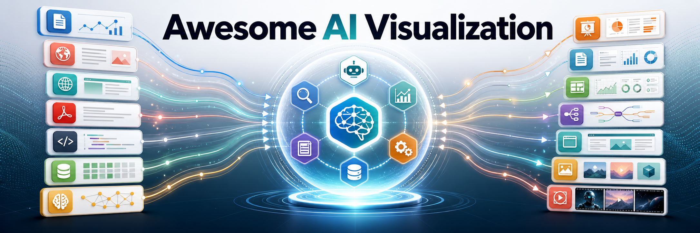

[English](README.md) | 简体中文 | [繁體中文](README.zh-TW.md) | [日本語](README.ja.md) | [한국어](README.ko.md) | [Español](README.es.md) | [Türkçe](README.tr.md) | [Русский](README.ru.md)

> [!NOTE]
> 本项目由 RenaissanceMind Agent 辅助自动更新。工具信息、Star、许可证和服务条款可能会变化，使用前请核实对应官网或仓库。

一个关于 AI 可视化与内容呈现的精选目录：收集使用 LLM 或 Agent，把论文、新闻、网页、文档、代码库、数据集和知识集合转成“给人看的”视觉产物的工具、网站、开源项目、Agent Skill 和 MCP Server。

这个列表按**信息来源**、**工具形态**、**产出物形式**和**依赖类型**标注。PPT 只是产出物之一；同一个工具也可能同时产出报告、网页、图表、思维导图或代码地图。

## Latest Refresh (2026-08-27)

| Project | Catalog focus |
| --- | --- |
| [all2md](https://github.com/thomas-villani/all2md) | Python library, CLI, and MCP server that converts PDFs, Office files, HTML, email, spreadsheets, and 40+ formats into LLM-ready Markdown, then renders Markdown back to DOCX, PDF, PPTX, HTML, and browser previews. |
| [Google Workspace MCP Server](https://github.com/taylorwilsdon/google_workspace_mcp) | Google Workspace MCP server and CLI with OAuth, local or remote deployment, and 120+ tools for agents to read, create, edit, and manage Google Docs, Sheets, Slides, Drive files, Forms, and related Workspace artifacts. |
| [claude-code-video-toolkit](https://github.com/digitalsamba/claude-code-video-toolkit) | Claude Code video-production workspace with skills, commands, templates, Remotion, FFmpeg, Playwright recording, voice, image, music, and open-model video tools for turning prompts, demos, and explainers into rendered MP4s. |
| [local-dashboard-builder](https://github.com/walm00/local-dashboard-builder) | Claude Code plugin and skill that walks a repo through a manifest-tracked workflow to scaffold zero-dependency local HTML decision dashboards from CSV, SQLite, git, subprocess, filesystem, or custom collectors. |
| [PPT-KIT](https://github.com/loonghao/ppt-kit) | PowerPoint Office add-in with an MCP bridge server, WebSocket bridge, Markdown editor, code highlighting, Mermaid rendering, and Office.js operations for creating, syncing, and manipulating live PowerPoint slides. |
| [Xmind Generator MCP Server](https://github.com/BangyiZhang/xmind-generator-mcp) | Node.js MCP server that lets LLM clients generate editable Xmind mind maps with hierarchical topics, notes, labels, markers, and relationships, and read existing .xmind files back out as Markdown outlines. |
| [Token Dashboard](https://github.com/nateherkai/token-dashboard) | Local, no-telemetry dashboard that reads Claude Code JSONL transcripts and turns them into per-prompt cost analytics, tool and file heatmaps, subagent attribution, cache analytics, project comparisons, and rule-based tips. |
| [Claude Usage Dashboard](https://github.com/phuryn/claude-usage) | Dependency-free local web app and VS Code extension that scans Claude Code session logs and visualizes token usage, model mix, sessions, projects, costs, hourly activity, and collapsible Chart.js dashboard sections. |

## ✨ 推荐使用方式

| 使用者 | 建议 |
| --- | --- |
| 🤖 For Agent | 安装/启用 [`ai-visualization-advisor`](skills/ai-visualization-advisor/SKILL.md) skill，让 Agent 根据信息源、目标读者和使用限制，建议合适的信息呈现形式与工具；它会优先读取 [`data/catalog.yml`](data/catalog.yml) 和 [`data/tool-research.yml`](data/tool-research.yml)。 |
| 👤 For Human | 查阅当前 README，或访问 [awesome-ai-visualization.renaissancemind.ai](https://awesome-ai-visualization.renaissancemind.ai/)（Recommended）浏览和筛选工具。 |

## 目录

- [主工作流工具](#主工作流工具)
- [辅助、前后处理与小工具](#辅助前后处理与小工具)
- [怎么筛选工具](#怎么筛选工具)
- [继续发现更多工具](#继续发现更多工具)
- [数据](#数据)
- [贡献](#贡献)

## 主工作流工具

这一部分放“从信息来源直接生成面向人阅读/展示的产物”的工具。每行都同时标注三条轴：信息来源、工具形态、产出物形式。

### 论文、科研资料与学术检索

从论文、科研主题和文献库出发，生成图形摘要、报告、课程、文献地图或学术传播产物。

| 项目 | 信息来源 | 工具形态 | 产出物形式 | 依赖类型 |
| --- | --- | --- | --- | --- |
| [Paper2Any](https://github.com/OpenDCAI/Paper2Any)  | 论文/科研资料 | 开源应用/框架 | 图形摘要/信息图 / PPT/演示文稿 / 网页/交互页面 | 本地语言环境 / 模型 API / 文档解析/OCR / 渲染/导出 / GPU/加速器 / 模板/素材 |
| [paper-2-web](https://github.com/davila7/claude-code-templates/blob/main/cli-tool/components/skills/scientific/paper-2-web/SKILL.md?plain=1)  | 论文/科研资料 | Agent Skill | 图形摘要/信息图 / PPT/演示文稿 / 网页/交互页面 | Agent 宿主 / 模型 API / 本地语言环境 / 渲染/导出 / 模板/素材 |
| [paper-to-course](https://github.com/ZeroxZhang/paper-to-course)  | 论文/科研资料 | Agent Skill | 网页/交互页面 / 问答/学习材料 | Agent 宿主 / 模型 API / 本地语言环境 / 渲染/导出 |
| [Auto-Research-In-Sleep](https://github.com/wanshuiyin/Auto-claude-code-research-in-sleep)  | 论文/科研资料 | Skill 集合 | 报告/长文档 / 证据表 | Agent 宿主 / 模型 API / 本地语言环境 / 系统工具 / 渲染/导出 / 模板/素材 |
| [AI Research SKILLs](https://github.com/Orchestra-Research/AI-Research-SKILLs)  | Papers/research / Codebase / Data/tables / Text/ideas | Skill collection | Long report / Evidence table / Structured data/Markdown / Architecture/flow diagram | Agent host / Local runtime / External search/data / Code analysis / Rendering/export |
| [scientific-agent-skills](https://github.com/K-Dense-AI/scientific-agent-skills)  | 论文/科研资料 | Skill 集合 | 图形摘要/信息图 / PPT/演示文稿 / 网页/交互页面 | Agent 宿主 / 模型 API / 外部检索/数据源 / 渲染/导出 |
| [claude-scientific-writer](https://github.com/K-Dense-AI/claude-scientific-writer)  | 论文/科研资料 | Agent Skill | 报告/长文档 / 证据表 | Agent 宿主 / 模型 API / 外部检索/数据源 / 模板/素材 |
| [SciGA](https://github.com/IyatomiLab/SciGA)  | 论文/科研资料 | 数据集/评测 | 图形摘要/信息图 / PPT/演示文稿 / 网页/交互页面 | 本地语言环境 / 文档解析/OCR / GPU/加速器 |
| [Academic Figures](https://github.com/sai-tv/academic-figures)  | 论文/科研资料 / 文本/想法 | Agent Skill | 图形摘要/信息图 / SVG/PNG/PDF | Agent 宿主 / 模型 API / 渲染/导出 / 模板/素材 |
| [PaperBanana](https://github.com/dwzhu-pku/PaperBanana)  | 论文/科研资料 / 文本/想法 | 开源应用/框架 | 图形摘要/信息图 / SVG/PNG/PDF | 本地语言环境 / 模型 API / 文档解析/OCR / 外部检索/数据源 / 渲染/导出 / 模板/素材 |
| [PaperBanana Skills](https://github.com/PlutoLei/paperbanana-skill)  | 论文/科研资料 / PDF/文档 / 数据/表格 / 文本/想法 | Agent Skill | 图形摘要/信息图 / PPT/演示文稿 / SVG/PNG/PDF | Agent 宿主 / 模型 API / 本地语言环境 / 文档解析/OCR / 外部检索/数据源 / 渲染/导出 / 模板/素材 |
| [academic-slides-skill](https://github.com/Rebeccca2000/academic-slides-skill)  | 论文/科研资料 / PDF/文档 / 文本/想法 | Agent Skill | PPT/演示文稿 / 网页/交互页面 / SVG/PNG/PDF | Agent 宿主 / 本地语言环境 / 渲染/导出 / 模板/素材 |
| [Academic Slides](https://github.com/rkdud007/academic-slides)  | Papers/research / PDF/documents / Text/ideas | Agent skill | PPT/deck / Web/interactive page / SVG/PNG/PDF | Agent host / Local runtime / Rendering/export / Templates/assets |
| [academic-pptx-skill](https://github.com/Gabberflast/academic-pptx-skill)  | 论文/科研资料 / PDF/文档 / 文本/想法 | Agent Skill | PPT/演示文稿 / 报告/简报 | Agent 宿主 / 模型 API / 渲染/导出 / 模板/素材 |
| [PaperToSlides](https://github.com/jxtse/PaperToSlides)  | 论文/科研资料 / PDF/文档 | 开源应用/框架 | PPT/演示文稿 | 本地语言环境 / 模型 API / 文档解析/OCR / 渲染/导出 / GPU/加速器 |
| [Paper2Slides](https://github.com/pchi123/Paper2Slides)  | Papers/research | Open-source app/framework | Graphical abstract/infographic / PPT/deck | Local runtime / Document parsing/OCR / Rendering/export / Templates/assets |
| [AI-Researcher](https://github.com/HKUDS/AI-Researcher)  | 论文/科研资料 | 研究原型 | 报告/长文档 / 证据表 | 本地语言环境 / 模型 API / 外部检索/数据源 / GPU/加速器 |
| [Elicit](https://elicit.com/) | 论文/科研资料 | 产品/SaaS | 报告/简报 / 证据表 | 浏览器/账号 / 外部检索/数据源 |
| [Paperguide](https://paperguide.ai/) | 论文/科研资料 | 产品/SaaS | 报告/简报 / 证据表 | 浏览器/账号 / 外部检索/数据源 |
| [SciSpace Infographic Maker](https://scispace.com/agents/infographic-maker-hbcwetac) | 论文/科研资料 | 产品/SaaS | 图形摘要/信息图 / PPT/演示文稿 / 网页/交互页面 | 浏览器/账号 / 模板/素材 |
| [Grabstract](https://grabstract.io/graphical-abstracts) | 论文/科研资料 | 产品/SaaS | 图形摘要/信息图 / PPT/演示文稿 / 网页/交互页面 | 浏览器/账号 / 模板/素材 |
| [Open Knowledge Maps](https://openknowledgemaps.org/) | 论文/科研资料 / 引用网络 | 产品/SaaS | 文献地图/知识地图 | 浏览器/账号 / 外部检索/数据源 |
| [Connected Papers](https://www.connectedpapers.com/) | 论文/科研资料 / 引用网络 | 产品/SaaS | 文献地图/知识地图 | 浏览器/账号 / 外部检索/数据源 |
| [ResearchRabbit](https://www.researchrabbit.ai/) | 论文/科研资料 / 引用网络 | 产品/SaaS | 文献地图/知识地图 | 浏览器/账号 / 外部检索/数据源 |
| [Litmaps](https://www.litmaps.com/) | 论文/科研资料 / 引用网络 | 产品/SaaS | 文献地图/知识地图 | 浏览器/账号 / 外部检索/数据源 |
| [Consensus](https://consensus.app/) | 论文/科研资料 | 产品/SaaS | 报告/简报 / 证据表 | 浏览器/账号 / 外部检索/数据源 |
 | [FigureWeave](https://github.com/Krisocer/FigureWeave)  | Papers/research / Text/ideas | Open-source app/framework | Graphical abstract/infographic / SVG/PNG/PDF / Web/interactive page | Local runtime / Model API / GPU/accelerator / Rendering/export |

| [Interactive Presentation Skill](https://github.com/MinnThikeTunn/Interactive-Presentation-Skill)  | Papers/research / PDF/documents / Code/technical text | Agent skill | PPT/deck / Web/interactive page / Graphical abstract/infographic | Agent host / Local runtime / Rendering/export |
| [BERIL Presentation Maker Skill](https://github.com/kbaseincubator/beril-presentation-maker-skill)  | 论文/科研资料 / PDF/文档 / 数据/表格 / 知识库/个人资料 | Agent Skill | PPT/演示文稿 / 图形摘要/信息图 / 报告/简报 | Agent 宿主 / 本地语言环境 / 模型 API / 文档解析/OCR / 渲染/导出 / 模板/素材 |

### 网页、新闻、资讯与行业情报

从网页、搜索结果、新闻流、市场数据或威胁情报出发，生成带来源的报告、仪表盘和知识图。

| 项目 | 信息来源 | 工具形态 | 产出物形式 | 依赖类型 |
| --- | --- | --- | --- | --- |
| [Paper Share Skills](https://github.com/yhbcode000/paper-share-skills)  | Papers/research / PDF/documents | Skill collection / Agent skill | PPT/deck / Video/audio / Graphical abstract/infographic | Agent host / Local runtime / System tools / Document parsing/OCR / Rendering/export / GPU/accelerator / Templates/assets |
| [Lab Meeting Report Skill](https://github.com/LikC1606/lab-meeting-report-skill)  | Papers/research / PDF/documents / Data/tables / Knowledge base | Agent skill | Long report / Briefing/report / PPT/deck / Evidence table / Structured data/Markdown | Agent host / Local runtime / Document parsing/OCR / External search/data / Rendering/export / Templates/assets |
| [GPT Researcher](https://github.com/assafelovic/gpt-researcher)  | 网页/搜索结果 / 新闻/资讯 | 开源应用/框架 | 报告/长文档 / 引用答案 | 本地语言环境 / 模型 API / 外部检索/数据源 / 存储/索引 |
| [STORM](https://github.com/stanford-oval/storm)  | 网页/搜索结果 / 新闻/资讯 | 开源应用/框架 | 报告/长文档 / 引用答案 | 本地语言环境 / 模型 API / 外部检索/数据源 / 存储/索引 |
| [Scira](https://github.com/zaidmukaddam/scira)  | 网页/搜索结果 / 新闻/资讯 | 开源应用/框架 / Bot/助手 | 报告/长文档 / 引用答案 | 本地语言环境 / 模型 API / 外部检索/数据源 / 存储/索引 |
| [Vane](https://github.com/ItzCrazyKns/Vane)  | 网页/搜索结果 / 新闻/资讯 | 开源应用/框架 / Bot/助手 | 报告/长文档 / 引用答案 | 本地语言环境 / 模型 API / 外部检索/数据源 / 存储/索引 |
| [FinRobot](https://github.com/AI4Finance-Foundation/FinRobot)  | 新闻/资讯 / 数据/表格 / 网页/搜索结果 | 开源应用/框架 | 报告/长文档 / 图表/仪表盘 | 本地语言环境 / 模型 API / 外部检索/数据源 / 渲染/导出 |
| [Market-Intelligence-Agent](https://github.com/vikas-kashyap97/Market-Intelligence-Agent)  | 新闻/资讯 / 数据/表格 / 网页/搜索结果 | 开源应用/框架 | 图表/仪表盘 / 报告/简报 | 本地语言环境 / 模型 API / 外部检索/数据源 / 渲染/导出 / 存储/索引 |
| [World Monitor](https://github.com/FutureSpeakAI/agent-fridays-global-intelligence-monitor)  | 新闻/资讯 / 网页/搜索结果 | 开源应用/框架 | 图表/仪表盘 / 报告/简报 | 本地语言环境 / 模型 API / 外部检索/数据源 / 渲染/导出 / 存储/索引 |
| [World Intelligence MCP Server](https://github.com/marc-shade/world-intel-mcp)  | 新闻/资讯 / 数据/表格 / 数据库 / 网页/搜索结果 | MCP Server | 图表/仪表盘 / 报告/简报 / 表格/时间线 / 证据表 | MCP Client / 本地语言环境 / 外部检索/数据源 / 存储/索引 / 渲染/导出 |
| [groundstation](https://github.com/dannybauman/groundstation)  | Data/tables / 网页/搜索结果 / 新闻/资讯 | MCP Server / Agent Skill / 开源应用/框架 | 图表/仪表盘 / 报告/简报 / 网页/交互页面 | Agent 宿主 / MCP Client / 本地语言环境 / External search/data / 渲染/导出 / 存储/索引 |
| [OSSInsight](https://github.com/pingcap/ossinsight)  | 代码库 / 数据/表格 / 网页/搜索结果 | 开源应用/框架 / 产品/SaaS | 图表/仪表盘 / 报告/简报 | 浏览器/账号 / 外部检索/数据源 / 渲染/导出 / 存储/索引 |

### 文档、PDF 与知识库

从 PDF、Office 文档、网页、个人资料库或团队知识库出发，生成简报、问答、学习材料和知识地图。

| 项目 | 信息来源 | 工具形态 | 产出物形式 | 依赖类型 |
| --- | --- | --- | --- | --- |
| [notex](https://github.com/smallnest/notex)  | PDF/文档 / 网页/搜索结果 / 知识库/个人资料 | 开源应用/框架 | 报告/简报 / 思维导图/知识地图 / 问答/学习材料 | 本地语言环境 / 模型 API / 文档解析/OCR / 渲染/导出 / 存储/索引 |
| [LLM Wiki](https://github.com/nashsu/llm_wiki)  | PDF/documents / Web/search / Knowledge base | Open-source app/framework | Long report / Mind map/knowledge map / Web/interactive page | Browser/account / Local runtime / Model API / Document parsing/OCR / Storage/index / Rendering/export |
| [Open Notebook](https://github.com/lfnovo/open-notebook)  | PDF/文档 / 网页/搜索结果 / 知识库/个人资料 | 开源应用/框架 | 报告/简报 / 思维导图/知识地图 / 问答/学习材料 | 本地语言环境 / 模型 API / 文档解析/OCR / 存储/索引 |
| [SurfSense](https://github.com/MODSetter/SurfSense)  | PDF/文档 / 网页/搜索结果 / 知识库/个人资料 | 开源应用/框架 | 报告/简报 / 思维导图/知识地图 / 问答/学习材料 | 本地语言环境 / 模型 API / 外部检索/数据源 / 存储/索引 |
| [DecipherIt](https://github.com/mtwn105/decipher-research-agent)  | PDF/documents / Web/search / Knowledge base / Any/multi-source | Open-source app/framework | Briefing/report / Mind map/knowledge map / Q&A/study material / Video/audio | Browser/account / Local runtime / Model API / Document parsing/OCR / External search/data / Storage/index / Rendering/export |
| [Danmo Work](https://github.com/danmo-ai/danmo-work)  | 任意/多源 / 代码库 / 数据/表格 / 知识库/个人资料 | 开源应用/框架 / Bot/助手 | 报告/长文档 / PPT/演示文稿 / 表格/时间线 / 网页/交互页面 / 结构化数据/Markdown | Agent 宿主 / 模型 API / 本地语言环境 / MCP Client / 外部检索/数据源 / 存储/索引 / 渲染/导出 |
| [NotebookLM](https://notebooklm.google/) | PDF/文档 / 网页/搜索结果 / 知识库/个人资料 | 产品/SaaS / Bot/助手 | 报告/简报 / 思维导图/知识地图 / 问答/学习材料 | 浏览器/账号 |
| [NotebookLM AI Plugin](https://github.com/proyecto26/notebooklm-ai-plugin)  | PDF/文档 / 网页/搜索结果 / 知识库/个人资料 / 任意/多源 | Agent Skill / Bot/助手 | PPT/演示文稿 / 视频/音频 / 思维导图/知识地图 / 信息图/视觉报告 / 报告/简报 / 表格/时间线 / 问答/学习材料 | Agent 宿主 / 浏览器/账号 / 本地语言环境 / 文档解析/OCR / 外部检索/数据源 / 渲染/导出 |
| [printable-docs-skill](https://github.com/sam33339999/printable-docs-skill)  | 文本/想法 / PDF/文档 / Office 文档 | Agent Skill | 报告/长文档 / 信息图/视觉报告 / PPT/演示文稿 / SVG/PNG/PDF | Agent 宿主 / 本地语言环境 / 渲染/导出 / 模板/素材 |
| [LaTeX Document Skill](https://github.com/ndpvt-web/latex-document-skill)  | PDF/documents / Data/tables / Text/ideas | Agent skill | Long report / SVG/PNG/PDF / Chart/dashboard / Infographic/visual report / Structured data/Markdown | Agent host / Local runtime / System tools / Document parsing/OCR / Rendering/export / Templates/assets |
| [notebooklm-py](https://github.com/teng-lin/notebooklm-py)  | PDF/documents / Web/search / Knowledge base / Any/multi-source | Agent skill / API/SDK/library | PPT/deck / Infographic/visual report / Mind map/knowledge map / Video/audio / Table/timeline / Structured data/Markdown | Agent host / Browser/account / Local runtime / Document parsing/OCR / External search/data / Rendering/export |
| [notebooklm-skill](https://github.com/claude-world/notebooklm-skill)  | PDF/documents / Web/search / Knowledge base / Any/multi-source | Agent skill / MCP server | PPT/deck / Briefing/report / Mind map/knowledge map / Infographic/visual report / Video/audio / Table/timeline / Q&A/study material | Agent host / MCP client / Browser/account / Local runtime / Document parsing/OCR / External search/data / Rendering/export |
| [NotebookLM MCP](https://github.com/alfredang/notebooklm-mcp)  | PDF/documents / Web/search / Knowledge base / Any/multi-source | MCP server | PPT/deck / Mind map/knowledge map / Infographic/visual report / Video/audio / Briefing/report / Q&A/study material | MCP client / Browser/account / Local runtime / Document parsing/OCR / External search/data / Rendering/export |
| [NotebookLM CLI & MCP Server](https://github.com/jacob-bd/notebooklm-mcp-cli)  | PDF/documents / Web/search / Knowledge base / Any/multi-source | MCP server / API/SDK/library / Agent skill | PPT/deck / Mind map/knowledge map / Infographic/visual report / Video/audio / Briefing/report / Table/timeline / Q&A/study material | MCP client / Browser/account / Local runtime / Document parsing/OCR / External search/data / Rendering/export |
| [notebooklm-claude-workflows](https://github.com/CreatmanCEO/notebooklm-claude-workflows)  | PDF/documents / Web/search / Knowledge base / Data/tables / Any/multi-source | Agent skill | Long report / Briefing/report / Mind map/knowledge map / Infographic/visual report / PPT/deck / Video/audio / Table/timeline | Agent host / MCP client / Browser/account / Local runtime / Document parsing/OCR / External search/data / Rendering/export / Storage/index |
| [qiaomu-anything-to-notebooklm](https://github.com/joeseesun/qiaomu-anything-to-notebooklm)  | PDF/文档 / 网页/搜索结果 / 知识库/个人资料 / 任意/多源 | Agent Skill | PPT/演示文稿 / 思维导图/知识地图 / 视频/音频 / 问答/学习材料 / 报告/简报 | Agent 宿主 / 浏览器/账号 / 本地语言环境 / 文档解析/OCR / 外部检索/数据源 / 渲染/导出 |
| [Claude Memory Knowledge Graph Visualizer](https://github.com/srijanshukla18/claude-memory-viz)  | Knowledge base / Any/multi-source | Open-source app/framework | Mind map/knowledge map / Web/interactive page / Structured data/Markdown | Local runtime / Rendering/export / Storage/index |
| [mindmap-markmap-viewer](https://github.com/Jaderson-bit/mindmap-markmap-viewer)  | Text/ideas / Knowledge base / PDF/documents | Agent skill | Whiteboard/mind map / Web/interactive page / SVG/PNG/PDF | Agent host / Local runtime / Rendering/export |
| [SimpleMindMap MCP Server](https://github.com/wanglin2/mind-map-mcp)  | Text/ideas / Knowledge base | MCP server | Whiteboard/mind map / SVG/PNG/PDF / Structured data/Markdown | MCP client / Local runtime / Browser/account / Rendering/export |
| [Report Skills](https://github.com/dashaworks/report-skills)  | Any/multi-source / Text/ideas / Web/search | Skill collection / MCP server | Long report / Web/interactive page / PPT/deck | Agent host / MCP client / Model API / Browser/account / Rendering/export / Templates/assets |
| [SEO Client Report Skill](https://github.com/dashaworks/seo-client-report-skill)  | 网页/搜索结果 / Data/tables / Any/multi-source | Agent Skill / MCP Server | 报告/长文档 / 网页/交互页面 / 图表/仪表盘 | Agent 宿主 / MCP Client / 模型 API / External search/data / 渲染/导出 / 模板/素材 |
| [Video Analysis MCP Service](https://github.com/tjh19971228/mcp_video_analysis)  | 视频/音频 / 网页/搜索结果 | MCP Server | 思维导图/知识地图 / 白板/思维导图 / SVG/PNG/PDF | MCP Client / 本地语言环境 / 模型 API / External search/data / 渲染/导出 |
| [HTML Express](https://github.com/zjp1997720/html-express)  | Text/ideas / Data/tables / Web/search / Any/multi-source | Agent skill | Long report / Web/interactive page / Chart/dashboard / Infographic/visual report | Agent host / Local runtime / Rendering/export / Templates/assets |
| [AI Marketing Suite for Claude Code](https://github.com/zubair-trabzada/ai-marketing-claude)  | 网页/搜索结果 / 新闻/资讯 / 文本/想法 | Skill 集合 | 报告/长文档 / 报告/简报 / 证据表 | Agent 宿主 / 本地语言环境 / 外部检索/数据源 / 渲染/导出 / 模板/素材 |
| [AI Summary Skill for Claude Code](https://github.com/molly554/Multi_sources_summarizition_lynote.ai)  | PDF/文档 / 网页/搜索结果 / 视频/音频 / 任意/多源 | Agent Skill | 报告/长文档 / 网页/交互页面 / 图表/Mermaid / 结构化数据/Markdown | Agent 宿主 / 本地语言环境 / 文档解析/OCR / 外部检索/数据源 / 渲染/导出 |
| [Carbone MCP Server](https://github.com/carboneio/carbone-mcp)  | 数据/表格 / Office 文档 / 文本/想法 | MCP Server / 产品/SaaS | 报告/长文档 / PPT/演示文稿 / SVG/PNG/PDF / 结构化数据/Markdown | MCP Client / 浏览器/账号 / 模型 API / 渲染/导出 / 模板/素材 / 外部检索/数据源 |
| [Sigrid Report Generator](https://github.com/Software-Improvement-Group/sigrid-report-generator)  | 数据/表格 / 代码库 / Office 文档 | 开源应用/框架 / API/SDK/库 | 报告/长文档 / PPT/演示文稿 / 图表/仪表盘 | 本地语言环境 / 浏览器/账号 / 外部检索/数据源 / 渲染/导出 / 模板/素材 |

### 代码库与软件系统

把 GitHub 仓库、本地代码、依赖和 diff 转成架构图、代码地图、Repo Wiki 或知识图谱。

| 项目 | 信息来源 | 工具形态 | 产出物形式 | 依赖类型 |
| --- | --- | --- | --- | --- |
| [GitDiagram](https://github.com/ahmedkhaleel2004/gitdiagram)  | 代码库 | 开源应用/框架 | 代码地图/Repo Wiki / 架构图/流程图 | 浏览器/账号 / 模型 API / 代码分析工具 |
| [CodeBoarding](https://github.com/Codeboarding/CodeBoarding)  | 代码库 | 开源应用/框架 | 代码地图/Repo Wiki / 架构图/流程图 | 本地语言环境 / 模型 API / 代码分析工具 / 渲染/导出 / 存储/索引 |
| [Understand-Anything](https://github.com/Egonex-AI/Understand-Anything)  | 代码库 | Agent Skill | 代码地图/Repo Wiki / 架构图/流程图 | Agent 宿主 / 本地语言环境 / 模型 API / 代码分析工具 / 存储/索引 |
| [GitNexus](https://github.com/abhigyanpatwari/GitNexus)  | 代码库 | 开源应用/框架 / MCP Server | 代码地图/Repo Wiki / 架构图/流程图 / 网页/交互页面 | MCP Client / 本地语言环境 / 代码分析工具 / 存储/索引 / 渲染/导出 |
| [Django ORM Lens](https://github.com/FROWNINGdev/django-orm-lens)  | 代码库 / 数据库 / 代码/技术描述 | MCP Server / 开源应用/框架 | 代码地图/Repo Wiki / 架构图/流程图 / 图表/仪表盘 | MCP Client / 本地语言环境 / 代码分析工具 / 渲染/导出 / 系统工具 |
| [DeepWiki Open](https://github.com/AsyncFuncAI/deepwiki-open)  | 代码库 | 开源应用/框架 | 代码地图/Repo Wiki / 架构图/流程图 | 本地语言环境 / 模型 API / 代码分析工具 / 渲染/导出 |
| [PocketFlow Tutorial Codebase Knowledge](https://github.com/The-Pocket/PocketFlow-Tutorial-Codebase-Knowledge)  | 代码库 | 开源应用/框架 | 代码地图/Repo Wiki / 架构图/流程图 | 本地语言环境 / 模型 API / 代码分析工具 / 渲染/导出 |
| [local-deepwiki-mcp](https://github.com/UrbanDiver/local-deepwiki-mcp)  | 代码库 | MCP Server / 开源应用/框架 | 代码地图/Repo Wiki / 架构图/流程图 / 网页/交互页面 / SVG/PNG/PDF | MCP Client / 本地语言环境 / 模型 API / 代码分析工具 / 存储/索引 / 渲染/导出 / GPU/加速器 |
| [GitVizz](https://github.com/adithya-s-k/GitVizz)  | 代码库 | 开源应用/框架 | 代码地图/Repo Wiki / 架构图/流程图 | 浏览器/账号 / 模型 API / 代码分析工具 / 渲染/导出 |
| [codeflow](https://github.com/braedonsaunders/codeflow)  | 代码库 | 开源应用/框架 | 代码地图/Repo Wiki / 架构图/流程图 | 浏览器/账号 / 模型 API / 代码分析工具 / 渲染/导出 |
| [oh-my-mermaid](https://github.com/oh-my-mermaid/oh-my-mermaid)  | 代码库 | Agent Skill | 代码地图/Repo Wiki / 架构图/流程图 | Agent 宿主 / 模型 API / 代码分析工具 / 渲染/导出 |
| [codag-visualizer](https://github.com/codag-megalith/codag-visualizer)  | 代码库 | 开源应用/框架 | 代码地图/Repo Wiki / 架构图/流程图 | 本地语言环境 / 代码分析工具 / 渲染/导出 |
| [codebase-memory-mcp](https://github.com/DeusData/codebase-memory-mcp)  | 代码库 | MCP Server | 代码地图/Repo Wiki / 架构图/流程图 | MCP Client / 本地语言环境 / 代码分析工具 / 存储/索引 |
| [CodeAtlas](https://github.com/lucyb0207/CodeAtlas)  | 代码库 | 开源应用/框架 | 代码地图/Repo Wiki / 架构图/流程图 | 本地语言环境 / 代码分析工具 / 渲染/导出 |
| [devlensOSS](https://github.com/devlensio/devlensOSS)  | 代码库 | 开源应用/框架 | 代码地图/Repo Wiki / 架构图/流程图 | 本地语言环境 / 代码分析工具 / 渲染/导出 |
| [Visual-Explainer](https://github.com/jircik/Visual-Explainer)  | 代码库 | Agent Skill | 代码地图/Repo Wiki / 架构图/流程图 | Agent 宿主 / 模型 API / 代码分析工具 / 渲染/导出 |
| [codemap-skill](https://github.com/Asixa/codemap-skill)  | 代码库 | Agent Skill | 代码地图/Repo Wiki / 架构图/流程图 | Agent 宿主 / 模型 API / 代码分析工具 |
| [DeepWiki](https://docs.devin.ai/work-with-devin/deepwiki) | 代码库 | 产品/SaaS | 代码地图/Repo Wiki / 架构图/流程图 | 浏览器/账号 / 代码分析工具 |
| [CodeSee](https://www.codesee.io/) | 代码库 | 产品/SaaS | 代码地图/Repo Wiki / 架构图/流程图 | 浏览器/账号 / 代码分析工具 |
| [Knossos MCP](https://github.com/AraneaDev/Knossos-MCP)  | Codebase | MCP server | Code map/Repo Wiki / Architecture/flow diagram / Diagram/Mermaid / Evidence table | MCP client / Local runtime / Code analysis / Storage/index / Rendering/export / System tools |
| [NodeSecure Report](https://github.com/NodeSecure/report)  | Codebase / Data/tables | Open-source app/framework / API/SDK/library | Code map/Repo Wiki / Long report / SVG/PNG/PDF | Local runtime / External search/data / Code analysis / Rendering/export / System tools |
| [AI Mind Map](https://github.com/shdra06/ai-mind-map)  | 代码库 / 知识库/个人资料 | MCP Server / 开源应用/框架 | 代码地图/Repo Wiki / 思维导图/知识地图 / 网页/交互页面 | MCP Client / Agent 宿主 / 本地语言环境 / 代码分析工具 / 存储/索引 / 渲染/导出 |
| [Architecture Discovery MCP](https://github.com/rdtan/architecture-discovery-mcp)  | 代码库 | MCP Server | 代码地图/Repo Wiki / 架构图/流程图 / PPT/演示文稿 / 表格/时间线 | MCP Client / 本地语言环境 / 代码分析工具 / 渲染/导出 / 模板/素材 |
 | [Architecture Review Agent Sample](https://github.com/Azure-Samples/agent-architecture-review-sample)  | Code/technical text / PDF/documents / Text/ideas | Open-source app/framework / Bot/assistant | Code map/repo wiki / Architecture/flow diagram / Briefing/report / Evidence table | Local runtime / Model API / MCP client / Rendering/export / External search/data |
| [Blueprint MCP](https://github.com/ArcadeAI/blueprint-mcp)  | Codebase / Knowledge base / Multi-source | MCP server / API/SDK/library | Code map/repo wiki / Architecture/flow diagram / SVG/PNG/PDF | MCP client / Agent host / Model API / External data / Code analysis / Rendering/export |
| [Noodles](https://github.com/unslop-xyz/noodles)  | Codebase | Open-source app/framework | Code map/repo wiki / Architecture/flow diagram / Web/interactive page | Local runtime / Code analysis / Rendering/export |
| [Graphify](https://github.com/Graphify-Labs/graphify)  | Codebase / PDF/documents / Any/multi-source | Agent skill / API/SDK/library | Code map/repo wiki / Mind map/knowledge map / Web/interactive page / Long report / Structured data/Markdown | Agent host / Local runtime / Code analysis / Storage/index / Model API / Rendering/export |
| [AgentDoc](https://github.com/jonverrier/AgentDoc)  | Codebase / Code/technical text | MCP server | Code map/repo wiki / Architecture/flow diagram / Diagram/Mermaid / Long report | MCP client / Agent host / Local runtime / Code analysis / Rendering/export |
| [Hypermnesia MCP Viz](https://github.com/cdeust/cortex-viz)  | Codebase / Knowledge base / Any/multi-source | MCP server | Code map/repo wiki / Mind map/knowledge map / Web/interactive page / Architecture/flow diagram | MCP client / Local runtime / Storage/index / Code analysis / Rendering/export |
| [Claude Setup Dashboard](https://github.com/ANDRS-Projects/claude-setup-dashboard)  | Codebase / Knowledge base / Data/tables | Agent skill | Chart/dashboard / Code map/repo wiki / Structured data/Markdown | Agent host / Local runtime / Code analysis / Rendering/export |
| [lithium-kb](https://github.com/liulinnuha/lithium-kb)  | Codebase / Knowledge base / Any/multi-source | MCP server / API/SDK/library | Code map/repo wiki / Mind map/knowledge map / Web/interactive page | MCP client / Local runtime / Storage/index / Code analysis / Rendering/export |
| [Hexwright](https://github.com/vonkernel/hexwright)  | 代码库 / 代码/技术描述 | MCP Server / 开源应用/框架 | 代码地图/Repo Wiki / 架构图/流程图 / 证据表 | Agent 宿主 / MCP Client / 本地语言环境 / 代码分析工具 / 渲染/导出 |
| [Harnss](https://github.com/OpenSource03/harnss)  | Codebase / Knowledge base / Any/multi-source | Open-source app/framework / Bot/assistant | Code map/repo wiki / Evidence table / Web/interactive page | Agent host / MCP client / Local runtime / System tools / Storage/index / Rendering/export |
| [Claude Plugins](https://github.com/JeonJe/claude-plugins)  | Knowledge base / Data/tables / Codebase | Skill collection / Bot/assistant | Chart/dashboard / Briefing/report / Evidence table | Agent host / Local runtime / Browser/account / Rendering/export |
| [project-tracker](https://github.com/szymontex/project-tracker)  | Knowledge base / Codebase | Agent skill | Chart/dashboard / Table/timeline / Structured data/Markdown | Agent host / Local runtime / Storage/index |
| [tldr-skill](https://github.com/UpayanGhosh/tldr-skill)  | Codebase | Agent skill | Code map/repo wiki / Architecture/flow diagram / Whiteboard/mind map / Web/interactive page | Agent host / Local runtime / Code analysis / Rendering/export / Storage/index |
| [Skill Atlas](https://github.com/ddutche/skill-atlas)  | Codebase / Knowledge base | Open-source app/framework | Code map/repo wiki / Diagram/Mermaid / Architecture/flow diagram / Web/interactive page | Browser/account / Local runtime / Model API / External search/data / Storage/index / Rendering/export |

### 数据、表格与业务指标

把 CSV、数据库、指标和业务数据转成图表、仪表盘或分析报告。

| 项目 | 信息来源 | 工具形态 | 产出物形式 | 依赖类型 |
| --- | --- | --- | --- | --- |
| [lecture-to-notes](https://github.com/drpwchen/lecture-to-notes)  | Any/multi-source / PDF/documents / Office docs / Text/ideas | Open-source app/framework / Agent skill | Web/interactive page / Long report / Structured data/Markdown / SVG/PNG/PDF | Local runtime / System tools / Document parsing/OCR / Rendering/export / GPU/accelerator / Model API |
| [Re:port Flow MCP](https://github.com/re-port-flow/reportflow-mcp)  | Text/ideas / Office docs / Data/tables | MCP server / Product/SaaS | Long report / Briefing/report / SVG/PNG/PDF | MCP client / Browser/account / Local runtime / Rendering/export / Templates/assets |
| [regulated-reporting-mcp](https://github.com/dbett4/regulated-reporting-mcp)  | Office docs / Data/tables / Database | MCP server | Long report / Evidence table / Structured data/Markdown | MCP client / Local runtime / Browser/account / External data / Rendering/export / System tools |
| [Data Formulator](https://github.com/microsoft/data-formulator)  | 数据/表格 / 数据库 | 开源应用/框架 | 图表/仪表盘 / 报告/简报 | 本地语言环境 / 模型 API / 渲染/导出 |
| [LIDA](https://github.com/microsoft/lida)  | 数据/表格 / 数据库 | 开源应用/框架 | 图表/仪表盘 / 报告/简报 | 本地语言环境 / 模型 API / 渲染/导出 |
| [tufte-claude-skill](https://github.com/aref-vc/tufte-claude-skill)  | 数据/表格 / 文本/想法 | Agent Skill | 图表/仪表盘 / 信息图/视觉报告 / 报告/简报 | Agent 宿主 / 本地语言环境 / 渲染/导出 / 模板/素材 |
| [WrenAI](https://github.com/Canner/WrenAI)  | 数据/表格 / 数据库 / 知识库/个人资料 | 开源应用/框架 / Agent Skill | 图表/仪表盘 / 报告/简报 | Agent 宿主 / 本地语言环境 / 模型 API / 外部检索/数据源 / 存储/索引 |
| [Vanna](https://github.com/vanna-ai/vanna)  | 数据库 / 数据/表格 | 开源应用/框架 / API/SDK/库 | 图表/仪表盘 / 报告/简报 | 本地语言环境 / 模型 API / 外部检索/数据源 / 存储/索引 / 渲染/导出 |
| [VMind](https://github.com/VisActor/VMind)  | 数据/表格 / 文本/想法 | API/SDK/库 | 图表/仪表盘 / 信息图/视觉报告 / 图表/渲染输出 | 本地语言环境 / 模型 API / 渲染/导出 / 模板/素材 |
| [Semiotic](https://github.com/nteract/semiotic)  | 数据/表格 / DSL/代码 | API/SDK/库 / MCP Server | 图表/仪表盘 / 图表/渲染输出 / SVG/PNG/PDF | 本地语言环境 / MCP Client / 渲染/导出 / 模板/素材 |
| [chart-visualization-skills](https://github.com/antvis/chart-visualization-skills)  | 数据/表格 / 文本/想法 / 代码/技术描述 | Skill 集合 / API/SDK/库 | 图表/仪表盘 / 信息图/视觉报告 / 架构图/流程图 / 图表/渲染输出 | Agent 宿主 / 本地语言环境 / 渲染/导出 / 模板/素材 |
| [mcp-server-chart](https://github.com/antvis/mcp-server-chart)  | 数据/表格 / 文本/想法 / 数据库 | MCP Server / Skill 集合 | 图表/仪表盘 / 信息图/视觉报告 / 架构图/流程图 / 白板/思维导图 / 图表/渲染输出 | MCP Client / 本地语言环境 / 渲染/导出 |
| [mcp-dashboards](https://github.com/KyuRish/mcp-dashboards)  | 数据/表格 / 数据库 / 任意/多源 | MCP Server | 图表/仪表盘 / PPT/演示文稿 / SVG/PNG/PDF | MCP Client / Agent 宿主 / 本地语言环境 / 外部检索/数据源 / 渲染/导出 |
| [ChartPane](https://github.com/ahmadsl/chartpane)  | Data/tables / Text/ideas | MCP server / Product/SaaS | Chart/dashboard / Web/interactive page | MCP client / Agent host / Browser/account / Rendering/export |
| [DataViz by SCKelemen](https://github.com/SCKelemen/dataviz)  | Data/tables / Database / DSL/code | MCP server / API/SDK/library | Chart/dashboard / Rendered chart / SVG/PNG/PDF | MCP client / Local runtime / Rendering/export |
| [Luminon MCP Dashboard](https://github.com/luminondev/luminon-mcp-dashboard)  | 数据/表格 / 数据库 / 文本/想法 | MCP Server / 开源应用/框架 / API/SDK/库 | 图表/仪表盘 / 网页/交互页面 | MCP Client / Agent 宿主 / 本地语言环境 / 渲染/导出 / 存储/索引 |
| [DashGen](https://github.com/4mohdisa/DashGen)  | 数据/表格 / 文本/想法 | 开源应用/框架 | 图表/仪表盘 / 网页/交互页面 | 浏览器/账号 / 本地语言环境 / 模型 API / 渲染/导出 / 存储/索引 |
| [AI Dashboard Generator](https://github.com/Leniolabs/ai-data-dashboard)  | 数据/表格 | 开源应用/框架 / 产品/SaaS | 图表/仪表盘 / 网页/交互页面 | 浏览器/账号 / 本地语言环境 / 模型 API / 渲染/导出 |
| [mcp-grafana](https://github.com/grafana/mcp-grafana)  | 数据/表格 / 数据库 / 任意/多源 | MCP Server | 图表/仪表盘 / SVG/PNG/PDF / 证据表 | MCP Client / 浏览器/账号 / 外部检索/数据源 / 渲染/导出 / 系统工具 |
| [Metabase Dashboard Skill](https://github.com/TongHuaLabs/metabase-dashboard-skill)  | 数据库 / 数据/表格 | Agent Skill | 图表/仪表盘 / 证据表 | Agent 宿主 / MCP Client / 浏览器/账号 / 外部检索/数据源 / 渲染/导出 / 模板/素材 |
| [Claude Data Analysis Assistant](https://github.com/liangdabiao/claude-data-analysis)  | 数据/表格 / 数据库 | Agent Skill / 开源应用/框架 | 图表/仪表盘 / 报告/长文档 / SVG/PNG/PDF | Agent 宿主 / 本地语言环境 / 模型 API / 渲染/导出 / 模板/素材 |
| [Data Analytics Skills for Claude](https://github.com/nimrodfisher/data-analytics-skills)  | 数据/表格 / 数据库 / 文本/想法 | Skill 集合 | 图表/仪表盘 / 报告/简报 / 信息图/视觉报告 | Agent 宿主 / 模型 API / 渲染/导出 / 模板/素材 |
| [wshm](https://github.com/wshm-dev/wshm)  | 代码库 / 数据/表格 / 网页/搜索结果 | 开源应用/框架 | 图表/仪表盘 / 报告/长文档 / 网页/交互页面 | 本地语言环境 / 模型 API / 外部检索/数据源 / 代码分析工具 / 存储/索引 / 渲染/导出 |
| [MatPlotAgent](https://github.com/thunlp/MatPlotAgent)  | 数据/表格 / 数据库 | 研究原型 | 图表/仪表盘 / 报告/简报 | 本地语言环境 / 模型 API / 渲染/导出 |
| [OpenVizAI](https://github.com/OpenVizAI/OpenVizAI)  | 数据/表格 / 数据库 | 开源应用/框架 | 图表/仪表盘 / 报告/简报 | 本地语言环境 / 模型 API / 渲染/导出 |
| [generative-dashboard-builder](https://github.com/KaranChandekar/generative-dashboard-builder)  | 数据/表格 / 数据库 | 开源应用/框架 | 图表/仪表盘 / 报告/简报 | 本地语言环境 / 模型 API / 渲染/导出 / 存储/索引 |
| [DataPulse Studio](https://github.com/suryaaxc/DataPulse-Studio)  | Data/tables / Database / Text/ideas | Product/SaaS | Chart/dashboard / Web/interactive page / Briefing/report | Browser/account / Local runtime / Model API / Rendering/export |
| [OpenBI](https://github.com/narender-rk10/OpenBI)  | 数据/表格 / 数据库 | 开源应用/框架 | 图表/仪表盘 / 报告/简报 | 本地语言环境 / 模型 API / 外部检索/数据源 / 存储/索引 / 渲染/导出 |
| [powerbi-pbix-mcp](https://github.com/cyphonica/powerbi-pbix-mcp)  | Data/tables / Database / Office docs | MCP server / API/SDK/library | Chart/dashboard / Briefing/report / SVG/PNG/PDF | MCP client / Local runtime / System tools / Rendering/export / Storage/index |
| [Power BI PBIR MCP](https://github.com/bobzhou-source/powerbi-pbir-mcp)  | Data/tables / Database / Office docs | MCP server / API/SDK/library | Chart/dashboard / Briefing/report / Structured data/Markdown | MCP client / Local runtime / System tools / Rendering/export |
| [MCP Visuals Server](https://github.com/harrybin/visuals-mcp)  | Data/tables / Knowledge base / Any/multi-source | MCP server | Chart/dashboard / Table/timeline / Web/interactive page | MCP client / Local runtime / Rendering/export |
| [dataviz-mcp](https://github.com/brandonburrus/dataviz-mcp)  | Data/tables / Text/ideas | MCP server | Chart/dashboard / Web/interactive page / Rendered chart | MCP client / Local runtime / Rendering/export |
| [TableKit](https://github.com/tablekit-io/tablekit)  | Database / Data/tables | MCP server / Product/SaaS | Chart/dashboard / Web/interactive page / Structured data/Markdown | MCP client / Browser/account / External search/data / Storage/index / Rendering/export |
| [Tableau Lineage](https://github.com/andey0Saikiran/tableau-lineage)  | 数据/表格 / 数据库 / Office 文档 | 开源应用/框架 | 图表/仪表盘 / 思维导图/知识地图 / 证据表 | 浏览器/账号 / 本地语言环境 / 文档解析/OCR / 渲染/导出 |
| [Convex MCP Visual](https://github.com/waynesutton/convex-mcp-visual)  | Data/tables / Database / Codebase | MCP server / Open-source app/framework | Chart/dashboard / Web/interactive page / Diagram/Mermaid / Repo map | MCP client / Local runtime / External data / Storage/index / Rendering/export |
| [Visualization MCP Server](https://github.com/xlisp/visualization-mcp-server)  | Data/tables / Text/ideas | MCP server | Chart/dashboard / Architecture/flow diagram / SVG/PNG/PDF | MCP client / Local runtime / Rendering/export |
| [Flint Chart](https://github.com/microsoft/flint-chart)  | Data/tables / DSL/code / Text/ideas | API/SDK/library / MCP server | Chart/dashboard / Rendered chart / SVG/PNG/PDF | MCP client / Local runtime / Rendering/export / Templates/assets |
| [ECharts Bigscreen Skill](https://github.com/xiaofuqing13/echarts-bigscreen-skill)  | Data/tables / Database / Text/ideas | Agent skill | Chart/dashboard / Web/interactive page / Infographic/visual report | Agent host / Local runtime / Rendering/export / Templates/assets |
| [viz-mcp](https://github.com/mindfullabai/viz-mcp)  | 数据/表格 / 任意/多源 | MCP Server | 图表/仪表盘 / SVG/PNG/PDF / 网页/交互页面 | MCP Client / 本地语言环境 / 渲染/导出 / 存储/索引 |
| [data-visualization-mcp-server](https://github.com/kate-marine/data-visualization-mcp-server)  | 数据/表格 / 数据库 | MCP Server | 图表/仪表盘 / SVG/PNG/PDF / 网页/交互页面 | MCP Client / 本地语言环境 / 渲染/导出 / 存储/索引 |
| [MCP Reportes](https://github.com/cdgutierrez6/mcp-reportes)  | 数据/表格 / 数据库 / 网页/搜索结果 | MCP Server | 图表/仪表盘 / 报告/简报 | MCP Client / 本地语言环境 / 外部检索/数据源 / 渲染/导出 / 模板/素材 |
| [Egile MCP Reporter](https://github.com/jpoullet2000/egile-mcp-reporter)  | 文本/想法 / 数据/表格 / Office 文档 | MCP Server / API/SDK/库 | 报告/长文档 / PPT/演示文稿 / 图表/仪表盘 / 网页/交互页面 / SVG/PNG/PDF | MCP Client / 本地语言环境 / 渲染/导出 / 模板/素材 |
| [DataViz](https://github.com/SCKelemen/dataviz)  | 数据/表格 / DSL/代码 | API/SDK/库 / MCP Server | 图表/仪表盘 / 图表/渲染输出 / SVG/PNG/PDF | MCP Client / 本地语言环境 / 渲染/导出 |
| [QuickChart MCP Server](https://github.com/GongRzhe/Quickchart-MCP-Server)  | 数据/表格 / DSL/代码 | MCP Server | 图表/仪表盘 / 图表/渲染输出 / SVG/PNG/PDF | MCP Client / 本地语言环境 / 渲染/导出 / 外部检索/数据源 |
| [Elastic MCP Dashbuilder](https://github.com/elastic/example-mcp-dashbuilder)  | 数据库 / 数据/表格 | MCP Server | 图表/仪表盘 / 网页/交互页面 | MCP Client / 本地语言环境 / 外部检索/数据源 / 存储/索引 / 渲染/导出 |
| [Chart Canvas](https://github.com/gluip/chart-canvas)  | 数据/表格 / 数据库 / DSL/代码 | MCP Server | 图表/仪表盘 / 图表/Mermaid / 网页/交互页面 | MCP Client / 本地语言环境 / 外部检索/数据源 / 渲染/导出 |
| [Panel Live Server](https://github.com/panel-extensions/panel-live-server)  | 数据/表格 / DSL/代码 | MCP Server / API/SDK/库 | 图表/仪表盘 / 网页/交互页面 | MCP Client / 本地语言环境 / 渲染/导出 / 存储/索引 |
| [HoloViz MCP](https://github.com/MarcSkovMadsen/holoviz-mcp)  | 数据/表格 / DSL/代码 | MCP Server / Skill 集合 | 图表/仪表盘 / 网页/交互页面 | MCP Client / Agent 宿主 / 本地语言环境 / 渲染/导出 |
| [Data-Analysis-Agent](https://github.com/Zafer-Liu/Data-Analysis-Agent)  | Data/tables / Database | Open-source app/framework / Bot/assistant | Chart/dashboard / Briefing/report | Browser/account / Local runtime / Model API / External search/data / Rendering/export / Storage/index |
| [AI-Report-Generator](https://github.com/archanags001/AI-Report-Generator)  | Data/tables / Text/ideas | Open-source app/framework / Bot/assistant | Chart/dashboard / Long report / SVG/PNG/PDF | Browser/account / Local runtime / Model API / Rendering/export / Storage/index |
| [PedroReports](https://github.com/bobinsingh/PedroReports-LLM-Powered-Report-Tool)  | Data/tables | Open-source app/framework / Bot/assistant | Chart/dashboard / Long report / SVG/PNG/PDF | Browser/account / Local runtime / Model API / Rendering/export / Storage/index |
| [Claude Trading Skills](https://github.com/tradermonty/claude-trading-skills)  | Data/tables / News / Web/search / Knowledge base | Skill collection / Agent skill | Chart/dashboard / Briefing/report / Evidence table / Structured data/Markdown | Agent host / Local runtime / External data / Storage/index / Rendering/export |
| [root-ext-viz](https://github.com/graphgrow/root-ext-viz)  | Data/tables / DSL/code | MCP server | Chart/dashboard / Rendered chart / SVG/PNG/PDF / Structured data/Markdown | MCP client / Local runtime / Rendering/export / System tools |
| [quickai](https://github.com/AlexGladkov/quickai)  | Data/tables / Knowledge base | MCP server / API/SDK/library | Chart/dashboard / Briefing/report / Web/interactive page / Structured data/Markdown | MCP client / Agent host / Local runtime / Storage/index / Rendering/export |
| [Amplitude MCP Server](https://github.com/amplitude/mcp-server-guide)  | Database / Data/tables | MCP server / Product/SaaS | Chart/dashboard / Evidence table | MCP client / Browser/account / External search/data / Storage/index |
| [JimuReport](https://github.com/jeecgboot/jimureport)  | 数据/表格 / 数据库 / 文本/想法 | 开源应用/框架 / Agent Skill | 图表/仪表盘 / 报告/简报 / 网页/交互页面 | 浏览器/账号 / 本地语言环境 / 外部检索/数据源 / 渲染/导出 / 存储/索引 |
| [Vizro](https://github.com/mckinsey/vizro)  | 数据/表格 / 数据库 / DSL/代码 | 开源应用/框架 / API/SDK/库 | 图表/仪表盘 / 网页/交互页面 | 本地语言环境 / 渲染/导出 / 模板/素材 |
| [mcp-server-antv](https://github.com/antvis/mcp-server-antv)  | 数据/表格 / DSL/代码 / 代码/技术描述 | MCP Server | 图表/仪表盘 / 图表/渲染输出 / 架构图/流程图 | MCP Client / 本地语言环境 / 外部检索/数据源 / 渲染/导出 |
| [mviz](https://github.com/matsonj/mviz)  | 数据/表格 / 数据库 / DSL/代码 | Agent Skill / API/SDK/库 | 图表/仪表盘 / 报告/长文档 / 网页/交互页面 | Agent 宿主 / 本地语言环境 / 外部检索/数据源 / 渲染/导出 / 模板/素材 |
| [Power BI Skills for Claude Code](https://github.com/lukasreese/powerbi-claude-skills)  | 数据/表格 / 数据库 / 文本/想法 | Skill 集合 | 图表/仪表盘 / 报告/长文档 | Agent 宿主 / 本地语言环境 / 外部检索/数据源 / 渲染/导出 / 模板/素材 |
 | [Universal AI Dashboard Generator](https://github.com/shaikmohammedshoaib666/universal-ai-dashboard-generator)  | Data/tables | Open-source app/framework | Chart/dashboard / Briefing/report / SVG/PNG/PDF | Local runtime / Model API / External search/data / Rendering/export |

| [GA4 Dashboard MCP](https://github.com/TheTechBasket/GA4-Dashboard-MCP)  | Data/tables / Database / Web/search | Open-source app/framework / MCP server | Chart/dashboard / Web/interactive page | Local runtime / External search/data / MCP client / Browser/account / Rendering/export |
| [Workforce Data Explorer](https://github.com/thelancehaun/workforce-data-explorer)  | Data/tables / Database / News/intelligence | Open-source app/framework / MCP server | Chart/dashboard / Briefing/report / Structured data/Markdown | Browser/account / Local runtime / External search/data / MCP client / Rendering/export |
| [DeepBI](https://github.com/DeepInsight-AI/DeepBI)  | Data/tables / 数据库 | 开源应用/框架 | 图表/仪表盘 / Structured data/Markdown | 本地语言环境 / 模型 API / External search/data / 存储/索引 / 渲染/导出 |
| [trRUSTt](https://github.com/oshjain/trrustt)  | Data/tables / 数据库 / Office 文档 | 开源应用/框架 / MCP Server | 图表/仪表盘 / 报告/简报 | 本地语言环境 / 模型 API / 系统工具 / MCP Client / External search/data / 渲染/导出 |
| [Metabase AI Assistant](https://github.com/enessari/metabase-ai-assistant)  | 数据库 / 数据/表格 | MCP Server / API/SDK/库 | 图表/仪表盘 / 证据表 / 结构化数据/Markdown | MCP Client / 浏览器/账号 / 本地语言环境 / 外部检索/数据源 / 存储/索引 / 渲染/导出 |
| [holoviz-viz-mcp](https://github.com/ghostiee-11/holoviz-viz-mcp)  | 数据/表格 / 数据库 / DSL/代码 | MCP Server / API/SDK/库 | 图表/仪表盘 / 网页/交互页面 / SVG/PNG/PDF | MCP Client / 本地语言环境 / 渲染/导出 / 存储/索引 |
| [uc-bq-claude-skill](https://github.com/UltraCart/uc-bq-claude-skill)  | 数据库 / 数据/表格 | Agent Skill / API/SDK/库 | 图表/仪表盘 / 报告/长文档 / SVG/PNG/PDF / 网页/交互页面 | Agent 宿主 / 本地语言环境 / 外部检索/数据源 / 渲染/导出 / 模板/素材 |
| [Claude Code Toolkit Data Visualization Agent](https://github.com/rohitg00/awesome-claude-code-toolkit/blob/main/agents/data-ai/data-visualization.md?plain=1)  | 数据/表格 / DSL/代码 | Agent Skill | 图表/仪表盘 / 网页/交互页面 / SVG/PNG/PDF | Agent 宿主 / 本地语言环境 / 渲染/导出 / 模板/素材 |
| [mcp-charts](https://github.com/bonnard-data/mcp-charts)  | Data/tables / Database / DSL/code | MCP server / API/SDK/library | Chart/dashboard / Web/interactive page / Structured data/Markdown | MCP client / Agent host / Local runtime / External search/data / Rendering/export |
| [mcp-superset](https://github.com/bintocher/mcp-superset)  | Database / Data/tables | MCP server / API/SDK/library | Chart/dashboard / Evidence table / Structured data/Markdown | MCP client / Browser/account / Local runtime / External search/data / Storage/index / Rendering/export |
| [Lightdash](https://github.com/lightdash/lightdash)  | Database / Data/tables / Knowledge base | Open-source app/framework / Product/SaaS / MCP server / Agent skill | Chart/dashboard / Briefing/report / Web/interactive page / PPT/deck | Browser/account / Agent host / MCP client / Local runtime / Model API / External search/data / Storage/index / Rendering/export |
| [AI-in-One Dashboard](https://github.com/microsoft/AI-in-One-Dashboard)  | Data/tables / Office docs / Database | Open-source app/framework / API/SDK/library | Chart/dashboard / Briefing/report / Table/timeline | Browser/account / System tools / External search/data / Document parsing/OCR / Rendering/export / Templates/assets |
| [delafuente-skills](https://github.com/menpente/delafuente-skills)  | Data/tables / Text/ideas / Web/search | Skill collection | Chart/dashboard / PPT/deck / Infographic/visual report | Agent host / Local runtime / Rendering/export / Templates/assets |
| [karthik-data-visualization-skill](https://github.com/skthewimp/karthik-data-visualization-skill)  | Data/tables / Text/ideas / Code/technical text | Skill collection | Chart/dashboard / Infographic/visual report / Briefing/report / Rendered chart | Agent host / Local runtime / Rendering/export / Templates/assets |
| [Countly MCP Server](https://github.com/Countly/countly-mcp-server)  | Data/tables / Database / Web/search | MCP server / API/SDK/library | Chart/dashboard / Briefing/report / Evidence table | MCP client / Browser/account / Local runtime / External search/data / Rendering/export |
| [MCP-SQL-Visualization](https://github.com/sathwikabbaraju/MCP-SQL-Visualization)  | Database / Data/tables / Text/ideas | MCP server | Chart/dashboard / Briefing/report / SVG/PNG/PDF | MCP client / Local runtime / Model API / External search/data / Rendering/export |
| [MCP Data Visualization Server](https://github.com/xoniks/mcp-visualization-duckdb)  | 数据/表格 / 数据库 | MCP Server / API/SDK/库 | 图表/仪表盘 / 网页/交互页面 / 结构化数据/Markdown | MCP Client / 本地语言环境 / 外部检索/数据源 / 存储/索引 / 渲染/导出 |
| [Claude Code Usage Analyzer](https://github.com/aarora79/claude-code-usage-analyzer)  | Data/tables / Knowledge base | Agent skill / API/SDK/library | Chart/dashboard / Long report / Structured data/Markdown / SVG/PNG/PDF | Agent host / Local runtime / External search/data / Rendering/export |

| [Jira OKR Dashboard MCP](https://github.com/GuruR-prog/jira-okr-dashboard-mcp)  | Data/tables / Database / Knowledge base | MCP server / Open-source app/framework | Chart/dashboard / Briefing/report / Tables/timeline / Structured data/Markdown | MCP client / Browser/account / Local runtime / Model API / External search/data / Storage/index / Rendering/export |
| [Oracle FDI ADW AI Dashboard MCP](https://github.com/pareshbhangale/oracle-fdi-adw-ai-dashboard-mcp)  | Database / Data/tables / Knowledge base | MCP server / Open-source app/framework | Chart/dashboard / Long report / Structured data/Markdown | MCP client / Local runtime / External search/data / Storage/index / Rendering/export / System tools |
| [local-dashboard-builder](https://github.com/walm00/local-dashboard-builder)  | Codebase / Data/tables / Database | Agent skill | Chart/dashboard / Web/interactive page / Table/timeline | Agent host / Local runtime / Rendering/export / Storage/index |
| [Token Dashboard](https://github.com/nateherkai/token-dashboard)  | Codebase / Data/tables / Knowledge base | Open-source app/framework | Chart/dashboard / Table/timeline / Web/interactive page | Local runtime / Storage/index / Rendering/export |
| [Claude Usage Dashboard](https://github.com/phuryn/claude-usage)  | Codebase / Data/tables / Knowledge base | Open-source app/framework | Chart/dashboard / Table/timeline / Web/interactive page | Local runtime / Storage/index / Rendering/export |

### 通用文本、想法与白板图示

从提示词、草稿、白板想法或半结构化文本生成信息图、流程图、白板图和视觉报告。

| 项目 | 信息来源 | 工具形态 | 产出物形式 | 依赖类型 |
| --- | --- | --- | --- | --- |
| [q-skills](https://github.com/TyrealQ/q-skills)  | 文本/想法 / PDF/文档 / 数据/表格 | Skill 集合 | 信息图/视觉报告 / 报告/长文档 | Agent 宿主 / 模型 API / 本地语言环境 / 渲染/导出 |
| [Visualize](https://github.com/careerhackeralex/visualize)  | 文本/想法 / 数据/表格 / 代码/技术描述 | Agent Skill | 网页/交互页面 / PPT/演示文稿 / 图表/仪表盘 / 信息图/视觉报告 / 架构图/流程图 | Agent 宿主 / 模型 API / 本地语言环境 / 渲染/导出 / 模板/素材 |
| [visualkan](https://github.com/dapih/visualkan)  | 文本/想法 / PDF/文档 / 代码/技术描述 / 任意/多源 | Agent Skill | 信息图/视觉报告 / 白板/思维导图 / PPT/演示文稿 / 架构图/流程图 | Agent 宿主 / 模型 API / 本地语言环境 / 渲染/导出 / 模板/素材 |
| [Editorial Infographics](https://github.com/aosoficial/agent-infographic-skill)  | Text/ideas / Web/search / News/intelligence / Data/tables | Agent skill | Infographic/visual report / Graphical abstract/infographic / Architecture/flow diagram | Agent host / Model API / Local runtime / Rendering/export / Templates/assets |
| [Epic Infographics](https://github.com/OrRon/EpicInfographics)  | Text/ideas / Data/tables / Any/multi-source | Agent skill | Infographic/visual report / Graphical abstract/infographic / SVG/PNG/PDF | Agent host / Local runtime / System tools / Rendering/export / Templates/assets |
| [visual-assets](https://github.com/shaunthebuilder/visual-assets)  | Text/ideas / Data/tables / Code/technical text / Any/multi-source | Agent skill | Infographic/visual report / Architecture/flow diagram / Chart/dashboard / SVG/PNG/PDF | Agent host / Local runtime / System tools / Rendering/export / GPU/accelerator / Templates/assets |
| [Gemini MCP](https://github.com/houtini-ai/gemini-mcp)  | Text/ideas / Web/search / News/intelligence / Data/tables | MCP server / API/SDK/library | SVG/PNG/PDF / Architecture/flow diagram / Infographic/visual report / Web/interactive page / Video/audio | MCP client / Model API / External search/data / Rendering/export / System tools |
| [Journalism agent skills](https://github.com/jamditis/claude-skills-journalism)  | News/intelligence / Web/search / PDF/documents / Data/tables / Text/ideas | Skill collection | Long report / Briefing/report / PPT/deck / Web/interactive page / Chart/dashboard / Infographic/visual report / Architecture/flow diagram | Agent host / Local runtime / Document parsing/OCR / External search/data / Rendering/export / Templates/assets |
| [Infographic Agent](https://github.com/ryanbaumann/infographic-agent)  | PDF/文档 / 网页/搜索结果 / 数据/表格 / 文本/想法 | 开源应用/框架 / Agent Skill | 信息图/视觉报告 / 图形摘要/信息图 / SVG/PNG/PDF | 浏览器/账号 / 本地语言环境 / Model API / 文档解析/OCR / 渲染/导出 / 存储/索引 |
| [README Generator Skill](https://github.com/geekjourneyx/readme-generator)  | Codebase / Text/ideas | Agent skill | Infographic/visual report / Long report / Web/interactive page | Agent host / Local runtime / Rendering/export / Templates/assets |
| [Infographics Skill](https://github.com/amigoscode/infographics-skill)  | 文本/想法 / 代码/技术描述 | Agent Skill | 信息图/视觉报告 / 图形摘要/信息图 / SVG/PNG/PDF | Agent 宿主 / 模型 API / 本地语言环境 / 渲染/导出 / 模板/素材 |
| [ip-diagram-creator](https://github.com/haloshin/ip-diagram-creator)  | Text/ideas / Web/search / PDF/documents / Office docs | Agent skill | Infographic/visual report / Graphical abstract/infographic / PPT/deck / SVG/PNG/PDF | Agent host / Model API / Rendering/export / Templates/assets |
| [Content Pipeline](https://github.com/Affitor/content-pipeline)  | News/intelligence / Web/search / Text/ideas | Open-source app/framework / Product/SaaS | Infographic/visual report / Graphical abstract/infographic / Briefing/report | Browser/account / Model API / External search/data / Rendering/export / Templates/assets |
| [print-onepager-skill](https://github.com/JavierDiaz90/print-onepager-skill)  | 文本/想法 / PDF/文档 / 数据/表格 | Agent Skill | 信息图/视觉报告 / 报告/简报 / SVG/PNG/PDF | Agent 宿主 / 本地语言环境 / 渲染/导出 / 模板/素材 |
| [visual-note-card-skills](https://github.com/beilunyang/visual-note-card-skills)  | 文本/想法 / 网页/搜索结果 / PDF/文档 | Agent Skill | 信息图/视觉报告 / 图形摘要/信息图 / 网页/交互页面 | Agent 宿主 / 模型 API / 本地语言环境 / 渲染/导出 / 模板/素材 |
| [Visual Explainer Skill](https://github.com/ericblue/visual-explainer-skill)  | 文本/想法 / PDF/文档 / 代码库 / 代码/技术描述 | Agent Skill | 信息图/视觉报告 / 白板/思维导图 / PPT/演示文稿 / 架构图/流程图 / 图形摘要/信息图 | Agent 宿主 / 模型 API / 渲染/导出 / 模板/素材 |
| [visual-explainer](https://github.com/nicobailon/visual-explainer)  | 文本/想法 / 代码库 / 代码/技术描述 / 数据/表格 | Agent Skill | 网页/交互页面 / PPT/演示文稿 / 架构图/流程图 / 图表/仪表盘 / 信息图/视觉报告 | Agent 宿主 / 本地语言环境 / 渲染/导出 / 模板/素材 |
| [infographic by remybroun](https://github.com/remybroun/infographic)  | Text/ideas / PDF/documents / Data/tables | Agent skill | Infographic/visual report / Web/interactive page / SVG/PNG/PDF / Chart/dashboard | Agent host / Local runtime / Document parsing/OCR / Rendering/export / System tools / Templates/assets |
| [Sideshow](https://github.com/modem-dev/sideshow)  | 文本/想法 / 代码/技术描述 / 数据/表格 / DSL/代码 | 开源应用/框架 | 网页/交互页面 / 图表/Mermaid / 架构图/流程图 / 图表/仪表盘 / SVG/PNG/PDF | Agent 宿主 / 本地语言环境 / 渲染/导出 |
| [OpenGenerativeUI](https://github.com/CopilotKit/OpenGenerativeUI)  | 文本/想法 / 数据/表格 / 代码/技术描述 | 开源应用/框架 / MCP Server | 网页/交互页面 / 信息图/视觉报告 / 架构图/流程图 / 图表/仪表盘 | Agent 宿主 / MCP Client / 本地语言环境 / 模型 API / 渲染/导出 / 模板/素材 |
| [Open Design](https://github.com/nexu-io/open-design)  | 文本/想法 / 网页/搜索结果 / 代码库 / 数据/表格 | 开源应用/框架 | 网页/交互页面 / PPT/演示文稿 / 图表/仪表盘 / SVG/PNG/PDF / 视频/音频 | Agent 宿主 / 模型 API / 本地语言环境 / 渲染/导出 / 系统工具 / 模板/素材 |
| [Talk to Figma MCP](https://github.com/grab/cursor-talk-to-figma-mcp)  | 文本/想法 / 代码/技术描述 / 数据/表格 | MCP Server | 网页/交互页面 / 图形摘要/信息图 / 架构图/流程图 / SVG/PNG/PDF | MCP Client / 浏览器/账号 / 本地语言环境 / 渲染/导出 / 系统工具 |
| [iPolloWork](https://github.com/Devin-AXIS/iPolloWork)  | 文本/想法 / 代码库 / 数据/表格 / 网页/搜索结果 | 开源应用/框架 | 网页/交互页面 / PPT/演示文稿 / 图表/仪表盘 / SVG/PNG/PDF / 视频/音频 | Agent 宿主 / 本地语言环境 / 模型 API / 渲染/导出 / 系统工具 / 模板/素材 |
| [baoyu-skills](https://github.com/JimLiu/baoyu-skills)  | 文本/想法 / PDF/文档 / 网页/搜索结果 | Skill 集合 | 信息图/视觉报告 / 图形摘要/信息图 / PPT/演示文稿 / SVG/PNG/PDF | Agent 宿主 / 模型 API / 本地语言环境 / 渲染/导出 / 模板/素材 |
| [aiz-infographic](https://github.com/aizzaku/aiz-infographic)  | 文本/想法 / 数据/表格 | Agent Skill | 信息图/视觉报告 / 网页/交互页面 / SVG/PNG/PDF | Agent 宿主 / 本地语言环境 / 渲染/导出 / 模板/素材 |
| [Social Card Images for AI Agents](https://github.com/kostja94/social-cards-skills)  | Text/ideas / Web/search / News/intelligence | Agent skill | Infographic/visual report / SVG/PNG/PDF | Agent host / Local runtime / Model API / Rendering/export / Templates/assets |
| [gemini-infographic](https://github.com/charlie947/social-media-skills/blob/main/skills/gemini-infographic/SKILL.md)  | Text/ideas / Web/search / News/intelligence | Agent skill | Infographic/visual report / Graphical abstract/infographic | Agent host / Model API / Templates/assets |
| [publiar-lead-magnet](https://github.com/TokDar2410621/publiar-lead-magnet)  | Text/ideas / Web/search / News/intelligence | Agent skill | Infographic/visual report / Graphical abstract/infographic / Structured data/Markdown | Agent host / Local runtime / Templates/assets |
| [XHS Images Skill](https://github.com/manwithshit/xhs-images)  | Text/ideas / Web/search / News/intelligence | Agent skill | Infographic/visual report / Graphical abstract/infographic / SVG/PNG/PDF | Agent host / Model API / Local runtime / Rendering/export / Templates/assets |
| [IG Card Generator](https://github.com/dean9703111/ig-card-generator)  | Text/ideas / Web/search / News/intelligence | Agent skill | Infographic/visual report / Table/timeline / SVG/PNG/PDF | Agent host / Local runtime / Rendering/export / Templates/assets |
| [publiar-mcp](https://github.com/TokDar2410621/publiar-mcp)  | Text/ideas / Web/search / News/intelligence / Knowledge base | MCP server / Product/SaaS | Infographic/visual report / SVG/PNG/PDF / Video/audio / Evidence table | MCP client / Browser/account / Local runtime / External search/data / Rendering/export / Templates/assets |
| [ascii-canvas](https://github.com/noodlebindev/ascii-canvas)  | 文本/想法 / 代码/技术描述 / 论文/科研资料 / 数据/表格 | Agent Skill | 信息图/视觉报告 / 架构图/流程图 / 白板/思维导图 / 表格/时间线 / PPT/演示文稿 | Agent 宿主 / 本地语言环境 / 渲染/导出 |
| [Piktochart AI](https://piktochart.com/generative-ai/) | 文本/想法 / PDF/文档 / 数据/表格 | 产品/SaaS | 信息图/视觉报告 / 报告/长文档 | 浏览器/账号 / 模板/素材 |
| [hbr-style-visualization](https://github.com/kgraph57/hbr-style-visualization)  | 文本/想法 / 数据/表格 | Agent Skill | 信息图/视觉报告 / 图表/仪表盘 / PPT/演示文稿 | Agent 宿主 / 模型 API / 渲染/导出 / 模板/素材 |
| [viz-skills](https://github.com/silvere/viz-skills)  | 文本/想法 / 网页/搜索结果 / PDF/文档 | Agent Skill | 信息图/视觉报告 / SVG/PNG/PDF / 白板/思维导图 | Agent 宿主 / 本地语言环境 / 渲染/导出 |
| [Claude Design](https://www.anthropic.com/news/claude-design-anthropic-labs) | 文本/想法 / PDF/文档 / Office 文档 / 网页/搜索结果 / 代码库 | 产品/SaaS / Bot/助手 | 信息图/视觉报告 / PPT/演示文稿 / 网页/交互页面 / SVG/PNG/PDF | 浏览器/账号 / 模型 API / 渲染/导出 / 模板/素材 |
| [Venngage AI Infographic Generator](https://venngage.com/ai-tools/infographic-generator) | 文本/想法 / PDF/文档 / 数据/表格 | 产品/SaaS | 信息图/视觉报告 / 报告/长文档 | 浏览器/账号 / 模板/素材 |
| [Venngage AI Report Generator](https://venngage.com/ai-tools/report-generator) | 文本/想法 / PDF/文档 / 数据/表格 | 产品/SaaS | 信息图/视觉报告 / 报告/长文档 | 浏览器/账号 / 模板/素材 |
| [Jeda AI Infographic Generator](https://www.jeda.ai/ai-infographic-generator) | 文本/想法 / PDF/文档 / 数据/表格 | 产品/SaaS | 信息图/视觉报告 / 报告/长文档 | 浏览器/账号 / 文档解析/OCR / 模板/素材 |
| [Infogram](https://infogram.com/) | 文本/想法 / PDF/文档 / 数据/表格 | 产品/SaaS | 信息图/视觉报告 / 报告/长文档 | 浏览器/账号 / 外部检索/数据源 / 模板/素材 |
| [ai-frontier-daily](https://github.com/yinjialu/ai-frontier-daily)  | News/intelligence / Web/search | Agent skill / Open-source app/framework | Infographic/visual report / Web/interactive page | Agent host / Local runtime / External search/data / Rendering/export / Templates/assets |
| [Smart Illustrator](https://github.com/axtonliu/smart-illustrator)  | Text/ideas / Web/search / Code/technical text | Agent skill | Infographic/visual report / Graphical abstract/infographic / Architecture/flow diagram / SVG/PNG/PDF | Agent host / Model API / Local runtime / System tools / Rendering/export / Templates/assets |
| [DeepDiagram](https://github.com/LingyiChen-AI/DeepDiagram)  | 文本/想法 / 代码/技术描述 / 数据/表格 | 开源应用/框架 | 架构图/流程图 / 白板/思维导图 / 图表/仪表盘 / 信息图/视觉报告 / 图表/Mermaid | 本地语言环境 / 模型 API / 渲染/导出 / 模板/素材 / 存储/索引 |
| [next-ai-draw-io](https://github.com/DayuanJiang/next-ai-draw-io)  | 文本/想法 / 代码/技术描述 | 开源应用/框架 | 架构图/流程图 / 白板/思维导图 / SVG/PNG/PDF | 浏览器/账号 / 本地语言环境 / 模型 API / 渲染/导出 / 模板/素材 |
| [Napkin AI](https://www.napkin.ai/) | 文本/想法 / 代码/技术描述 | 产品/SaaS | 架构图/流程图 / 白板/思维导图 | 浏览器/账号 / 模板/素材 |
| [Eraser AI](https://www.eraser.io/ai) | 文本/想法 / 代码/技术描述 | 产品/SaaS | 架构图/流程图 / 白板/思维导图 | 浏览器/账号 / 模板/素材 |
| [Mermaid Chart AI](https://mermaid.ai/mermaid-ai) | 文本/想法 / 代码/技术描述 | 产品/SaaS | 架构图/流程图 / 白板/思维导图 | 浏览器/账号 / 渲染/导出 |
| [Whimsical AI](https://whimsical.com/ai) | 文本/想法 / 代码/技术描述 | 产品/SaaS | 架构图/流程图 / 白板/思维导图 | 浏览器/账号 / 模板/素材 |
| [Lucid AI](https://www.lucidchart.com/pages/use-cases/diagram-with-AI) | 文本/想法 / 代码/技术描述 | 产品/SaaS | 架构图/流程图 / 白板/思维导图 | 浏览器/账号 / 模板/素材 |
| [Miro AI diagrams](https://help.miro.com/hc/en-us/articles/28782102127890-Miro-AI-with-Diagrams-and-mindmaps) | 文本/想法 / 代码/技术描述 | 产品/SaaS | 架构图/流程图 / 白板/思维导图 | 浏览器/账号 / 模板/素材 |
| [FigJam AI](https://help.figma.com/hc/en-us/articles/18706554628119-Make-boards-and-diagrams-with-FigJam-AI) | 文本/想法 / 代码/技术描述 | 产品/SaaS | 架构图/流程图 / 白板/思维导图 | 浏览器/账号 / 模板/素材 |
| [System Design Visualizer](https://github.com/mallahyari/system-design-visualizer)  | 代码/技术描述 / 文本/想法 | 开源应用/框架 | 架构图/流程图 / 图表/Mermaid / 网页/交互页面 | 浏览器/账号 / 本地语言环境 / 模型 API / 渲染/导出 |
| [Strategy Consulting Visualization Skill](https://github.com/kgraph57/mckinsey-style-visualization-skill)  | 文本/想法 / 数据/表格 | Agent Skill | 信息图/视觉报告 / PPT/演示文稿 / SVG/PNG/PDF / 图表/仪表盘 | Agent 宿主 / 本地语言环境 / 渲染/导出 / 模板/素材 |
| [Diagram Creator Skill](https://github.com/ferdinandobons/diagram-creator-skill)  | 文本/想法 / PDF/文档 / Office 文档 / 数据/表格 / 代码/技术描述 | Agent Skill | 架构图/流程图 / 网页/交互页面 / 白板/思维导图 | Agent 宿主 / 本地语言环境 / 渲染/导出 / 模板/素材 |
| [Huashu Design](https://github.com/alchaincyf/huashu-design)  | Text/ideas / Data/tables / Web/search | Agent skill | Infographic/visual report / PPT/deck / Web/interactive page / Video/audio | Agent host / Local runtime / Model API / Rendering/export / Templates/assets |
| [brandsystem-mcp](https://github.com/Brandcode-Studio/brandsystem-mcp)  | Web/search / PDF/documents / Knowledge base / Any/multi-source | MCP server / API/SDK/library | Structured data/Markdown / Long report / Evidence table | MCP client / Agent host / Local runtime / Document parsing/OCR / Rendering/export / Templates/assets |
| [excalidraw-skill-pack](https://github.com/isatimur/excalidraw-skill-pack)  | Text/ideas / Code/technical text | Agent skill / MCP server / API/SDK/library | Architecture/flow diagram / Whiteboard/mind map / SVG/PNG/PDF | Agent host / MCP client / Local runtime / Rendering/export / Templates/assets |
| [Capci MCP](https://github.com/vishal-bulbule/capci-mcp)  | Text/ideas / Data/tables / Code/technical text | MCP server / Product/SaaS | Architecture/flow diagram / Whiteboard/mind map / Chart/dashboard / Graphical abstract/infographic / Video/audio | MCP client / Browser/account / Model API / External search/data / Rendering/export / Templates/assets |
| [Muse](https://github.com/edheltzel/Muse)  | Text/ideas / Codebase / Code/technical text / Data/tables | Agent skill | Web/interactive page / PPT/deck / Architecture/flow diagram / Chart/dashboard / Infographic/visual report | Agent host / Local runtime / Rendering/export / Templates/assets |
| [vibe-diagram](https://github.com/imchenway/vibe-diagram)  | Text/ideas / Code/technical text / DSL/code | Agent skill | Architecture/flow diagram / Web/interactive page / Diagram/Mermaid | Agent host / Local runtime / Rendering/export / Templates/assets |
| [tech-diagram](https://github.com/k0tter/tech-diagram)  | Code/technical text / DSL/code / Text/ideas | Agent skill | Architecture/flow diagram / SVG/PNG/PDF | Agent host / Local runtime / Rendering/export / Templates/assets |
 | [MCP Diagram Agent](https://github.com/shaikn6/mcp-diagram-agent)  | Text/ideas / Code/technical text | MCP server / API/SDK/library | Architecture/flow diagram / SVG/PNG/PDF | MCP client / Local runtime / Model API / Rendering/export |
 | [Excalidraw Icons MCP](https://github.com/iagogfe/excalidraw-icons-mcp)  | Text/ideas / Code/technical text / DSL/code | MCP server / Agent skill | Architecture/flow diagram / Whiteboard/mind map / SVG/PNG/PDF / Web/interactive page | MCP client / Local runtime / Rendering/export / Templates/assets |
 | [statement-to-tikz](https://github.com/will702/statement-to-tikz)  | Text/ideas / DSL/code | Open-source app/framework / API/SDK/library | Architecture/flow diagram / SVG/PNG/PDF / Structured data/Markdown | Local runtime / Model API / Rendering/export / System tools |
 | [GenAI Drawio Creator](https://github.com/tuoxie2046/GenAI-DrawIO-Creator)  | Text/ideas / PDF/documents / Codebase / Code/technical text | Open-source app/framework / MCP server | Architecture/flow diagram / SVG/PNG/PDF / Web/interactive page | Browser/account / Model API / MCP client / Local runtime / Rendering/export / Templates/assets |
| [Diagram Designer](https://github.com/LeDat98/mcp-diagram-designer)  | DSL/code / Code/technical text / Text/ideas | MCP server | Architecture/flow diagram / Diagram/Mermaid / SVG/PNG/PDF | MCP client / Model API / Rendering/export / Templates/assets |
 | [FlowDoc](https://github.com/htlin222/flowdoc)  | Data/tables / DSL/code / Papers/research | API/SDK/library | Architecture/flow diagram / Diagram/Mermaid / SVG/PNG/PDF | Local runtime / Rendering/export |
| [static-ad-concept-generator](https://github.com/Creatify-AI/static-ad-concept-generator)  | Text/ideas / Web/search / Any/multi-source | Agent skill | Infographic/visual report / Structured data/Markdown | Agent host / Local runtime / Templates/assets |
| [Infographic Skill by kseriri](https://github.com/kseriri/infographic-skill)  | 文本/想法 / PDF/文档 / Office 文档 | Agent Skill | 信息图/视觉报告 / 图形摘要/信息图 / PPT/演示文稿 / SVG/PNG/PDF | Agent 宿主 / 本地语言环境 / 模型 API / 渲染/导出 / 模板/素材 |
| [Claude Visual Generator](https://github.com/sckim-ai/claude-visual-generator)  | 论文/科研资料 / PDF/文档 / Office 文档 / 文本/想法 | Agent Skill | 信息图/视觉报告 / 图形摘要/信息图 / PPT/演示文稿 / SVG/PNG/PDF | Agent 宿主 / 本地语言环境 / 模型 API / 渲染/导出 / 模板/素材 |

| [Diagram Builder](https://github.com/mcp-use/mcp-diagram-builder)  | Text/ideas / Code/technical text / DSL/code | MCP server / Product/SaaS | Diagram/Mermaid / Architecture/flow diagram / Whiteboard/mind map / Web/interactive page | MCP client / Browser/account / Local runtime / Rendering/export |
| [Hand-drawn Infographic Restyler](https://github.com/layyyback/handdrawn-infographic-skill/blob/main/restyle-handdrawn-infographic/SKILL.md?plain=1)  | Text/ideas / PDF/documents / Office docs / Any/multi-source | Agent skill | Infographic/visual report / Graphical abstract/infographic / SVG/PNG/PDF | Agent host / Model API / Local runtime / Rendering/export / Templates/assets |
| [High-Density Infographic Skill](https://github.com/AAAAAAAJ/infographic-skill)  | Text/ideas / Web/search / Data/tables | Agent skill | Infographic/visual report / Graphical abstract/infographic / SVG/PNG/PDF | Agent host / Model API / Rendering/export / Templates/assets |
| [html-infographic](https://github.com/mitchelfletcher11/html-infographic)  | Text/ideas / Code/technical text | Agent skill | Infographic/visual report / Web/interactive page / SVG/PNG/PDF | Agent host / Local runtime / Rendering/export / Templates/assets |

### 程序化视频与动态讲解

把提示词、网页、代码库、结构化时间线或 Agent 生成的 HTML 转成带解说或动画的 MP4/视频产物。

| 项目 | 信息来源 | 工具形态 | 产出物形式 | 依赖类型 |
| --- | --- | --- | --- | --- |
| [html-video](https://github.com/nexu-io/html-video)  | 文本/想法 / 网页/搜索结果 / 代码库 | 开源应用/框架 | 视频/音频 / 网页/交互页面 | Agent 宿主 / 本地语言环境 / 模型 API / 渲染/导出 / 系统工具 / 模板/素材 |
| [HyperFrames](https://github.com/heygen-com/hyperframes)  | 文本/想法 / 网页/搜索结果 / PDF/文档 / 数据/表格 / DSL/代码 | 开源应用/框架 / Agent Skill | 视频/音频 / 网页/交互页面 / 图表/仪表盘 | Agent 宿主 / 本地语言环境 / 渲染/导出 / 系统工具 / 模板/素材 |
| [animated-diagram](https://github.com/mkierin/animated-diagram)  | Text/ideas / Code/technical text | Agent skill | Video/audio / Web/interactive page / Architecture/flow diagram / Infographic/visual report | Agent host / Local runtime / Rendering/export / Templates/assets |
| [remotion-motion-graphics-skill](https://github.com/liamrjohnston30/remotion-motion-graphics-skill)  | Text/ideas / Code/technical text | Agent skill | Video/audio / Architecture/flow diagram | Agent host / Local runtime / Rendering/export / System tools / Templates/assets |
| [NextFrame](https://github.com/ChaosRealmsAI/NextFrame)  | DSL/代码 / 文本/想法 | 开源应用/框架 | 视频/音频 / 网页/交互页面 | 本地语言环境 / 渲染/导出 / 系统工具 |
| [YAML Infographic](https://github.com/changyiwu/yaml-infographic)  | Text/ideas / Data/tables / Web/search | Agent skill | Infographic/visual report / SVG/PNG/PDF / Structured data/Markdown | Agent host / Local runtime / Model API / Rendering/export / Templates/assets |
| [Helios](https://github.com/BintzGavin/helios)  | DSL/代码 / 文本/想法 | API/SDK/库 / Agent Skill | 视频/音频 / 网页/交互页面 | 本地语言环境 / 渲染/导出 / 系统工具 / Agent 宿主 |
| [OpenMontage](https://github.com/calesthio/OpenMontage)  | 文本/想法 / 网页/搜索结果 / 新闻/资讯 | 开源应用/框架 | 视频/音频 | Agent 宿主 / 本地语言环境 / 模型 API / 外部检索/数据源 / 渲染/导出 / 系统工具 |
| [ralphy](https://github.com/alecs5am/ralphy)  | 文本/想法 / 网页/搜索结果 | 开源应用/框架 | 视频/音频 | Agent 宿主 / 本地语言环境 / 模型 API / 渲染/导出 / 系统工具 / 存储/索引 |
| [data-animation-skills](https://github.com/iart-ai/data-animation-skills)  | 数据/表格 / 文本/想法 | Skill 集合 | 视频/音频 / 图表/仪表盘 / 信息图/视觉报告 / PPT/演示文稿 | Agent 宿主 / 本地语言环境 / 渲染/导出 / 模板/素材 |
| [Mediator](https://github.com/nathanfhh/nbp-web-gen)  | Text/ideas / PDF/documents / Web/search / Any/multi-source | Open-source app/framework | Graphical abstract/infographic / PPT/deck / Architecture/flow diagram / Whiteboard/mind map / Video/audio / SVG/PNG/PDF | Browser/account / Model API / GPU/accelerator / Document parsing/OCR / Rendering/export / Templates/assets |
| [3brown1blue](https://github.com/AmitSubhash/3brown1blue)  | Text/ideas / 论文/科研资料 / Office 文档 | Agent Skill / API/SDK/library | Video/audio / 网页/交互页面 | Agent 宿主 / 本地语言环境 / 模型 API / 系统工具 / 渲染/导出 / 模板/素材 |
| [claude-code-video-toolkit](https://github.com/digitalsamba/claude-code-video-toolkit)  | Text/ideas / Web/search / Video/audio / Any/multi-source | Skill collection / Open-source app/framework | Video/audio / Graphical abstract/infographic / Web/interactive page | Agent host / Local runtime / Model API / GPU/accelerator / System tools / Rendering/export / Templates/assets |

### 演示文稿与多源内容呈现

把文本、文档、网页、研究材料或大纲转成 PPT、Deck，或让 Agent 生成/编辑演示文稿。

| 项目 | 信息来源 | 工具形态 | 产出物形式 | 依赖类型 |
| --- | --- | --- | --- | --- |
| [humanize-presentations](https://github.com/dmmdea/humanize-presentations)  | Office docs / Text/ideas | Agent skill | PPT/deck / Evidence table | Agent host / Local runtime / System tools / Rendering/export |
| [SlideForge MCP](https://github.com/smartdatabrokers/slideforge-mcp)  | Text/ideas / Data/tables / Office docs / Any/multi-source | Product/SaaS / MCP server / API/SDK/library | PPT/deck / Chart/dashboard / SVG/PNG/PDF | Browser/account / MCP client / Model API / External search/data / Rendering/export / Templates/assets |
| [Vela Slides](https://github.com/AgentiaPT/vela-slides)  | Text/ideas / PDF/documents / Web/search / Any/multi-source | Open-source app/framework / Agent skill | PPT/deck / Web/interactive page / SVG/PNG/PDF | Agent host / Local runtime / Rendering/export / System tools / Templates/assets |
| [ppt-master](https://github.com/hugohe3/ppt-master)  | 文本/想法 / PDF/文档 / 网页/搜索结果 | 开源应用/框架 | PPT/演示文稿 | 本地语言环境 / 模型 API / 渲染/导出 / 模板/素材 |
| [Oh My PPT](https://github.com/arcsin1/oh-my-ppt)  | Text/ideas / PDF/documents / Office docs / Data/tables | Open-source app/framework | PPT/deck / Web/interactive page / SVG/PNG/PDF / Video/audio | Local runtime / Model API / Rendering/export / Templates/assets |
| [Presenton](https://github.com/presenton/presenton)  | 文本/想法 / PDF/文档 / 网页/搜索结果 | 开源应用/框架 / API/SDK/库 | PPT/演示文稿 | 本地语言环境 / 模型 API / 渲染/导出 / MCP Client / 模板/素材 |
| [NodeSlide](https://github.com/HomenShum/NodeSlide)  | 文本/想法 / 数据/表格 / PDF/文档 | 开源应用/框架 / 产品/SaaS | PPT/演示文稿 / 网页/交互页面 / 图表/仪表盘 | 浏览器/账号 / 本地语言环境 / 模型 API / 渲染/导出 / 模板/素材 |
| [Deckbuilder](https://github.com/teknologika/Deckbuilder)  | 文本/想法 / DSL/代码 / 数据/表格 | MCP Server / API/SDK/库 | PPT/演示文稿 | MCP Client / 本地语言环境 / 渲染/导出 / 模板/素材 |
| [CREPE](https://github.com/mariolpantunes/crepe-mcp)  | Papers/research / Web/search / Any/multi-source | MCP server | PPT/deck / SVG/PNG/PDF / Graphical abstract/infographic | MCP client / Agent host / Local runtime / External search/data / Rendering/export / System tools |
| [zifeiyu-ppt-skill](https://github.com/ye4wzp/zifeiyu-ppt-skill)  | Text/ideas / Data/tables / Code/technical text | Agent skill | PPT/deck / Web/interactive page / SVG/PNG/PDF | Agent host / Local runtime / Rendering/export / System tools / Templates/assets |
| [slides-from-video](https://github.com/guoxiaojiang/slides-from-video)  | Any/multi-source / Text/ideas | Agent skill / API/SDK/library | PPT/deck / SVG/PNG/PDF | Agent host / Local runtime / Document parsing/OCR / Rendering/export / System tools |
| [claude-code-deck-skill](https://github.com/Jhonzw/claude-code-deck-skill)  | Text/ideas / PDF/documents / Office docs | Agent skill / API/SDK/library | PPT/deck | Agent host / Local runtime / Document parsing/OCR / Rendering/export / Templates/assets |
| [getihu-p2h2p](https://github.com/Allenfang2026/getihu-p2h2p)  | Office docs / Text/ideas / PDF/documents / Any/multi-source | Agent skill | PPT/deck / Web/interactive page | Agent host / Local runtime / Document parsing/OCR / Rendering/export / System tools / Templates/assets |
| [Talksmith](https://github.com/veigap/talksmith)  | Papers/research / PDF/documents / Web/search / Knowledge base / Any/multi-source | Agent skill | PPT/deck / Web/interactive page / Structured data/Markdown | Agent host / Local runtime / Document parsing/OCR / Rendering/export / Storage/index / Templates/assets |
| [skill_doc2ppt](https://github.com/ibadbasit/skill_doc2ppt)  | Office docs / PDF/documents / Text/ideas | Agent skill / Open-source app/framework | PPT/deck / Web/interactive page | Browser/account / Local runtime / Document parsing/OCR / Rendering/export / System tools |
| [ppt-agent-skill](https://github.com/Akxan/ppt-agent-skill)  | Text/ideas / Data/tables / Code/technical text | Agent skill | PPT/deck / Web/interactive page / Chart/dashboard | Agent host / Local runtime / Rendering/export / System tools / Templates/assets |
| [slide-creator](https://github.com/kaisersong/slide-creator)  | Text/ideas / Data/tables / Any/multi-source | Agent skill | PPT/deck / Web/interactive page / SVG/PNG/PDF | Agent host / Local runtime / Rendering/export / System tools / Templates/assets |
| [Codex Slides](https://github.com/nexu-io/codex-slides)  | 文本/想法 / 代码库 / PDF/文档 / 网页/搜索结果 / 任意/多源 | 开源应用/框架 / Agent Skill / MCP Server | PPT/演示文稿 / 报告/简报 / 网页/交互页面 / SVG/PNG/PDF | Agent 宿主 / 本地语言环境 / 渲染/导出 / 模板/素材 |
| [banana-slides](https://github.com/Anionex/banana-slides)  | 文本/想法 / PDF/文档 / Office 文档 / 任意/多源 | 开源应用/框架 / 产品/SaaS | PPT/演示文稿 / SVG/PNG/PDF / 网页/交互页面 | 浏览器/账号 / 本地语言环境 / 模型 API / 文档解析/OCR / 渲染/导出 / 模板/素材 |
| [pptpress](https://github.com/liustack/pptpress)  | 文本/想法 / DSL/代码 / Office 文档 | Agent Skill / API/SDK/库 | PPT/演示文稿 / 结构化数据/Markdown | Agent 宿主 / 本地语言环境 / 渲染/导出 / 模板/素材 |
| [AppAutomaton Presentation](https://github.com/appautomaton/presentation)  | 文本/想法 / 网页/搜索结果 / 数据/表格 / 任意/多源 | Skill 集合 / Agent Skill | PPT/演示文稿 / 报告/简报 / SVG/PNG/PDF | Agent 宿主 / 本地语言环境 / 模型 API / 外部检索/数据源 / 渲染/导出 / 模板/素材 |
| [open-gamma](https://github.com/composio-community/open-gamma)  | 文本/想法 / 网页/搜索结果 / 任意/多源 | 开源应用/框架 / Bot/助手 | PPT/演示文稿 / 网页/交互页面 | 浏览器/账号 / 本地语言环境 / 模型 API / 外部检索/数据源 / 渲染/导出 / 模板/素材 |
| [exploded-view](https://github.com/luisxavierxd/exploded-view)  | 代码/技术描述 / 文本/想法 / DSL/代码 | Agent Skill | PPT/演示文稿 / 网页/交互页面 / 视频/音频 | Agent 宿主 / 本地语言环境 / 渲染/导出 / 模板/素材 / 系统工具 |
| [clayz-presentation-skills](https://github.com/clayzwang/clayz-presentation-skills)  | Text/ideas / PDF/documents / Data/tables / Any/multi-source | Skill collection | PPT/deck / Briefing/report / SVG/PNG/PDF | Agent host / Local runtime / Rendering/export / Templates/assets |
| [Korean Presentation Skill](https://github.com/kez-lab/korean-presentation-skill)  | Text/ideas / Data/tables / Papers/research | Agent skill | PPT/deck / SVG/PNG/PDF / Chart/dashboard | Agent host / Local runtime / Rendering/export / System tools / Templates/assets |
| [generate-ai-presentations-skill](https://github.com/hsuliang/generate-ai-presentations-skill)  | Text/ideas / PDF/documents / Office docs / Web/search | Agent skill | PPT/deck / SVG/PNG/PDF / Structured data/Markdown | Agent host / Model API / Local runtime / Rendering/export / Templates/assets |
| [Dokki Slides](https://github.com/Dokki-lab/dokki-slides)  | Text/ideas / Data/tables / DSL/code | Agent skill | PPT/deck / Web/interactive page / Structured data/Markdown | Agent host / Local runtime / Rendering/export / Templates/assets |
| [mzyx-presentation-skills](https://github.com/Nikitzu/mzyx-presentation-skills)  | Text/ideas / Data/tables / Code/technical text | Agent skill | PPT/deck / Web/interactive page / Chart/dashboard | Agent host / Local runtime / Rendering/export / Templates/assets |
| [LangChat Slides](https://github.com/LangChat/langchat-slides)  | Text/ideas / Data/tables / Any/multi-source | Open-source app/framework | PPT/deck / Chart/dashboard / SVG/PNG/PDF / Web/interactive page | Browser/account / Local runtime / Model API / Rendering/export / Templates/assets |
| [slides-grab](https://github.com/NomaDamas/slides-grab)  | Text/ideas / PDF/documents / Office docs / Web/search | Agent skill / API/SDK/library / Open-source app/framework | PPT/deck / Web/interactive page / SVG/PNG/PDF | Agent host / Local runtime / Rendering/export / System tools / Templates/assets |
| [presentation-skill](https://github.com/siril9/presentation-skill)  | 文本/想法 / PDF/文档 / 数据/表格 / 论文/科研资料 | Agent Skill | PPT/演示文稿 / 图表/仪表盘 / 架构图/流程图 / SVG/PNG/PDF | Agent 宿主 / 本地语言环境 / 渲染/导出 / 模板/素材 |
| [deck](https://github.com/k1LoW/deck)  | 文本/想法 / PDF/文档 / 网页/搜索结果 | API/SDK/库 | PPT/演示文稿 | 本地语言环境 / 浏览器/账号 / 外部检索/数据源 / 渲染/导出 / 模板/素材 |
| [Bento](https://github.com/nyblnet/bento)  | 文本/想法 / 数据/表格 / 任意/多源 | 开源应用/框架 | PPT/演示文稿 / 网页/交互页面 / 图表/仪表盘 / SVG/PNG/PDF | 浏览器/账号 / 本地语言环境 / 渲染/导出 / 模板/素材 |
| [deckproof-mcp](https://github.com/OwnOptic/deckproof-mcp)  | Office docs / Text/ideas | MCP server | PPT/deck / Evidence table | MCP client / Local runtime / Rendering/export / System tools / Templates/assets |
| [PPTAgent](https://github.com/icip-cas/PPTAgent)  | 文本/想法 / PDF/文档 / 网页/搜索结果 | 研究原型 | PPT/演示文稿 | 本地语言环境 / 模型 API / 渲染/导出 / 模板/素材 |
| [AI Multi-Agent Presentation Builder](https://github.com/Azure-Samples/ai-multi-agent-presentation-builder)  | 文本/想法 / 网页/搜索结果 | 开源应用/框架 | PPT/演示文稿 | 本地语言环境 / 模型 API / 外部检索/数据源 / 渲染/导出 / 模板/素材 |
| [presentation-ai](https://github.com/allweonedev/presentation-ai)  | 文本/想法 / PDF/文档 / 网页/搜索结果 | 开源应用/框架 | PPT/演示文稿 | 本地语言环境 / 模型 API / 渲染/导出 / 模板/素材 |
| [DeckForge](https://github.com/Whatsonyourmind/deckforge)  | 文本/想法 / 数据/表格 / 数据库 | 开源应用/框架 / MCP Server / API/SDK/库 | PPT/演示文稿 / 图表/仪表盘 | MCP Client / 本地语言环境 / 模型 API / 渲染/导出 / 模板/素材 / 存储/索引 |
| [slide-deck-ai](https://github.com/barun-saha/slide-deck-ai)  | 文本/想法 / PDF/文档 / 网页/搜索结果 | 开源应用/框架 | PPT/演示文稿 | 本地语言环境 / 模型 API / 渲染/导出 / 模板/素材 |
| [odin-slides](https://github.com/leonid20000/odin-slides)  | 文本/想法 / PDF/文档 / 网页/搜索结果 | 开源应用/框架 | PPT/演示文稿 | 本地语言环境 / 模型 API / 文档解析/OCR / 渲染/导出 / 系统工具 |
| [SlideSmith AI](https://github.com/SalmanSattar01/docweaver)  | PDF/documents / Office docs / Text/ideas | Open-source app/framework | PPT/deck / SVG/PNG/PDF / Web/interactive page | Local runtime / Model API / Document parsing/OCR / Rendering/export / GPU/accelerator |
| [slide-maker](https://github.com/addsumtech/slides_maker)  | 论文/科研资料 / PDF/文档 / Office 文档 / 代码库 / 数据/表格 / 文本/想法 | 开源应用/框架 / Agent Skill | PPT/演示文稿 / 图表/仪表盘 / SVG/PNG/PDF | Agent 宿主 / 本地语言环境 / Model API / 文档解析/OCR / 渲染/导出 / 模板/素材 |
| [edit2docs](https://github.com/CocoRoF/edit2docs)  | 文本/想法 / Office 文档 / 数据/表格 | 开源应用/框架 / MCP Server / API/SDK/库 | PPT/演示文稿 / 报告/长文档 / 图表/仪表盘 / SVG/PNG/PDF | Agent 宿主 / MCP Client / 本地语言环境 / 模型 API / 文档解析/OCR / 渲染/导出 |
| [dashi-ppt-skill](https://github.com/chuspeeism/dashi-ppt-skill)  | 文本/想法 / PDF/文档 / Office 文档 / 数据/表格 / 网页/搜索结果 | Agent Skill | PPT/演示文稿 / 网页/交互页面 / 图表/仪表盘 / SVG/PNG/PDF | Agent 宿主 / 本地语言环境 / 渲染/导出 / 系统工具 / 模板/素材 |
| [deck-factory](https://github.com/kimsh-1/deck-factory)  | 文本/想法 / 数据/表格 / 网页/搜索结果 | Agent Skill | PPT/演示文稿 / 网页/交互页面 / SVG/PNG/PDF / 视频/音频 | Agent 宿主 / 本地语言环境 / 渲染/导出 / 系统工具 / 模板/素材 |
| [econ-slides-skill](https://github.com/hanlulong/econ-slides-skill)  | 论文/科研资料 / PDF/文档 / 数据/表格 | Agent Skill | PPT/演示文稿 / 报告/简报 / SVG/PNG/PDF | Agent 宿主 / 本地语言环境 / 文档解析/OCR / 渲染/导出 / 系统工具 / 模板/素材 |
| [voiceover-deck](https://github.com/Gostems87/voiceover-deck)  | 文本/想法 / 网页/搜索结果 | Agent Skill | PPT/演示文稿 / 网页/交互页面 / 视频/音频 | Agent 宿主 / 本地语言环境 / 渲染/导出 / 模板/素材 |
| [PresentationSkill-ClaudeCode](https://github.com/ZeroAlcoholic/PresentationSkill-ClaudeCode)  | 文本/想法 / PDF/文档 / 数据/表格 / 任意/多源 | Skill 集合 / Agent Skill | PPT/演示文稿 / 图形摘要/信息图 / 报告/简报 / 网页/交互页面 / SVG/PNG/PDF | Agent 宿主 / 本地语言环境 / 渲染/导出 / 系统工具 / 模板/素材 |
| [ppt-agents](https://github.com/chenxingqiang/ppt-agents)  | 文本/想法 / PDF/文档 / 网页/搜索结果 | 开源应用/框架 | PPT/演示文稿 | Agent 宿主 / 本地语言环境 / 模型 API / 渲染/导出 |
| [Slideia](https://github.com/Fidelisaboke/slideia)  | 文本/想法 / PDF/文档 / 网页/搜索结果 | 开源应用/框架 / MCP Server / API/SDK/库 | PPT/演示文稿 | MCP Client / 本地语言环境 / 模型 API / 渲染/导出 |
| [deckdown](https://github.com/adityachauhan0/deckdown)  | 文本/想法 / PDF/文档 / 网页/搜索结果 | 开源应用/框架 | PPT/演示文稿 | 本地语言环境 / 渲染/导出 |
| [Frontend Slides](https://github.com/zarazhangrui/frontend-slides)  | Text/ideas / PDF/documents | Agent Skill | PPT/deck / Web/interactive page | Agent host / Model API / Local runtime / Rendering/export |
| [Thesis Defense PPTX Skill](https://github.com/zouchenzhen/thesis-defense-pptx-skill)  | Papers/research / PDF/documents / Office docs | Agent skill | PPT/deck / SVG/PNG/PDF / Evidence table | Agent host / Local runtime / System tools / Document parsing/OCR / Rendering/export / Templates/assets |
| [dashiai-ppt-skill](https://github.com/mujingquan835/dashiai-ppt-skill)  | Text/ideas / PDF/documents / Office docs / Data/tables | Agent skill | PPT/deck / Web/interactive page / Chart/dashboard / SVG/PNG/PDF | Agent host / Local runtime / System tools / Rendering/export / Templates/assets |
| [Frontend Slides Editable](https://github.com/archlizheng/frontend-slides-editable)  | Text/ideas / PDF/documents / Office docs | Agent skill | PPT/deck / Web/interactive page / SVG/PNG/PDF | Agent host / Local runtime / Rendering/export / Templates/assets |
| [Google MCP](https://github.com/quinnjr/google-mcp)  | Office docs / Data/tables / Knowledge base | MCP server | PPT/deck / Long report / Chart/dashboard / Structured data/Markdown | MCP client / Browser/account / Local runtime / External search/data / Rendering/export |
| [UseIt Agent](https://github.com/UseIt-AI/use-it-agent)  | Text/ideas / Office docs / Code/technical text / Any/multi-source | Open-source app/framework / Bot/assistant | PPT/deck / Architecture/flow diagram / SVG/PNG/PDF | Agent host / MCP client / Local runtime / System tools / Rendering/export |
| [image2editable](https://github.com/DSY-Xueai/image2editable)  | PDF/documents / Office docs / Text/ideas | Agent skill / API/SDK/library | PPT/deck / SVG/PNG/PDF | Agent host / Model API / Local runtime / Document parsing/OCR / GPU/accelerator / Rendering/export / System tools |
| [Slides AI Plugin](https://github.com/proyecto26/slides-ai-plugin)  | 文本/想法 / PDF/文档 / 网页/搜索结果 | Agent Skill | PPT/演示文稿 / 网页/交互页面 | Agent 宿主 / 模型 API / 本地语言环境 / 渲染/导出 / 模板/素材 |
| [Present](https://github.com/glebis/claude-skills/tree/main/present)  | 文本/想法 / PDF/文档 / 网页/搜索结果 / 知识库/个人资料 | Agent Skill | PPT/演示文稿 / 网页/交互页面 / 视频/音频 / 报告/长文档 | Agent 宿主 / 模型 API / 本地语言环境 / 渲染/导出 / 模板/素材 |
| [slidemason](https://github.com/erickittelson/slidemason)  | 文本/想法 / PDF/文档 / 网页/搜索结果 | 开源应用/框架 / Agent Skill | PPT/演示文稿 / SVG/PNG/PDF | Agent 宿主 / 本地语言环境 / 渲染/导出 / 模板/素材 |
| [cc-slidev](https://github.com/rhuss/cc-slidev)  | 文本/想法 / 代码/技术描述 | Agent Skill | PPT/演示文稿 / 网页/交互页面 / SVG/PNG/PDF | Agent 宿主 / 本地语言环境 / 渲染/导出 / 模板/素材 |
| [revealjs-skill](https://github.com/ryanbbrown/revealjs-skill)  | 文本/想法 / 数据/表格 / 代码/技术描述 | Agent Skill | PPT/演示文稿 / 网页/交互页面 / 图表/仪表盘 / SVG/PNG/PDF | Agent 宿主 / 本地语言环境 / 渲染/导出 / 系统工具 / 模板/素材 |
| [slidev-deck-stack](https://github.com/astroicers/slidev-deck-stack)  | 文本/想法 / 代码/技术描述 / DSL/代码 | Agent Skill | PPT/演示文稿 / 网页/交互页面 / 图表/Mermaid / SVG/PNG/PDF | Agent 宿主 / 本地语言环境 / 渲染/导出 / 模板/素材 |
| [high-quality-slides](https://github.com/andyqiu847-ai/high-quality-slides)  | 文本/想法 / PDF/文档 / Office 文档 / 网页/搜索结果 | Agent Skill | PPT/演示文稿 / 网页/交互页面 / SVG/PNG/PDF | Agent 宿主 / 模型 API / 本地语言环境 / 文档解析/OCR / 渲染/导出 / 模板/素材 |
| [Presentation Skill](https://github.com/grapeot/presentation_skill)  | 文本/想法 / PDF/文档 / 网页/搜索结果 | Agent Skill | PPT/演示文稿 / 网页/交互页面 / 图形摘要/信息图 | Agent 宿主 / 模型 API / 本地语言环境 / 渲染/导出 / 模板/素材 |
| [presentation-writing-claude-skill](https://github.com/marcusnelson/presentation-writing-claude-skill)  | 文本/想法 / PDF/文档 / Office 文档 / 数据/表格 | Agent Skill | PPT/演示文稿 / 报告/简报 / 结构化数据/Markdown | Agent 宿主 / 模型 API / 文档解析/OCR / 渲染/导出 / 模板/素材 |
| [Office-PowerPoint-MCP-Server](https://github.com/GongRzhe/Office-PowerPoint-MCP-Server)  | 文本/想法 / PDF/文档 / 网页/搜索结果 | MCP Server | PPT/演示文稿 | MCP Client / 本地语言环境 / 渲染/导出 / 系统工具 |
| [PowerPoint MCP by Ayushmaniar](https://github.com/Ayushmaniar/powerpoint-mcp)  | Text/ideas / Office docs / PDF/documents | MCP server | PPT/deck / SVG/PNG/PDF | MCP client / Local runtime / System tools / Rendering/export / Templates/assets |
| [mcp-powerpoint](https://github.com/islem-zaraa/mcp-powerpoint)  | Text/ideas / Office docs | MCP server / API/SDK/library | PPT/deck / SVG/PNG/PDF | MCP client / Local runtime / Rendering/export |
| [Presentation Gen MCP Server](https://github.com/kevinten-ai/mcp-presentation)  | 文本/想法 / 数据/表格 / Office 文档 | MCP Server | PPT/演示文稿 | MCP Client / 本地语言环境 / 渲染/导出 / 模板/素材 |
| [MCP Office Documents Server](https://github.com/ForLegalAI/mcp-ms-office-documents)  | 文本/想法 / Office 文档 / 数据/表格 | MCP Server | PPT/演示文稿 / 报告/长文档 / 图表/仪表盘 / 结构化数据/Markdown | MCP Client / 本地语言环境 / 渲染/导出 / 系统工具 / 模板/素材 / 存储/索引 |
| [2slides MCP Server](https://github.com/2slides/mcp-2slides)  | 文本/想法 / PDF/文档 / 网页/搜索结果 | MCP Server / 产品/SaaS | PPT/演示文稿 | MCP Client / 浏览器/账号 / 模型 API / 渲染/导出 / 模板/素材 |
| [PowerPointMcp](https://github.com/sbroenne/mcp-server-powerpoint)  | 文本/想法 / Office 文档 / 数据/表格 | MCP Server / API/SDK/库 | PPT/演示文稿 / SVG/PNG/PDF / 图表/仪表盘 | MCP Client / 本地语言环境 / 渲染/导出 / 系统工具 |
| [PPT-MCP](https://github.com/guangxiangdebizi/PPT-MCP)  | 文本/想法 / Office 文档 / 数据/表格 | MCP Server | PPT/演示文稿 / 图表/仪表盘 | MCP Client / 本地语言环境 / 渲染/导出 / 模板/素材 |
| [PptMcp](https://github.com/trsdn/mcp-server-ppt)  | 文本/想法 / Office 文档 / 数据/表格 | MCP Server / API/SDK/库 | PPT/演示文稿 / SVG/PNG/PDF / 视频/音频 / 图表/仪表盘 | MCP Client / 本地语言环境 / 渲染/导出 / 系统工具 |
| [Slides MCP Server](https://github.com/zavora-ai/mcp_slides)  | 文本/想法 / Office 文档 / 数据/表格 | MCP Server | PPT/演示文稿 / 图表/仪表盘 / SVG/PNG/PDF / 结构化数据/Markdown | MCP Client / 本地语言环境 / 渲染/导出 / 系统工具 / 模板/素材 |
| [gslides-2-html-presenter](https://github.com/tdupur/elastic-gslides-2-html-presenter)  | Office docs / Web/search | Agent skill | PPT/deck / Web/interactive page / SVG/PNG/PDF | Agent host / MCP client / Browser/account / Local runtime / System tools / Rendering/export |
| [ppt-mcp](https://github.com/ykuwai/ppt-mcp)  | 文本/想法 / Office 文档 / 数据/表格 | MCP Server | PPT/演示文稿 / SVG/PNG/PDF / 图表/仪表盘 | MCP Client / 本地语言环境 / 渲染/导出 / 系统工具 / 模板/素材 |
| [OfficeCLI](https://github.com/iOfficeAI/OfficeCLI)  | 文本/想法 / Office 文档 / 数据/表格 | 开源应用/框架 / Agent Skill | PPT/演示文稿 / 报告/长文档 / 图表/仪表盘 / SVG/PNG/PDF | Agent 宿主 / 本地语言环境 / 渲染/导出 / 系统工具 |
| [Kova](https://github.com/KovaMD/Kova)  | Text/ideas / DSL/code / Data/tables | Open-source app/framework / API/SDK/library | PPT/deck / Web/interactive page / Diagram/Mermaid / SVG/PNG/PDF | Local runtime / Rendering/export / System tools / Templates/assets |
| [image-to-editable-ppt-skill](https://github.com/ningzimu/image-to-editable-ppt-skill)  | PDF/文档 / Office 文档 / 文本/想法 | Agent Skill | PPT/演示文稿 / SVG/PNG/PDF | Agent 宿主 / 本地语言环境 / 模型 API / 文档解析/OCR / 渲染/导出 / 系统工具 |
| [dom-to-pptx](https://github.com/atharva9167j/dom-to-pptx)  | 网页/搜索结果 / DSL/代码 / 文本/想法 | API/SDK/库 / Agent Skill | PPT/演示文稿 / SVG/PNG/PDF | Agent 宿主 / 本地语言环境 / 渲染/导出 / 模板/素材 |
| [MinerU2PPT](https://github.com/JuniverseCoder/MinerU2PPT)  | PDF/文档 / Office 文档 | 开源应用/框架 | PPT/演示文稿 | 本地语言环境 / 文档解析/OCR / 渲染/导出 / 系统工具 / GPU/加速器 |
| [ppt-rs](https://github.com/yingkitw/ppt-rs)  | DSL/代码 / 文本/想法 / Office 文档 | API/SDK/库 / MCP Server | PPT/演示文稿 / SVG/PNG/PDF / 图表/仪表盘 | MCP Client / 本地语言环境 / 渲染/导出 / 系统工具 |
| [html2pptx](https://github.com/abdelkrimkr/html2pptx)  | 网页/搜索结果 / DSL/代码 | API/SDK/库 | PPT/演示文稿 | 本地语言环境 / 渲染/导出 |
| [office-editor-mcp](https://github.com/theWDY/office-editor-mcp)  | 文本/想法 / Office 文档 / 数据/表格 | MCP Server | PPT/演示文稿 / 报告/长文档 / 图表/仪表盘 / 结构化数据/Markdown | MCP Client / 本地语言环境 / 文档解析/OCR / 渲染/导出 / 系统工具 |
| [Alai MCP Server](https://github.com/getalai/alai-mcp-server)  | 文本/想法 / PDF/文档 / 网页/搜索结果 | MCP Server / 产品/SaaS | PPT/演示文稿 / SVG/PNG/PDF | MCP Client / 浏览器/账号 / 渲染/导出 / 模板/素材 |
| [presentation-skill-pack](https://github.com/isatimur/presentation-md)  | 文本/想法 / PDF/文档 / 网页/搜索结果 / DSL/代码 | Agent Skill / MCP Server / API/SDK/库 | PPT/演示文稿 / 网页/交互页面 / SVG/PNG/PDF | Agent 宿主 / MCP Client / 本地语言环境 / 模型 API / 渲染/导出 / 模板/素材 |
| [PPTX Generator MCP Server](https://github.com/dmytro-ustynov/pptx-generator-mcp)  | 文本/想法 / PDF/文档 / DSL/代码 | MCP Server | PPT/演示文稿 / 结构化数据/Markdown | MCP Client / 本地语言环境 / 渲染/导出 / 模板/素材 |
| [AIOffice](https://github.com/onecer/AIOffice)  | 文本/想法 / Office 文档 / 数据/表格 | MCP Server / API/SDK/库 | PPT/演示文稿 / 报告/长文档 / 图表/仪表盘 | MCP Client / 本地语言环境 / 系统工具 / 渲染/导出 / 模板/素材 |
| [DeepSeek-PPT-skill](https://github.com/lecutu/DeepSeek-PPT-skill)  | 文本/想法 / DSL/代码 | Agent Skill / API/SDK/库 | PPT/演示文稿 / 证据表 | Agent 宿主 / 本地语言环境 / 模型 API / 渲染/导出 / 模板/素材 |
| [powerpoint-mcp](https://github.com/juanocampo400/powerpoint-mcp)  | 文本/想法 / Office 文档 | MCP Server | PPT/演示文稿 | MCP Client / 本地语言环境 / 渲染/导出 / 系统工具 |
| [Presentations.AI MCP Server](https://github.com/slidecraft-in/presentations-ai-mcp-server)  | 文本/想法 / PDF/文档 / Office 文档 / 网页/搜索结果 | MCP Server / 产品/SaaS | PPT/演示文稿 / SVG/PNG/PDF | MCP Client / 浏览器/账号 / 文档解析/OCR / 渲染/导出 / 模板/素材 |
| [Figma Console MCP](https://github.com/southleft/figma-console-mcp)  | 文本/想法 / 代码/技术描述 / 数据/表格 | MCP Server | PPT/演示文稿 / 白板/思维导图 / 架构图/流程图 / SVG/PNG/PDF | MCP Client / 浏览器/账号 / 本地语言环境 / 渲染/导出 / 系统工具 |
| [google-slides-mcp](https://github.com/matteoantoci/google-slides-mcp)  | 文本/想法 / Office 文档 | MCP Server | PPT/演示文稿 | MCP Client / 本地语言环境 / 浏览器/账号 / 渲染/导出 |
| [DocGem MCP](https://github.com/xpm-cmd/docgem-mcp)  | 文本/想法 / Office 文档 / 数据/表格 / DSL/代码 | MCP Server | PPT/演示文稿 / 报告/长文档 / 图表/Mermaid / 架构图/流程图 / SVG/PNG/PDF / 结构化数据/Markdown | MCP Client / Agent 宿主 / 本地语言环境 / 渲染/导出 / 系统工具 |
| [mcp-ppt](https://github.com/ltc6539/mcp-ppt)  | 文本/想法 / PDF/文档 / 网页/搜索结果 | MCP Server | PPT/演示文稿 / SVG/PNG/PDF | MCP Client / 本地语言环境 / 渲染/导出 |
| [Lutrin](https://github.com/julien-riel/lutrin)  | 文本/想法 / DSL/代码 / 数据/表格 | 开源应用/框架 / Agent Skill / API/SDK/库 | PPT/演示文稿 / 网页/交互页面 / 图表/Mermaid / 图表/仪表盘 | 本地语言环境 / 渲染/导出 / 模板/素材 |
| [slide-mcp](https://github.com/Rikuto-des/slide-mcp)  | 文本/想法 / 数据/表格 / DSL/代码 | MCP Server / 开源应用/框架 | PPT/演示文稿 / 图表/仪表盘 / SVG/PNG/PDF | MCP Client / 浏览器/账号 / 本地语言环境 / 模型 API / 渲染/导出 / 模板/素材 |
| [figma-slides-mcp](https://github.com/luan007/figma-slides-mcp)  | 文本/想法 / 数据/表格 / DSL/代码 | MCP Server / Agent Skill | PPT/演示文稿 / 图表/仪表盘 / 架构图/流程图 / SVG/PNG/PDF | MCP Client / 浏览器/账号 / 本地语言环境 / 渲染/导出 / 模板/素材 |
| [figma-use-slides](https://github.com/figma/mcp-server-guide/blob/main/skills/figma-use-slides/SKILL.md)  | 文本/想法 / Office 文档 / 数据/表格 / 网页/搜索结果 | Agent Skill / MCP Server | PPT/演示文稿 / 网页/交互页面 / SVG/PNG/PDF | MCP Client / 浏览器/账号 / Agent 宿主 / 渲染/导出 / 模板/素材 |
| [pptx-tools](https://github.com/jongalloway/pptx-tools)  | 文本/想法 / Office 文档 | MCP Server / API/SDK/库 | PPT/演示文稿 / 结构化数据/Markdown | MCP Client / 本地语言环境 / 渲染/导出 / 系统工具 / 模板/素材 |
| [che-pptx-mcp](https://github.com/PsychQuant/che-pptx-mcp)  | 文本/想法 / Office 文档 | MCP Server | PPT/演示文稿 / 结构化数据/Markdown / SVG/PNG/PDF | MCP Client / 本地语言环境 / 渲染/导出 / 系统工具 |
| [Marp MCP](https://github.com/masaki39/marp-mcp)  | 文本/想法 / DSL/代码 | MCP Server / Agent Skill | PPT/演示文稿 / 网页/交互页面 | MCP Client / Agent 宿主 / 本地语言环境 / 渲染/导出 / 模板/素材 |
| [Marp Slide Creator](https://github.com/softaworks/agent-toolkit/blob/main/skills/marp-slide/README.md)  | 文本/想法 / DSL/代码 | Agent Skill | PPT/演示文稿 / 网页/交互页面 / SVG/PNG/PDF | Agent 宿主 / 本地语言环境 / 渲染/导出 / 模板/素材 |
| [marp-slides](https://github.com/robonuggets/marp-slides)  | 文本/想法 / 数据/表格 / DSL/代码 | Agent Skill | PPT/演示文稿 / 图表/仪表盘 / 网页/交互页面 / SVG/PNG/PDF | Agent 宿主 / 本地语言环境 / 渲染/导出 / 模板/素材 |
| [PptxGenJS-mcp-server](https://github.com/Hrithik-s-Raj/PptxGenJS-mcp-server)  | 文本/想法 / 数据/表格 | MCP Server | PPT/演示文稿 / 图表/仪表盘 | MCP Client / Agent 宿主 / 本地语言环境 / 渲染/导出 |
| [md-slides](https://github.com/zl190/md-slides)  | 文本/想法 / DSL/代码 | Agent Skill | PPT/演示文稿 / 网页/交互页面 / 架构图/流程图 | Agent 宿主 / 本地语言环境 / 模型 API / 渲染/导出 / 模板/素材 |
| [md2html](https://github.com/ogermer/md2html)  | 文本/想法 / DSL/代码 | Agent Skill | PPT/演示文稿 / 网页/交互页面 / SVG/PNG/PDF | Agent 宿主 / 本地语言环境 / 渲染/导出 / 模板/素材 |
| [deckset-claude-skill](https://github.com/doudou1337/deckset-claude-skill)  | 文本/想法 / DSL/代码 | Agent Skill | PPT/演示文稿 | Agent 宿主 / 本地语言环境 / 模型 API / 渲染/导出 / 模板/素材 |
| [pptx-from-layouts-skill](https://github.com/tristan-mcinnis/pptx-from-layouts-skill)  | 文本/想法 / PDF/文档 / 网页/搜索结果 | Agent Skill | PPT/演示文稿 | Agent 宿主 / 本地语言环境 / 渲染/导出 / 模板/素材 |
| [hands-on-deck](https://github.com/EveryInc/hands-on-deck)  | 文本/想法 / PDF/文档 / 网页/搜索结果 | Agent Skill | PPT/演示文稿 | Agent 宿主 / 本地语言环境 / 渲染/导出 |
| [agent-slides](https://github.com/mpuig/agent-slides)  | 文本/想法 / PDF/文档 / 网页/搜索结果 | Agent Skill | PPT/演示文稿 | Agent 宿主 / 本地语言环境 / 模型 API / 渲染/导出 / 模板/素材 |
| [ultimate-ppt-master-skill](https://github.com/kdnsna/ultimate-ppt-master-skill)  | 文本/想法 / PDF/文档 / 网页/搜索结果 | Agent Skill | PPT/演示文稿 | Agent 宿主 / 本地语言环境 / 模型 API / 渲染/导出 / 模板/素材 |
| [Beamer Skill](https://github.com/Noi1r/beamer-skill)  | Papers/research / PDF/documents / Text/ideas | Agent skill | PPT/deck / SVG/PNG/PDF / Architecture/flow diagram | Agent host / Local runtime / System tools / Document parsing/OCR / Rendering/export / Templates/assets |
| [PowerPoint Slides Skill](https://github.com/Noi1r/powerpoint-skill)  | Papers/research / PDF/documents / Text/ideas / DSL/code | Agent skill | PPT/deck / Architecture/flow diagram / SVG/PNG/PDF | Agent host / Local runtime / System tools / Document parsing/OCR / Rendering/export / Templates/assets |
| [slide-wright](https://github.com/arifszn/slide-wright)  | Text/ideas / PDF/documents / Web/search / Data/tables | Agent skill | PPT/deck / Web/interactive page / SVG/PNG/PDF | Agent host / Local runtime / Model API / Rendering/export / Templates/assets |
| [Terry-slide-gen](https://github.com/TerryFYL/Terry-slide-gen)  | Text/ideas / Papers/research / PDF/documents / Web/search | Agent skill | PPT/deck / SVG/PNG/PDF | Agent host / Local runtime / Model API / Rendering/export / Templates/assets |
| [codex-ppt-skill](https://github.com/ningzimu/codex-ppt-skill)  | 文本/想法 / PDF/文档 / 网页/搜索结果 | Agent Skill | PPT/演示文稿 | Agent 宿主 / 本地语言环境 / 模型 API / 渲染/导出 / 模板/素材 |
| [presentation-skills](https://github.com/pamelafox/presentation-skills)  | 文本/想法 / PDF/文档 / 网页/搜索结果 | Skill 集合 | PPT/演示文稿 | Agent 宿主 / 本地语言环境 / 渲染/导出 |
| [anthropics/skills](https://github.com/anthropics/skills)  | 文本/想法 / PDF/文档 / 网页/搜索结果 | Skill 集合 | PPT/演示文稿 | Agent 宿主 / 本地语言环境 / 文档解析/OCR / 渲染/导出 |
| [MiniMax-AI/skills](https://github.com/MiniMax-AI/skills)  | 文本/想法 / PDF/文档 / 网页/搜索结果 | Skill 集合 | PPT/演示文稿 | Agent 宿主 / 本地语言环境 / 模型 API / 渲染/导出 |
| [daymade/claude-code-skills](https://github.com/daymade/claude-code-skills)  | 文本/想法 / PDF/文档 / Office 文档 / DSL/代码 | Skill 集合 | PPT/演示文稿 / 图表/Mermaid / SVG/PNG/PDF / 结构化数据/Markdown | Agent 宿主 / 本地语言环境 / 渲染/导出 / 系统工具 / 文档解析/OCR |
| [slide-design-skill](https://github.com/SlideSpeak/slide-design-skill)  | 文本/想法 / 网页/搜索结果 / 数据/表格 | Agent Skill | PPT/演示文稿 / 网页/交互页面 / 图表/仪表盘 / 信息图/视觉报告 | Agent 宿主 / 本地语言环境 / 模型 API / 渲染/导出 / 模板/素材 |
| [html-slides](https://github.com/bluedusk/html-slides)  | 文本/想法 / Office 文档 / DSL/代码 | Agent Skill | PPT/演示文稿 / 网页/交互页面 | Agent 宿主 / 本地语言环境 / 渲染/导出 / 模板/素材 |
| [pptx-mcp-live](https://github.com/ykarapazar/pptx-mcp-live)  | 文本/想法 / Office 文档 / 数据/表格 | MCP Server | PPT/演示文稿 / SVG/PNG/PDF | MCP Client / 本地语言环境 / 渲染/导出 / 系统工具 |
| [claude-skill-academic-ppt](https://github.com/PHY041/claude-skill-academic-ppt)  | 论文/科研资料 / PDF/文档 / 文本/想法 / DSL/代码 | Agent Skill | PPT/演示文稿 / 图形摘要/信息图 | Agent 宿主 / 本地语言环境 / 模型 API / 文档解析/OCR / 渲染/导出 / 模板/素材 |
| [ppt-skills](https://github.com/danny0926/ppt-skills)  | 文本/想法 / 数据/表格 | Agent Skill | PPT/演示文稿 / 信息图/视觉报告 / SVG/PNG/PDF | Agent 宿主 / 本地语言环境 / 渲染/导出 / 模板/素材 |
| [typst-claude-skill](https://github.com/ChanMeng666/typst-claude-skill)  | 文本/想法 / PDF/文档 / 论文/科研资料 / DSL/代码 | Agent Skill | 报告/长文档 / PPT/演示文稿 / SVG/PNG/PDF | Agent 宿主 / 本地语言环境 / 渲染/导出 / 模板/素材 |
| [LobsterAI](https://github.com/netease-youdao/LobsterAI)  | 任意/多源 / PDF/文档 / Office 文档 / 网页/搜索结果 / 数据/表格 | 开源应用/框架 / Bot/助手 | PPT/演示文稿 / 报告/长文档 / 网页/交互页面 / 图表/仪表盘 / 视频/音频 | Agent 宿主 / 本地语言环境 / 模型 API / MCP Client / 系统工具 / 外部检索/数据源 / 渲染/导出 / 存储/索引 |
| [Garden Skills](https://github.com/ConardLi/garden-skills)  | 任意/多源 / PDF/文档 / 网页/搜索结果 / 文本/想法 / 数据/表格 | Skill 集合 | PPT/演示文稿 / 网页/交互页面 / 报告/长文档 / 信息图/视觉报告 / 图表/仪表盘 / 视频/音频 | Agent 宿主 / 本地语言环境 / 模型 API / 渲染/导出 / 模板/素材 |
| [ai-agents-skills](https://github.com/hoodini/ai-agents-skills)  | 任意/多源 / 文本/想法 / 网页/搜索结果 / 代码/技术描述 | Skill 集合 | PPT/演示文稿 / 网页/交互页面 / 视频/音频 / 图表/Mermaid / 图形摘要/信息图 | Agent 宿主 / 本地语言环境 / 模型 API / 系统工具 / 渲染/导出 / 模板/素材 |
| [keynote-slides-skill](https://github.com/dbmcco/keynote-slides-skill)  | 文本/想法 / 数据/表格 / 网页/搜索结果 | Agent Skill | PPT/演示文稿 / 网页/交互页面 / 信息图/视觉报告 | Agent 宿主 / 本地语言环境 / 模型 API / 渲染/导出 / 模板/素材 |
| [Claude Office Skills](https://github.com/claude-office-skills/skills)  | Office 文档 / PDF/文档 / 文本/想法 / 数据/表格 | Skill 集合 / MCP Server | PPT/演示文稿 / 报告/长文档 / SVG/PNG/PDF / 结构化数据/Markdown | Agent 宿主 / 本地语言环境 / MCP Client / 系统工具 / 文档解析/OCR / 渲染/导出 / 模板/素材 |
| [guizang-ppt-skill](https://github.com/op7418/guizang-ppt-skill)  | 文本/想法 / PDF/文档 / 网页/搜索结果 / 数据/表格 | Agent Skill | PPT/演示文稿 / 网页/交互页面 / 信息图/视觉报告 / SVG/PNG/PDF | Agent 宿主 / 本地语言环境 / 模型 API / 渲染/导出 / 模板/素材 |
| [gpt-image2-ppt-skills](https://github.com/JuneYaooo/gpt-image2-ppt-skills)  | 文本/想法 / Office 文档 / 网页/搜索结果 | Agent Skill | PPT/演示文稿 / 信息图/视觉报告 / SVG/PNG/PDF | Agent 宿主 / 本地语言环境 / 模型 API / 渲染/导出 / 模板/素材 |
| [ppt-image-first](https://github.com/NyxTides/ppt-image-first)  | 文本/想法 / PDF/文档 / 网页/搜索结果 | Agent Skill | PPT/演示文稿 / 信息图/视觉报告 | Agent 宿主 / 本地语言环境 / 模型 API / 渲染/导出 / 模板/素材 |
| [Skywork-Skills](https://github.com/SkyworkAI/Skywork-Skills)  | 任意/多源 / 文本/想法 / PDF/文档 / 数据/表格 | Skill 集合 | PPT/演示文稿 / 报告/长文档 / 图表/仪表盘 / 信息图/视觉报告 / 视频/音频 | Agent 宿主 / 本地语言环境 / 模型 API / 渲染/导出 / 模板/素材 |
| [slide-deck-generator](https://github.com/code-on-sunday/slide-deck-generator)  | 文本/想法 / DSL/代码 | Agent Skill | PPT/演示文稿 / 网页/交互页面 | Agent 宿主 / 本地语言环境 / 渲染/导出 / 模板/素材 |
| [codex-claude-academic-skills](https://github.com/zLanqing/codex-claude-academic-skills)  | 论文/科研资料 / PDF/文档 / Office 文档 / 数据/表格 | Skill 集合 | PPT/演示文稿 / 报告/长文档 / 图表/仪表盘 / SVG/PNG/PDF | Agent 宿主 / 本地语言环境 / 模型 API / 文档解析/OCR / 渲染/导出 / 模板/素材 |
| [Gamma](https://gamma.app/) | 文本/想法 / PDF/文档 / 网页/搜索结果 | 产品/SaaS | PPT/演示文稿 | 浏览器/账号 / 模板/素材 |
| [SlideSpeak](https://slidespeak.co/) | 文本/想法 / PDF/文档 / 网页/搜索结果 | 产品/SaaS | PPT/演示文稿 | 浏览器/账号 / 文档解析/OCR / 模板/素材 |
| [slidespeak-mcp](https://github.com/SlideSpeak/slidespeak-mcp)  | 文本/想法 / PDF/文档 / 网页/搜索结果 | MCP Server / 产品/SaaS | PPT/演示文稿 | MCP Client / 浏览器/账号 / 模型 API / 渲染/导出 / 模板/素材 |
| [Canva AI Presentations](https://www.canva.com/create/ai-presentations/) | 文本/想法 / PDF/文档 / 网页/搜索结果 | 产品/SaaS | PPT/演示文稿 | 浏览器/账号 / 模板/素材 |
| [Presentations.AI](https://www.presentations.ai/) | 文本/想法 / PDF/文档 / 网页/搜索结果 | 产品/SaaS | PPT/演示文稿 | 浏览器/账号 / 文档解析/OCR / 模板/素材 |
| [Beautiful.ai](https://www.beautiful.ai/presentation-maker) | 文本/想法 / PDF/文档 / 网页/搜索结果 | 产品/SaaS | PPT/演示文稿 | 浏览器/账号 / 模板/素材 |
| [Decktopus](https://www.decktopus.com/) | 文本/想法 / PDF/文档 / 网页/搜索结果 | 产品/SaaS | PPT/演示文稿 | 浏览器/账号 / 模板/素材 |
| [PPT.AI](https://ppt.ai/) | 文本/想法 / PDF/文档 / 网页/搜索结果 | 产品/SaaS | PPT/演示文稿 | 浏览器/账号 / 文档解析/OCR / 模板/素材 |
| [Slidesgo AI Presentation Maker](https://slidesgo.com/ai/presentation-maker) | 文本/想法 / PDF/文档 / 网页/搜索结果 | 产品/SaaS | PPT/演示文稿 | 浏览器/账号 / 模板/素材 |
| [Microsoft Copilot in PowerPoint](https://powerpoint.cloud.microsoft/create/en/ai-presentation-maker/) | 文本/想法 / PDF/文档 / 网页/搜索结果 | 产品/SaaS / Bot/助手 | PPT/演示文稿 | 浏览器/账号 / 系统工具 / 模板/素材 |
| [Adobe Express AI Presentation Maker](https://www.adobe.com/express/create/ai/presentation) | 文本/想法 / PDF/文档 / 网页/搜索结果 | 产品/SaaS | PPT/演示文稿 | 浏览器/账号 / 模板/素材 |
| [ai-pptx-generator-studio](https://github.com/sktt13ef/ai-pptx-generator-studio)  | 文本/想法 / PDF/文档 / DSL/代码 | 开源应用/框架 | PPT/演示文稿 / 网页/交互页面 / SVG/PNG/PDF | 本地语言环境 / 模型 API / 渲染/导出 / 模板/素材 |
 | [Slide Alchemy](https://github.com/CodingFeng101/slide-alchemy)  | Office docs / PDF/documents / Text/ideas | Agent skill | PPT/deck / SVG/PNG/PDF | Agent host / Model API / Local runtime / Document parsing/OCR / Rendering/export |

| [DeckMason](https://github.com/a692570/deckmason)  | Text/ideas / PDF/documents / Data/tables | Agent skill | PPT/deck / Web/interactive page / SVG/PNG/PDF | Agent host / Local runtime / Rendering/export / Templates/assets |
| [Sven presentation-skills](https://github.com/Sven-LI-sankyuu/presentation-skills)  | Text/ideas / PDF/documents / Office docs / Data/tables | Skill collection | PPT/deck / Long report / Video/audio / Graphical abstract/infographic | Agent host / Local runtime / Rendering/export / System tools / Templates/assets |
| [InfoSlides.MCP](https://github.com/arnibj/InfoSlides.MCP)  | Office docs / Data/tables / Text/ideas | MCP server / API/SDK/library | PPT/deck / Video/audio / SVG/PNG/PDF | MCP client / Browser/account / Rendering/export / External search/data |
| [Aniya Studio](https://github.com/yizhian/Aniya-Studio)  | Text/ideas / PDF/documents / Office docs | Open-source app/framework | PPT/deck / Web/interactive page | Browser/account / Local runtime / Model API / Rendering/export / Templates/assets |
| [Beamer-MCP](https://github.com/context-machine-lab/Beamer-MCP)  | Text/ideas / Papers/research / DSL/code | MCP server | PPT/deck / Graphical abstract/infographic / SVG/PNG/PDF | MCP client / Local runtime / System tools / Rendering/export / Templates/assets |
| [mdslides-mcp-server](https://github.com/bsmnyk/mdslides-mcp-server)  | Text/ideas / DSL/code | MCP server | PPT/deck / Web/interactive page / Structured data/Markdown | MCP client / Local runtime / System tools / Rendering/export / Templates/assets |
| [Slidev MCP Server](https://github.com/raykuonz/slidev-mcp-server)  | Text/ideas / Code/technical text / DSL/code | MCP server | PPT/deck / Web/interactive page / SVG/PNG/PDF | MCP client / Local runtime / System tools / Rendering/export / Templates/assets |
| [slidev-mcp](https://github.com/oconsl/slidev-mcp)  | Text/ideas / Code/technical text / DSL/code / Data/tables | MCP server | PPT/deck / Web/interactive page / Diagram/Mermaid / SVG/PNG/PDF | MCP client / Local runtime / System tools / Rendering/export / Templates/assets |
| [Presentation Pro Designer](https://github.com/DXBMark/presentation-pro-designer)  | Text/ideas / PDF/documents / Office docs / Data/tables | Agent skill / API/SDK/library | PPT/deck / Briefing/report / Chart/dashboard | Agent host / Local runtime / Templates/assets / Rendering/export |
| [Gamma MCP Server](https://github.com/cbruyndoncx/gamma-mcp-server)  | Text/ideas / PDF/documents / Web/search | MCP server / Product/SaaS | PPT/deck / Briefing/report | MCP client / Browser/account / Model API / Rendering/export / Templates/assets |
| [Slide Builder](https://github.com/heisenberg-alt/gh-copilot-slides)  | Web/search / PDF/documents / Office docs / Text/ideas | Open-source app/framework / MCP server / Bot/assistant | PPT/deck / Web/interactive page / SVG/PNG/PDF | MCP client / Local runtime / Model API / External search/data / Document parsing/OCR / Rendering/export / Templates/assets |
| [pptx-viewer](https://github.com/ChristopherVR/pptx-viewer)  | Office docs / Text/ideas | API/SDK/library / MCP server | PPT/deck / Structured data/Markdown / SVG/PNG/PDF / Video/audio | MCP client / Local runtime / Rendering/export / System tools |
| [Office Coding Agent](https://github.com/sbroenne/office-coding-agent)  | Office docs / Text/ideas / Data/tables | Open-source app/framework / Bot/assistant | PPT/deck / Chart/dashboard / Long report | Browser/account / Agent host / MCP client / Local runtime / Model API / Rendering/export / System tools |
| [PowerPoint Automation MCP](https://github.com/buckylee2019/powerpoint-automation-mcp)  | Text/ideas / Office docs | MCP server | PPT/deck / SVG/PNG/PDF | MCP client / Local runtime / Rendering/export / Templates/assets |
| [make-slide](https://github.com/Kuneosu/make-slide)  | Text/ideas / PDF/documents / Web/search | Agent skill | PPT/deck / Web/interactive page / SVG/PNG/PDF | Agent host / Local runtime / Rendering/export / Templates/assets |
| [next-slide](https://github.com/codesstar/next-slide)  | Text/ideas / PDF/documents / Web/search / DSL/code | Agent skill | PPT/deck / Web/interactive page / SVG/PNG/PDF | Agent host / Local runtime / Rendering/export / Templates/assets |
| [macOS Office365 MCP Server](https://github.com/vAirpower/macos-office365-mcp-server)  | Office docs / Text/ideas | MCP server | PPT/deck / Long report | MCP client / Local runtime / Rendering/export / System tools |
| [ktundwal presentation-skills](https://github.com/ktundwal/presentation-skills)  | 文本/想法 / PDF/文档 / 网页/搜索结果 / DSL/代码 | Skill 集合 / Agent Skill | PPT/演示文稿 / 网页/交互页面 / SVG/PNG/PDF | Agent 宿主 / 本地语言环境 / 系统工具 / 渲染/导出 / 模板/素材 |
| [google-slides-skill](https://github.com/eranw2000/google-slides-skill)  | Office 文档 / 文本/想法 / 网页/搜索结果 | Agent Skill | PPT/演示文稿 / SVG/PNG/PDF / 报告/简报 | Agent 宿主 / 浏览器/账号 / 本地语言环境 / 外部检索/数据源 / 渲染/导出 / 模板/素材 |
| [deck-builder skill](https://github.com/lowrentkicker/deck-builder)  | 文本/想法 / PDF/文档 / Office 文档 / 数据/表格 | Agent Skill | PPT/演示文稿 / 图表/仪表盘 / SVG/PNG/PDF | Agent 宿主 / 本地语言环境 / 模型 API / 系统工具 / 渲染/导出 / 模板/素材 |
| [pdf2slides](https://github.com/ha0ranyu/pdf2slides)  | PDF/文档 | API/SDK/库 | PPT/演示文稿 / 结构化数据/Markdown | 本地语言环境 / 文档解析/OCR / 渲染/导出 / 系统工具 |
| [PPT Visual Reconstruction](https://github.com/lirunjie0510/ppt-visual-reconstruction)  | Office 文档 / PDF/文档 / 任意/多源 | Agent Skill | PPT/演示文稿 / SVG/PNG/PDF | Agent 宿主 / 本地语言环境 / 文档解析/OCR / 渲染/导出 / 模板/素材 |

| [DCC MCP PowerPoint](https://github.com/dcc-mcp/dcc-mcp-powerpoint)  | Text/ideas / Office docs / Data/tables / Code/technical text | MCP server / Skill collection | PPT/deck / SVG/PNG/PDF / Evidence table | MCP client / Local runtime / System tools / Rendering/export / Templates/assets |
| [Reference HTML PPTX Skills](https://github.com/TimekeeperXY/reference-html-pptx-skill)  | Text/ideas / Office docs / PDF/documents / Any/multi-source | Skill collection | PPT/deck / Web/interactive page / SVG/PNG/PDF | Agent host / Local runtime / System tools / Rendering/export / Templates/assets |
| [Talk-to-Your-Slides](https://github.com/KyuDan1/Talk-to-Your-Slides)  | Office docs / Text/ideas | Research prototype / Bot/assistant | PPT/deck / Evidence table | Agent host / MCP client / Local runtime / Model API / Rendering/export |
| [Google Workspace MCP Server](https://github.com/taylorwilsdon/google_workspace_mcp)  | Office docs / Data/tables / Knowledge base / Web/search | MCP server / API/SDK/library | PPT/deck / Long report / Chart/dashboard / Structured data/Markdown | MCP client / Browser/account / Local runtime / External search/data / Storage/index / Rendering/export |
| [PPT-KIT](https://github.com/loonghao/ppt-kit)  | Text/ideas / Office docs / DSL/code | Open-source app/framework / MCP server | PPT/deck / Diagram/Mermaid / SVG/PNG/PDF | MCP client / Local runtime / System tools / Rendering/export / Templates/assets |

## 辅助、前后处理与小工具

这一部分放更小、更底层或更专门的工具。它们不一定独立完成整条内容生产链，但经常是 Agent 工作流里的关键组件。

### PDF、文档解析与结构化抽取

前处理工具：把 PDF、论文、Office 或扫描件转成 Markdown、JSON、layout、表格和 OCR 结果。

| 项目 | 信息来源 | 工具形态 | 产出物形式 | 依赖类型 |
| --- | --- | --- | --- | --- |
| [MinerU](https://github.com/opendatalab/MinerU)  | PDF/文档 / Office 文档 / 论文/科研资料 | 开源应用/框架 | 结构化数据/Markdown | 本地语言环境 / 文档解析/OCR / GPU/加速器 |
| [Docling](https://github.com/docling-project/docling)  | PDF/文档 / Office 文档 / 论文/科研资料 | 开源应用/框架 | 结构化数据/Markdown | 本地语言环境 / 文档解析/OCR |
| [MarkItDown](https://github.com/microsoft/markitdown)  | PDF/文档 / Office 文档 / 网页/搜索结果 | API/SDK/库 | 结构化数据/Markdown | 本地语言环境 / 文档解析/OCR / 模型 API |
| [MarkSight](https://github.com/Rinava/MarkSight)  | 文本/想法 / PDF/文档 / DSL/代码 | 开源应用/框架 / MCP Server | 结构化数据/Markdown / 网页/交互页面 / 图表/Mermaid / SVG/PNG/PDF | MCP Client / 本地语言环境 / 渲染/导出 |
| [Marker](https://github.com/datalab-to/marker)  | PDF/文档 / Office 文档 / 论文/科研资料 | 开源应用/框架 | 结构化数据/Markdown | 本地语言环境 / 文档解析/OCR / GPU/加速器 |
| [Unstructured](https://github.com/Unstructured-IO/unstructured)  | PDF/文档 / Office 文档 / 论文/科研资料 | 开源应用/框架 | 结构化数据/Markdown | 本地语言环境 / 文档解析/OCR |
| [GROBID](https://github.com/grobidOrg/grobid)  | PDF/文档 / Office 文档 / 论文/科研资料 | 开源应用/框架 | 结构化数据/Markdown | 本地语言环境 / 系统工具 / 文档解析/OCR |
| [PaperMage](https://github.com/allenai/papermage)  | PDF/文档 / Office 文档 / 论文/科研资料 | API/SDK/库 | 结构化数据/Markdown | 本地语言环境 / 文档解析/OCR |
| [s2orc-doc2json](https://github.com/allenai/s2orc-doc2json)  | PDF/文档 / Office 文档 / 论文/科研资料 | 开源应用/框架 | 结构化数据/Markdown | 本地语言环境 / 文档解析/OCR |
 | [CloudPedagogy Word-to-Mermaid Renderer](https://github.com/cloudpedagogy/cloudpedagogy-word-mermaid-renderer)  | Office docs / Text/ideas / DSL/code | Open-source app/framework | Diagram/Mermaid / Web/interactive page / Structured data/Markdown | Local runtime / Document parsing/OCR / Rendering/export |
| [OfficeIMO](https://github.com/EvotecIT/OfficeIMO)  | Office docs / PDF/documents | API/SDK/library | Structured data/Markdown / Long report / PPT/deck / SVG/PNG/PDF | Local runtime / Document parsing/OCR / Rendering/export / System tools |
| [office_oxide](https://github.com/yfedoseev/office_oxide)  | Office docs / PDF/documents | API/SDK/library / MCP server | Structured data/Markdown / PPT/deck / Evidence table | MCP client / Local runtime / Document parsing/OCR / Rendering/export / System tools |
| [PowerPoint Analyzer MCP Server](https://github.com/shiosalt/powerpoint-analyzer-mcp)  | Office docs | MCP server / API/SDK/library | Structured data/Markdown / PPT/deck | MCP client / Local runtime / Document parsing/OCR / Rendering/export |
| [chart-ocr-mcp](https://github.com/olliemorgan685-glitch/chart-ocr-mcp)  | Office docs / PDF/documents / Data/tables | MCP server / API/SDK/library | Structured data/Markdown / Chart/dashboard / Evidence table | MCP client / Local runtime / Document parsing/OCR / GPU/accelerator / Rendering/export |
| [all2md](https://github.com/thomas-villani/all2md)  | PDF/documents / Office docs / Web/search / Data/tables | API/SDK/library / MCP server | Structured data/Markdown / Long report / PPT/deck / Web/interactive page | Local runtime / Document parsing/OCR / Rendering/export |

### 思维导图专项工具

相对小而聚焦的工具：专门把文档、网页、视频、威胁情报或文本转成思维导图。

| 项目 | 信息来源 | 工具形态 | 产出物形式 | 依赖类型 |
| --- | --- | --- | --- | --- |
| [TI-Mindmap-GPT](https://github.com/format81/TI-Mindmap-GPT)  | 新闻/资讯 / 网页/搜索结果 / PDF/文档 | 开源应用/框架 | 思维导图/知识地图 / 报告/长文档 / 表格/时间线 | 本地语言环境 / 模型 API / 文档解析/OCR / 渲染/导出 / 外部检索/数据源 |
| [mindmap-generator](https://github.com/Dicklesworthstone/mindmap-generator)  | PDF/文档 / 网页/搜索结果 / 知识库/个人资料 | 开源应用/框架 | 思维导图/知识地图 | 本地语言环境 / 模型 API / 文档解析/OCR / 渲染/导出 |
| [Mapify](https://mapify.so/) | PDF/文档 / 网页/搜索结果 / 知识库/个人资料 | 产品/SaaS | 思维导图/知识地图 | 浏览器/账号 / 文档解析/OCR / 模板/素材 |
| [Mapify MCP Server](https://github.com/xmindltd/mapify-mcp-server)  | 文本/想法 / PDF/文档 / 网页/搜索结果 / 任意/多源 | MCP Server / 产品/SaaS | 思维导图/知识地图 | MCP Client / 浏览器/账号 / 模型 API / 外部检索/数据源 / 模板/素材 |
| [mindmapio-mcp](https://github.com/MohGanji/mindmapio-mcp)  | 文本/想法 / 网页/搜索结果 / 知识库/个人资料 / 任意/多源 | MCP Server / Agent Skill / 产品/SaaS | 思维导图/知识地图 / 问答/学习材料 | MCP Client / Agent 宿主 / 浏览器/账号 / 本地语言环境 / 外部检索/数据源 |
| [mind-map-mcp](https://github.com/sawyer-shi/mind-map-mcp)  | 文本/想法 / PDF/文档 / 知识库/个人资料 | MCP Server / 开源应用/框架 | 思维导图/知识地图 / SVG/PNG/PDF | MCP Client / 本地语言环境 / 渲染/导出 |
| [mindmap-mcp-server](https://github.com/YuChenSSR/mindmap-mcp-server)  | 文本/想法 / PDF/文档 / 知识库/个人资料 | MCP Server | 思维导图/知识地图 / 网页/交互页面 | MCP Client / 本地语言环境 / 渲染/导出 |
| [Obsidian Visual Skills Pack](https://github.com/axtonliu/axton-obsidian-visual-skills)  | 文本/想法 / 知识库/个人资料 / 代码/技术描述 | Skill 集合 | 白板/思维导图 / 图表/Mermaid / 架构图/流程图 | Agent 宿主 / 本地语言环境 / 渲染/导出 / 存储/索引 |
| [MindRepo](https://github.com/NguyenVu04/mind-repo)  | PDF/文档 / 知识库/个人资料 / 论文/科研资料 | 开源应用/框架 | 思维导图/知识地图 / 问答/学习材料 / 报告/简报 | 本地语言环境 / 模型 API / 文档解析/OCR / 存储/索引 |
| [Mind Map Wizard](https://github.com/linus-sch/Mind-Map-Wizard)  | 文本/想法 / PDF/文档 / 网页/搜索结果 / 知识库/个人资料 | 开源应用/框架 / 产品/SaaS | 思维导图/知识地图 / 问答/学习材料 / SVG/PNG/PDF | 浏览器/账号 / 本地语言环境 / 模型 API / 外部检索/数据源 / 渲染/导出 |
| [Mind Map Generator Skill](https://github.com/0x-man/mindmap-skill)  | 文本/想法 / PDF/文档 / 网页/搜索结果 / 知识库/个人资料 | Agent Skill | 思维导图/知识地图 / 网页/交互页面 / SVG/PNG/PDF / 图表/Mermaid | Agent 宿主 / 本地语言环境 / 模型 API / 渲染/导出 / 存储/索引 |
| [LLMapper Skill](https://github.com/jorgearango/llmapper-skill)  | PDF/文档 / 网页/搜索结果 / 文本/想法 / 知识库/个人资料 | Agent Skill | 思维导图/知识地图 / 图表/Mermaid / 网页/交互页面 / 结构化数据/Markdown | Agent 宿主 / 模型 API / 本地语言环境 / 文档解析/OCR / 渲染/导出 / 存储/索引 |
| [Echo Slides Skill](https://github.com/xiangzhouEcho/Echo-Slides-Skill)  | Any/multi-source / Office docs | Agent skill / API/SDK/library | SVG/PNG/PDF / Structured data/Markdown / PPT/deck | Agent host / Local runtime / System tools / Rendering/export / Document parsing/OCR |
| [Office Reporting MCP Kit](https://github.com/hotalexnet/office-reporting-mcp-kit)  | Office docs / Data/tables / Text/ideas | MCP server / Agent skill / API/SDK/library | Long report / PPT/deck / Chart/dashboard / SVG/PNG/PDF / Evidence table | MCP client / Agent host / Local runtime / Rendering/export / System tools / Templates/assets |
| [ai-netcafe](https://github.com/mario03690/ai-netcafe)  | PDF/documents / Data/tables / Web/search / Text/ideas | MCP server / Product/SaaS / API/SDK/library | Long report / PPT/deck / Web/interactive page / Structured data/Markdown | MCP client / Browser/account / External search/data / Rendering/export |
| [Markmap MCP Server](https://github.com/jinzcdev/markmap-mcp-server)  | 文本/想法 / PDF/文档 / 知识库/个人资料 / DSL/代码 | MCP Server | 思维导图/知识地图 / 网页/交互页面 / SVG/PNG/PDF | MCP Client / 本地语言环境 / 渲染/导出 |
| [mcp-scapple](https://github.com/binaryloader/mcp-scapple)  | Text/ideas / 知识库/个人资料 | MCP Server | 白板/思维导图 / 思维导图/知识地图 / SVG/PNG/PDF | MCP Client / 本地语言环境 / 渲染/导出 |
| [Xmind Generator MCP Server](https://github.com/BangyiZhang/xmind-generator-mcp)  | Text/ideas / Knowledge base / DSL/code | MCP server | Mind map/knowledge map / Whiteboard/mind map / Structured data/Markdown | MCP client / Local runtime / System tools / Rendering/export |

### 图表、Mermaid 与渲染组件

后处理/渲染工具：让 Agent 更容易生成、验证或导出 Mermaid、SVG、PNG、PDF 等图表产物。

| 项目 | 信息来源 | 工具形态 | 产出物形式 | 依赖类型 |
| --- | --- | --- | --- | --- |
| [mermaid-mcp by tci-nebula](https://github.com/tci-nebula/mermaid-mcp)  | DSL/code / Text/ideas / Code/technical text | MCP server | Diagram/Mermaid / SVG/PNG/PDF / Architecture/flow diagram | MCP client / Local runtime / Rendering/export / System tools |
| [Mermaid MCP by fay-i](https://github.com/fay-i/mermaid-mcp)  | DSL/code / Text/ideas / Code/technical text | MCP server | Diagram/Mermaid / SVG/PNG/PDF / PPT/deck | MCP client / Local runtime / System tools / Rendering/export / Storage/index |
| [Open Visualization Protocol](https://github.com/babarda/open-visualization-protocol)  | Data/tables / DSL/code / Text/ideas | Agent skill / Skill collection / API/SDK/library | Chart/dashboard / Rendered chart / SVG/PNG/PDF / PPT/deck | Agent host / Local runtime / Rendering/export / Templates/assets |
| [Mermaid](https://github.com/mermaid-js/mermaid)  | DSL/代码 | API/SDK/库 | 图表/Mermaid / SVG/PNG/PDF | 渲染/导出 |
| [mermaid-js-ai-agent](https://github.com/disler/mermaid-js-ai-agent)  | 文本/想法 / 代码/技术描述 | 开源应用/框架 | 图表/Mermaid / SVG/PNG/PDF | 本地语言环境 / 模型 API / 渲染/导出 |
| [mermaid-skill](https://github.com/Agents365-ai/mermaid-skill)  | 文本/想法 / 代码/技术描述 | Agent Skill | 图表/Mermaid / SVG/PNG/PDF | Agent 宿主 / 本地语言环境 / 模型 API / 渲染/导出 |
| [Mermaid Skill for Claude Code](https://github.com/WH-2099/mermaid-skill)  | 文本/想法 / 代码/技术描述 / DSL/代码 | Agent Skill | 图表/Mermaid / 架构图/流程图 / 白板/思维导图 / SVG/PNG/PDF | Agent 宿主 / 本地语言环境 / 渲染/导出 |
| [drawing-skills](https://github.com/aniryou/drawing-skills)  | 文本/想法 / 代码/技术描述 / DSL/代码 | Skill 集合 | 图表/Mermaid / 架构图/流程图 / SVG/PNG/PDF | Agent 宿主 / 本地语言环境 / 系统工具 / 渲染/导出 / 模板/素材 |
| [mermaid-diagram-to-image](https://github.com/emdashcodes/claude-code-plugins#mermaid-diagram-to-image)  | DSL/code / Code/technical text / Text/ideas | Agent skill / Skill collection | Diagram/Mermaid / Architecture/flow diagram / SVG/PNG/PDF | Agent host / Local runtime / System tools / Rendering/export |
| [Pretty-mermaid-skills](https://github.com/imxv/Pretty-mermaid-skills)  | 文本/想法 / 代码/技术描述 | Agent Skill | 图表/Mermaid / SVG/PNG/PDF | Agent 宿主 / 本地语言环境 / 渲染/导出 |
| [agent-toolkit mermaid diagrams](https://github.com/softaworks/agent-toolkit)  | 文本/想法 / 代码/技术描述 | Skill 集合 | 图表/Mermaid / SVG/PNG/PDF | Agent 宿主 / 模型 API / 渲染/导出 |
| [beautiful-mermaid](https://github.com/lukilabs/beautiful-mermaid)  | DSL/代码 | API/SDK/库 | 图表/Mermaid / SVG/PNG/PDF | 本地语言环境 / 渲染/导出 |
| [LLMermaid](https://github.com/fladdict/llmermaid)  | 文本/想法 / 代码/技术描述 | 研究原型 | 图表/Mermaid / SVG/PNG/PDF | 本地语言环境 / 模型 API / 渲染/导出 |
| [GenAIScript](https://github.com/microsoft/genaiscript)  | PDF/文档 / 数据/表格 / 代码库 / DSL/代码 | API/SDK/库 | 图表/Mermaid / 结构化数据/Markdown | 本地语言环境 / 模型 API / 文档解析/OCR / 渲染/导出 |
| [mcp-mermaid](https://github.com/hustcc/mcp-mermaid)  | 文本/想法 / 代码/技术描述 / DSL/代码 | MCP Server | 图表/Mermaid / SVG/PNG/PDF | MCP Client / 本地语言环境 / 渲染/导出 |
| [diagram-pptx](https://github.com/sci-gen/diagram-pptx)  | DSL/代码 / 代码/技术描述 | API/SDK/库 | PPT/演示文稿 / 图表/Mermaid / 架构图/流程图 / SVG/PNG/PDF | 本地语言环境 / 渲染/导出 |
| [mermaider](https://github.com/vtomilin/mermaider)  | DSL/代码 / 代码/技术描述 | MCP Server | 图表/Mermaid / 图表/渲染输出 | MCP Client / 本地语言环境 / 渲染/导出 / 系统工具 |
| [Mermaid Live MCP Server](https://github.com/TakanariShimbo/mermaid-live-mcp-server/blob/main/docs/README.md?plain=1)  | 文本/想法 / 代码/技术描述 / DSL/代码 | MCP Server | 图表/Mermaid / 架构图/流程图 / SVG/PNG/PDF | MCP Client / 本地语言环境 / 渲染/导出 |
| [Draw.io MCP Server](https://github.com/lgazo/drawio-mcp-server)  | 文本/想法 / 代码/技术描述 / DSL/代码 | MCP Server | 架构图/流程图 / 图表/Mermaid / SVG/PNG/PDF | MCP Client / 本地语言环境 / 渲染/导出 / 模板/素材 |
| [Architecture Diagram Generator](https://github.com/Cocoon-AI/architecture-diagram-generator)  | 文本/想法 / 代码/技术描述 | Agent Skill | 架构图/流程图 / 网页/交互页面 / SVG/PNG/PDF | Agent 宿主 / 本地语言环境 / 渲染/导出 / 模板/素材 |
| [FlowForge](https://github.com/wentong2022-arch/flowforge-skill)  | 文本/想法 / 代码/技术描述 / DSL/代码 | Agent Skill | 架构图/流程图 / 白板/思维导图 / SVG/PNG/PDF | Agent 宿主 / 本地语言环境 / 渲染/导出 / 模板/素材 |
| [Dashmotion](https://github.com/csthink/dashmotion)  | 文本/想法 / 代码/技术描述 / DSL/代码 | Agent Skill | 架构图/流程图 / 图表/Mermaid / 网页/交互页面 / SVG/PNG/PDF | Agent 宿主 / 本地语言环境 / 渲染/导出 / 模板/素材 |
| [Mermaid PowerPoint Add-in](https://github.com/accionlabs/mermaid-powerpoint-addin)  | DSL/代码 / 文本/想法 | 开源应用/框架 | PPT/演示文稿 / 图表/Mermaid / 架构图/流程图 / SVG/PNG/PDF | 浏览器/账号 / 本地语言环境 / 渲染/导出 / 系统工具 |
| [gemini-diagram-mcp](https://github.com/arunsanna/gemini-diagram-mcp)  | Text/ideas / Data/tables / Code/technical text | MCP server | Architecture/flow diagram / Chart/dashboard / SVG/PNG/PDF | MCP client / Model API / Rendering/export |
| [diagrams-mcp](https://github.com/ByteOverDev/diagrams-mcp)  | 文本/想法 / 代码/技术描述 / DSL/代码 | MCP Server | 架构图/流程图 / 图表/Mermaid / SVG/PNG/PDF | MCP Client / 本地语言环境 / 渲染/导出 / 系统工具 |
| [drawio-skill](https://github.com/Agents365-ai/drawio-skill)  | 文本/想法 / 代码库 / 代码/技术描述 / DSL/代码 / 数据/表格 | Agent Skill | 架构图/流程图 / 图表/Mermaid / 代码地图/Repo Wiki / SVG/PNG/PDF | Agent 宿主 / 本地语言环境 / 渲染/导出 / 系统工具 / 代码分析工具 / 模板/素材 |
| [Draw.io MCP Plugin](https://github.com/jmo808/drawio_plugin)  | 文本/想法 / 代码库 / 代码/技术描述 / DSL/代码 / 数据/表格 | MCP Server / Agent Skill | 架构图/流程图 / 图表/Mermaid / 代码地图/Repo Wiki / SVG/PNG/PDF | MCP Client / Agent 宿主 / 本地语言环境 / 渲染/导出 / 系统工具 / 代码分析工具 / 模板/素材 |
| [Network Sketcher](https://github.com/cisco-open/network-sketcher)  | 文本/想法 / 数据/表格 / 代码/技术描述 | MCP Server / 开源应用/框架 | 架构图/流程图 / PPT/演示文稿 / 网页/交互页面 / SVG/PNG/PDF / 结构化数据/Markdown | MCP Client / 本地语言环境 / 外部检索/数据源 / 渲染/导出 / 系统工具 / 代码分析工具 |
| [diagramzu-mcp](https://github.com/yenchieh/diagramzu-mcp)  | 文本/想法 / 代码/技术描述 / DSL/代码 | MCP Server / 产品/SaaS | 图表/Mermaid / 架构图/流程图 / 网页/交互页面 | MCP Client / 浏览器/账号 / 本地语言环境 / 渲染/导出 / 存储/索引 |
| [Claude Mermaid](https://github.com/veelenga/claude-mermaid)  | 文本/想法 / 代码/技术描述 / DSL/代码 | MCP Server / Agent Skill | 图表/Mermaid / SVG/PNG/PDF | MCP Client / Agent 宿主 / 本地语言环境 / 渲染/导出 |
| [Sailor](https://github.com/aj-geddes/sailor)  | Text/ideas / Code/technical text / DSL/code | MCP server / Open-source app/framework | Diagram/Mermaid / Architecture/flow diagram / Whiteboard/mind map / SVG/PNG/PDF | MCP client / Browser/account / Local runtime / Model API / Rendering/export / System tools |
| [Mermaid MCP App](https://github.com/finfin/mermaid-mcp-app)  | Text/ideas / Code/technical text / DSL/code | MCP server / Open-source app/framework | Diagram/Mermaid / Architecture/flow diagram / Whiteboard/mind map / SVG/PNG/PDF | MCP client / Local runtime / Rendering/export |
| [mermaid-diagram-claude-code](https://github.com/zabolotiny/mermaid-diagram-claude-code)  | 文本/想法 / 代码库 / 代码/技术描述 / DSL/代码 | Agent Skill / MCP Server | 图表/Mermaid / 架构图/流程图 / 网页/交互页面 | Agent 宿主 / MCP Client / 本地语言环境 / 代码分析工具 / 渲染/导出 |
| [mermaid-mcp-server](https://github.com/peng-shawn/mermaid-mcp-server)  | 文本/想法 / 代码/技术描述 / DSL/代码 | MCP Server | 图表/Mermaid / SVG/PNG/PDF | MCP Client / 本地语言环境 / 渲染/导出 |
| [Mermaid MCP Server by Narasimha](https://github.com/Narasimhaponnada/mermaid-mcp)  | Text/ideas / Code/technical text / DSL/代码 | MCP Server | 图表/Mermaid / Architecture/flow diagram / SVG/PNG/PDF | MCP Client / 本地语言环境 / 渲染/导出 |
| [mcp-media-forge](https://github.com/PavelGuzenfeld/mcp-media-forge)  | 文本/想法 / 数据/表格 / DSL/代码 | MCP Server | 图表/Mermaid / 架构图/流程图 / 图表/仪表盘 / 网页/交互页面 / PPT/演示文稿 / SVG/PNG/PDF | MCP Client / 本地语言环境 / 渲染/导出 / 系统工具 |
| [BriefPress](https://github.com/liustack/briefpress)  | 网页/搜索结果 / 文本/想法 / 数据/表格 | Agent Skill / API/SDK/库 | 信息图/视觉报告 / 报告/简报 / 图表/仪表盘 / SVG/PNG/PDF | Agent 宿主 / 本地语言环境 / 渲染/导出 |
| [MCP Chart Server](https://github.com/KamranBiglari/mcp-server-chart)  | 数据/表格 / 文本/想法 / DSL/代码 | MCP Server | 图表/仪表盘 / SVG/PNG/PDF | MCP Client / 本地语言环境 / 渲染/导出 |
| [UML-MCP](https://github.com/antoinebou12/uml-mcp)  | 文本/想法 / 代码/技术描述 / DSL/代码 | MCP Server | 架构图/流程图 / 图表/Mermaid / SVG/PNG/PDF | MCP Client / 本地语言环境 / 渲染/导出 |
| [Kroki-MCP](https://github.com/utain/kroki-mcp)  | 文本/想法 / 代码/技术描述 / DSL/代码 | MCP Server | 图表/Mermaid / 架构图/流程图 / SVG/PNG/PDF | MCP Client / 本地语言环境 / 渲染/导出 |
| [drawio-mcp](https://github.com/jgraph/drawio-mcp)  | 文本/想法 / 代码/技术描述 / DSL/代码 | MCP Server / Agent Skill | 架构图/流程图 / 图表/Mermaid / SVG/PNG/PDF | MCP Client / Agent 宿主 / 本地语言环境 / 渲染/导出 / 系统工具 |
| [Excalidraw MCP](https://github.com/excalidraw/excalidraw-mcp)  | 文本/想法 / 代码/技术描述 | MCP Server | 架构图/流程图 / 白板/思维导图 / 网页/交互页面 | MCP Client / 浏览器/账号 / 本地语言环境 / 渲染/导出 |
| [mcp_excalidraw](https://github.com/yctimlin/mcp_excalidraw)  | 文本/想法 / 代码/技术描述 / DSL/代码 | MCP Server / Agent Skill | 架构图/流程图 / 白板/思维导图 / 网页/交互页面 / SVG/PNG/PDF | MCP Client / Agent 宿主 / 浏览器/账号 / 本地语言环境 / 渲染/导出 |
| [whiteboard](https://github.com/kamiazya/whiteboard)  | 文本/想法 / 代码/技术描述 / 知识库/个人资料 | MCP Server / Agent Skill / 开源应用/框架 | 白板/思维导图 / 架构图/流程图 / 网页/交互页面 / SVG/PNG/PDF | MCP Client / Agent 宿主 / 浏览器/账号 / 本地语言环境 / 渲染/导出 / 存储/索引 |
| [AntV Infographic](https://github.com/antvis/infographic)  | 文本/想法 / 数据/表格 / DSL/代码 | API/SDK/库 | 信息图/视觉报告 / 图表/渲染输出 / SVG/PNG/PDF | 本地语言环境 / 渲染/导出 / 模板/素材 |
| [Infographic MCP App](https://github.com/VancySavoki/infographic-mcp-app)  | 文本/想法 / DSL/代码 | MCP Server | 信息图/视觉报告 / 架构图/流程图 / 网页/交互页面 | MCP Client / 本地语言环境 / 渲染/导出 / 模板/素材 |
| [Microsoft MCP Interactive UI Samples](https://github.com/microsoft/mcp-interactiveUI-samples)  | Any/multi-source / Office docs / Data/tables / Knowledge base | MCP server / Open-source app/framework | Web/interactive page / Chart/dashboard / Briefing/report / Table/timeline | MCP client / Agent host / Browser/account / Local runtime / External search/data / Storage/index / Templates/assets |
| [mcp-apps-render](https://github.com/vikasudasi/mcp-apps-render)  | Data/tables / DSL/code / Any/multi-source | API/SDK/library | Chart/dashboard / Web/interactive page / Rendered chart | Local runtime / Rendering/export / MCP client |
| [docu.md Markdown Viewer](https://github.com/markdown-viewer/markdown-viewer-extension)  | PDF/documents / Web/search / Text/ideas / DSL/code | Open-source app/framework / API/SDK/library | Long report / Web/interactive page / SVG/PNG/PDF / Diagram/Mermaid | Browser/account / Local runtime / Document parsing/OCR / Rendering/export |
| [Infrastructure Diagram MCP Server](https://github.com/andrewmoshu/diagram-mcp-server)  | Code/technical text / DSL/code / Text/ideas | MCP server | Architecture/flow diagram / SVG/PNG/PDF / Structured data/Markdown | MCP client / Local runtime / System tools / Rendering/export / Templates/assets |
| [Azure Diagram MCP](https://github.com/dminkovski/azure-diagram-mcp)  | Code/technical text / DSL/code / Text/ideas | MCP server | Architecture/flow diagram / SVG/PNG/PDF | MCP client / Local runtime / System tools / Rendering/export |
| [slideshot](https://github.com/06ketan/slideshot)  | Text/ideas / Web/search / DSL/code | MCP server / API/SDK/library / Open-source app/framework | PPT/deck / SVG/PNG/PDF / Rendered chart | MCP client / Browser/account / Local runtime / Rendering/export / Templates/assets |
| [Markdown Viewer Agent Skills](https://github.com/markdown-viewer/skills)  | 文本/想法 / 数据/表格 / 代码/技术描述 | Skill 集合 | 架构图/流程图 / 图表/仪表盘 / 信息图/视觉报告 / 思维导图/知识地图 / 图表/渲染输出 | Agent 宿主 / 本地语言环境 / 渲染/导出 / 模板/素材 |
| [Preview Skills](https://github.com/veelenga/preview-skills)  | 文本/想法 / 数据/表格 / DSL/代码 / 代码/技术描述 | Skill 集合 | 网页/交互页面 / 图表/Mermaid / 结构化数据/Markdown | Agent 宿主 / 本地语言环境 / 渲染/导出 |
| [Markdown Exporter](https://github.com/bowenliang123/markdown-exporter)  | Text/ideas / Data/tables / DSL/code | Agent skill / API/SDK/library | Long report / PPT/deck / Web/interactive page / SVG/PNG/PDF / Table/timeline / Structured data/Markdown | Agent host / Local runtime / Rendering/export / Templates/assets |
| [PDF Reporter MCP](https://github.com/alexmakeev/pdf-reporter-mcp)  | Text/ideas / DSL/code / Data/tables | MCP server | Diagram/Mermaid / SVG/PNG/PDF / Long report / Architecture/flow diagram | MCP client / Local runtime / Rendering/export / System tools / Templates/assets |
| [AgentFigureGallery](https://github.com/Dsadd4/AgentFigureGallery)  | 论文/科研资料 / 数据/表格 | Agent Skill / 数据集/评测 | 图表/渲染输出 / SVG/PNG/PDF | Agent 宿主 / 本地语言环境 / 外部检索/数据源 / 渲染/导出 |
| [amCharts 5 MCP Server](https://github.com/amcharts/amcharts5-mcp)  | 数据/表格 / DSL/代码 | MCP Server | 图表/仪表盘 / 图表/渲染输出 | MCP Client / 浏览器/账号 / 外部检索/数据源 / 渲染/导出 |
| [media-gen-mcp](https://github.com/wangdong233/media-gen-mcp)  | Text/ideas / PDF/documents / Data/tables / Any/multi-source | MCP server | Graphical abstract/infographic / Architecture/flow diagram / Chart/dashboard / SVG/PNG/PDF / Video/audio / Structured data/Markdown | MCP client / Local runtime / Model API / Document parsing/OCR / Rendering/export / System tools |

| [AWS Architecture Diagram MCP](https://github.com/aws-samples/sample-architecture-diagram-mcp-server)  | Text/ideas / Code/technical text / DSL/code | MCP server | Architecture/flow diagram / Web/interactive page / SVG/PNG/PDF / Structured data/Markdown | MCP client / Local runtime / Rendering/export / Templates/assets / System tools |
| [Cloud Diagram MCP App](https://github.com/tubone24/preview-cloud-diagram-mcp-apps)  | Text/ideas / Code/technical text / DSL/code | MCP server | Architecture/flow diagram / Web/interactive page | MCP client / Browser/account / Local runtime / Rendering/export / Templates/assets |
| [Archy](https://github.com/phxdev1/archy-mcp)  | Text/ideas / Codebase / Code/technical text | MCP server | Architecture/flow diagram / Diagram/Mermaid / SVG/PNG/PDF | MCP client / Local runtime / Model API / Code analysis / Rendering/export |
| [Visual Documentation Plugin](https://github.com/mhattingpete/claude-skills-marketplace/blob/main/visual-documentation-plugin/README.md?plain=1)  | 文本/想法 / 代码库 / 代码/技术描述 / 数据/表格 | Skill 集合 / Agent Skill | 架构图/流程图 / 图表/仪表盘 / 表格/时间线 / 网页/交互页面 | Agent 宿主 / 本地语言环境 / 渲染/导出 / 模板/素材 |
| [MCP Diagram Server](https://github.com/angrysky56/mcp-diagram-server)  | Text/ideas / Code/technical text / DSL/code | MCP server | Diagram/Mermaid / Architecture/flow diagram / Whiteboard/mind map / SVG/PNG/PDF | MCP client / Local runtime / Storage/index / Rendering/export |
| [Diagram Bridge MCP](https://github.com/tohachan/diagram-bridge-mcp)  | Text/ideas / Code/technical text / DSL/code | MCP server | Diagram/Mermaid / Architecture/flow diagram / SVG/PNG/PDF | MCP client / Local runtime / Rendering/export |
| [DiagrammerGPT](https://github.com/aszala/DiagrammerGPT)  | Text/ideas / Code/technical text | Research prototype | Architecture/flow diagram / Diagram/Mermaid / SVG/PNG/PDF | Local runtime / Model API / GPU / Rendering/export |
| [Whimsical MCP Server](https://github.com/BrockReece/whimsical-mcp-server)  | Text/ideas / Code/technical text / DSL/code | MCP server | Whiteboard/mind map / Architecture/flow diagram / Web/interactive page | MCP client / Browser/account / Local runtime / Rendering/export |
| [tl-draw-mcp](https://github.com/Siddharth11Roy/tldraw-claude-mcp)  | Text/ideas / Code/technical text / DSL/code | MCP server | Whiteboard/mind map / Architecture/flow diagram / Web/interactive page | MCP client / Local runtime / Rendering/export |

## 怎么筛选工具

### 信息来源

| 信息来源 | 含义 |
| --- | --- |
| 论文/科研资料 | 论文、arXiv、学术 PDF、科研主题和实验结果。 |
| PDF/文档 | PDF、长文档、手册、报告和网页导出的文档。 |
| Office 文档 | Word、PowerPoint、Excel 等办公文件。 |
| 网页/搜索结果 | 网页、搜索结果、URL、网页正文和引用来源。 |
| 新闻/资讯 | 新闻流、市场资讯、威胁情报、行业动态。 |
| 代码库 | GitHub 仓库、本地代码、diff、依赖关系。 |
| 数据/表格 | CSV、Excel、指标、时间序列和业务数据。 |
| 数据库 | SQL/BI 数据源、业务库、向量库或外部数据接口。 |
| 知识库/个人资料 | Notion、Google Drive、Slack、会议资料、个人文档库。 |
| 文本/想法 | 一句话提示、草稿、大纲、白板想法。 |
| 代码/技术描述 | 代码片段、API 描述、系统设计文本。 |
| DSL/代码 | Mermaid、图表 DSL、配置和可执行绘图代码。 |
| 引用网络 | 论文引用关系、相关论文网络、文献图谱。 |
| 任意/多源 | 跨多种来源都能工作的通用场景。 |

### 工具形态

| 工具形态 | 含义 |
| --- | --- |
| 产品/SaaS | 托管网站或商业产品，通常需要浏览器和账号。 |
| 开源应用/框架 | 可以本地运行、部署或二次开发的应用/框架。 |
| Agent Skill | 给 Claude Code、Codex、Cursor、Gemini CLI 等 Agent 执行的工作流包。 |
| Skill 集合 | 包含多个 Agent Skill 的仓库或套件。 |
| MCP Server | 通过 Model Context Protocol 把文件、PPT、代码或数据能力暴露给 Agent。 |
| API/SDK/库 | 被其他工具调用的解析、渲染、生成或数据接口。 |
| Bot/助手 | 以聊天、搜索助手、浏览器扩展或协作助手形态出现的工具。 |
| 研究原型/数据集 | 论文、评测、数据集或研究代码。 |
| Awesome/索引 | 帮助继续发现工具、论文和 Skill 的目录。 |

### 产出物形式

| 产出物形式 | 含义 |
| --- | --- |
| PPT/演示文稿 | PPTX、Slides、Deck、带模板或母版的演示稿。 |
| 报告/长文档 | 带引用的 research report、行业报告、分析报告。 |
| 报告/简报 | 摘要、briefing、study guide、问答型材料。 |
| 网页/交互页面 | HTML、交互式教程、网页 explainer、可分享页面。 |
| 图形摘要/信息图 | Graphical abstract、infographic、海报、科学示意图。 |
| 信息图/视觉报告 | 商业信息图、视觉报告、品牌化摘要。 |
| 架构图/流程图 | Mermaid、流程图、时序图、系统图、白板图。 |
| 白板/思维导图 | 白板、自由画布、发散式图示。 |
| 思维导图/知识地图 | Mind map、概念图、知识网络。 |
| 文献地图/知识地图 | 文献关系图、相关论文图、科研知识地图。 |
| 图表/仪表盘 | Charts、BI dashboard、KPI、交互式数据视图。 |
| 表格/时间线 | 证据表、IOC 表、事件时间线、对照表。 |
| 代码地图/Repo Wiki | 仓库结构图、Repo wiki、依赖图、代码知识图谱。 |
| 图表/Mermaid | Mermaid、diagram-as-code、可验证图表文本。 |
| SVG/PNG/PDF | 渲染后的图片、矢量图或导出文件。 |
| 视频/音频 | 论文视频、讲解视频、音频简报。 |
| 结构化数据/Markdown | Markdown、JSON、layout、表格、OCR 结果，供后续生成使用。 |
| 证据表 | 文献筛选表、证据矩阵、引用表。 |
| 引用答案 | 带来源引用的回答或搜索结果综合。 |
| 问答/学习材料 | Notebook 问答、测验、学习指南。 |
| 工具索引 | Awesome list、工具目录、论文列表。 |
| 图表/渲染输出 | 渲染器或图表组件生成的视觉输出。 |

### 依赖类型

`依赖类型` 描述一个工具真正依赖什么。它和上面的三类标签不同：前面几列回答“从哪里来、工具是什么、产物是什么”，依赖类型回答“运行它需要什么”。

| 依赖类型 | 含义 | 常见例子 |
| --- | --- | --- |
| 浏览器/账号 | 只需要浏览器和账号，通常不需要本地安装 | Google 账号、Canva 账号、商业 SaaS 套餐 |
| Agent 宿主 | 需要在 Agent 环境中运行 Skill 或工作流 | Claude Code、Codex、Cursor、Gemini CLI、OpenCode |
| 模型 API | 需要调用文本、视觉或图像模型接口 | OpenAI、Anthropic、Gemini、OpenRouter、Azure OpenAI、Replicate |
| 本地语言环境 | 需要本地安装语言运行时和包管理器 | Python、Node.js、Go、Rust、Java、Conda、uv、pnpm |
| 系统工具 | 依赖本机二进制工具或办公软件 | Docker、LibreOffice、Microsoft PowerPoint、Pandoc、LaTeX、Chrome |
| 文档解析/OCR | 依赖 PDF 解析、OCR、版面恢复或文档结构抽取 | MinerU、Docling、Marker、GROBID、Tesseract、版面模型 |
| 渲染/导出 | 依赖把中间格式渲染成 SVG、PNG、PDF、PPTX 或网页 | Mermaid、Kroki、Playwright、python-pptx、pptxgenjs、SVG 渲染器 |
| 外部检索/数据源 | 需要联网搜索、论文库、引用网络或数据库 | arXiv、Semantic Scholar、OpenAlex、Google Scholar、网页搜索 |
| GPU/加速器 | 本地模型推理、OCR、视觉模型或图像生成需要加速 | CUDA、ROCm、Apple Metal/MPS、云 GPU |
| MCP Client | 需要能连接 MCP Server 的客户端 | Claude Desktop、Cursor、Codex、Cline、Continue |
| 代码分析工具 | 代码库可视化常见依赖，用于解析文件、符号和依赖 | tree-sitter、语言服务器、ripgrep、ctags、Git |
| 存储/索引 | 需要持久化项目状态、向量索引或图数据库 | SQLite、Postgres、Chroma、Qdrant、Neo4j、文件索引 |
| 模板/素材 | 需要额外模板、品牌素材或设计资源才能产出高质量结果 | PPTX 模板、母版、品牌素材包、图标集、图片素材 |

GitHub 项目的 Star 徽章直接放在项目名后面，尽量使用实时 badge；非 GitHub 产品不显示 Star。

## 继续发现更多工具

这一部分收录已有 awesome list、论文列表、Skill 目录和 MCP 目录。它们不是单个生产工具，但适合继续扩展这个仓库。

| 项目 | 覆盖范围 | 工具形态 | 适合用来找什么 |
| --- | --- | --- | --- |
| [open-agent-hub](https://github.com/guanyang/open-agent-hub)  | Any/multi-source / Text/ideas / Code/technical text | Awesome/index / Skill collection | Cross-agent skill, agent, and command manager with indexed diagram, infographic, slide, Markdown-to-HTML, and image-card skills. |
| [Awesome Claude Code Subagents](https://github.com/VoltAgent/awesome-claude-code-subagents)  | Any/multi-source / Text/ideas / Data/tables / Code/technical text | Awesome/index / Bot/assistant | Claude Code subagent directory for technical writing, data analysis, documentation, design, and visual communication. |
| [awesome-agent-skills](https://github.com/VoltAgent/awesome-agent-skills)  | 任意/多源 | Awesome/索引 | 大型 Agent Skill 目录。 |
| [awesome-claude-skills](https://github.com/ComposioHQ/awesome-claude-skills)  | 任意/多源 | Awesome/索引 | Claude Skills 目录，覆盖可视化、数据、文档、自动化和 MCP 发现。 |
| [awesome-claude-design](https://github.com/rohitg00/awesome-claude-design)  | Any/multi-source / Web/search | Awesome/index | Claude Design DESIGN.md prompts, aesthetic families, recipes, skills, and visual references for agent-made artifacts. |
| [awesome-llm-skills](https://github.com/Prat011/awesome-llm-skills)  | 任意/多源 | Awesome/索引 | 跨 Agent 的 LLM Skill 列表。 |
| [Awesome-Powerpoint-AI-Agents](https://github.com/ishandutta2007/Awesome-Powerpoint-AI-Agents)  | 任意/多源 | Awesome/索引 | 和本仓库最接近的 PowerPoint AI Agent 生态列表。 |
| [AI-Presentation-Builders-Index](https://github.com/danielrosehill/AI-Presentation-Builders-Index)  | 任意/多源 | Awesome/索引 | 开放、自托管和 Agent 驱动的演示文稿构建器、Skill、MCP、渲染器和解析器索引。 |
| [many-ppt-skills](https://github.com/brycewang-stanford/many-ppt-skills)  | 任意/多源 | Awesome/索引 | 数据驱动的 HTML 原生与原生 PPTX AI 演示文稿 Skill 对比索引。 |
| [Claude-Skills](https://github.com/borghei/Claude-Skills)  | Any/multi-source | Skill collection / Awesome/index | Product, research, document, data, markdown-to-HTML, report, and MCP-callable skill library. |
| [ClaudeSkills by StarU](https://github.com/staruhub/ClaudeSkills)  | Any/multi-source / Web/search / PDF/documents / Text/ideas | Skill collection / Awesome/index | Curated Agent Skills collection with deep research, deck-studio, product docs, publishing, PDF parsing, architecture, visual checks, examples, and acceptance scripts. |
| [design-agent-skills](https://github.com/podo/design-agent-skills)  | Any/multi-source | Awesome/index / Skill collection | Design, presentation, data visualization, diagram, motion, PM, content-design, and research skills. |
| [awesome-claude-connectors](https://github.com/rdmgator12/awesome-claude-connectors)  | Any/multi-source | Awesome/index | Claude connector and MCP directory including visual-content, presentation, chart, file, research, dashboard, and document-export integrations. |
| [awesome-mcp-servers](https://github.com/punkpeye/awesome-mcp-servers)  | 任意/多源 | Awesome/索引 | 大型 MCP Server 目录。 |
| [awesome-claude-code](https://github.com/hesreallyhim/awesome-claude-code)  | 任意/多源 | Awesome/索引 | Claude Code Skill、Hook、Slash Command、应用和插件索引。 |
| [awesome_ai_agents](https://github.com/jim-schwoebel/awesome_ai_agents)  | 任意/多源 | Awesome/索引 | 综合 AI Agent 资源目录。 |
| [awesome-ai-tools](https://github.com/mahseema/awesome-ai-tools)  | 任意/多源 | Awesome/索引 | 综合 AI 工具目录。 |
| [awesome-ai-auto-research](https://github.com/worldbench/awesome-ai-auto-research)  | 任意/多源 | Awesome/索引 | AI 自动科研工具版图，包括论文转幻灯片、海报、视频、网页和社交媒体产物。 |
| [trending-claude-skills](https://github.com/linny006/trending-claude-skills)  | Codebase / Web/search | Awesome/index | Auto-updated leaderboard for recently created or updated Claude Skills and AI-agent repositories. |
| [LLM-Visualization-Paper-List](https://github.com/zengxingchen/LLM-Visualization-Paper-List)  | 任意/多源 | Awesome/索引 | LLM 与可视化交叉方向的论文列表。 |
| [awesome-ai-for-science](https://github.com/ai-boost/awesome-ai-for-science)  | 任意/多源 | Awesome/索引 | AI for Science 的工具、论文、数据集和框架索引。 |
| [AlterLab-Academic-Skills](https://github.com/AlterLab-IEU/AlterLab-Academic-Skills)  | 任意/多源 | Skill 集合 | 经过评测的学术 Agent Skill，覆盖可视化、报告、写作和科研流程。 |
| [SenseNova-Skills](https://github.com/OpenSenseNova/SenseNova-Skills)  | 任意/多源 | Skill 集合 | 办公与生产力 Skill 集合，覆盖图像生成、可视化、幻灯片、Excel 分析和深度研究。 |
| [OpenClaw Medical Skills](https://github.com/FreedomIntelligence/OpenClaw-Medical-Skills)  | 论文/科研资料 / PDF/文档 / 数据/表格 / 数据库 | Skill 集合 | 医学与科研 Skill 库，覆盖研究报告、临床文档、组学可视化、通路图、QC 报告和图表输出。 |
| [Awesome HTML Slide Skills](https://github.com/ToseaAI/awesome-html-slide-skills)  | 任意/多源 | Awesome/索引 | HTML 演示文稿 Skill 与模板库索引，面向 Agent 生成单文件演示生态。 |
| [TransformingScienceLLMs](https://github.com/NL2G/TransformingScienceLLMs)  | 任意/多源 | Awesome/索引 | LLM 辅助科学工作的论文、模型和工具集合。 |
| [HeyClaude](https://github.com/JSONbored/awesome-claude)  | Any/multi-source | Awesome/index / MCP server | Claude workflow registry for agents, MCP servers, skills, commands, hooks, tools, templates, feeds, JSON exports, Raycast, and read-only MCP discovery. |

| [awesome-presentation-skills](https://github.com/cosen1024/awesome-presentation-skills)  | Any/multi-source | Awesome/index | Presentation-agent-skill index comparing editable PPTX, HTML slide, and image-first deck workflows. |

## 数据

结构化目录在 [data/catalog.yml](data/catalog.yml)，包含信息来源、工具形态、产出物形式、依赖类型、分类、GitHub Star 快照、许可证、更新时间和简短说明。

工具调研缓存放在 [data/tool-research.yml](data/tool-research.yml)，包含官方示例、文档、demo、模板、论文、视频、效果图/GIF 等线索；它不直接渲染到 README。

搜索记录和检索策略在 [docs/search-log.md](docs/search-log.md)。

## 贡献

欢迎补充项目。新增条目最好包含：

- 项目名称和 URL。
- 信息来源：例如 `论文/科研资料、网页/搜索结果、新闻/资讯、PDF/文档、代码库、数据/表格`。
- 工具形态：例如 `产品/SaaS、开源应用/框架、Agent Skill、MCP Server、API/SDK/库、Bot/助手`。
- 产出物形式：例如 `PPT/演示文稿、报告/长文档、网页/交互页面、思维导图/知识地图、图表/仪表盘`。
- 依赖类型：从上面的依赖类型表里选择，例如 `模型 API、渲染/导出、模板/素材`。
- 一句话说明它为什么属于这个列表。

优先收录能产出可查看、可编辑、可引用、可展示，或者能帮助人理解复杂系统的工具。
